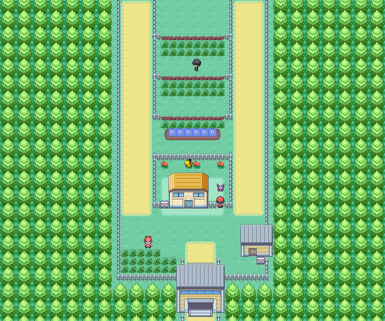
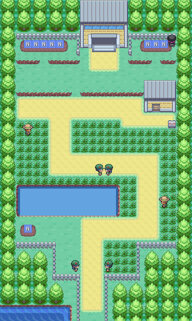
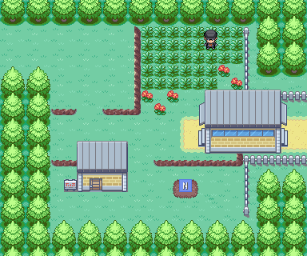
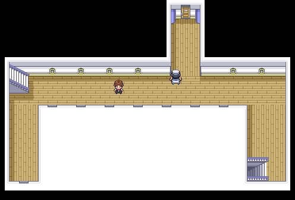
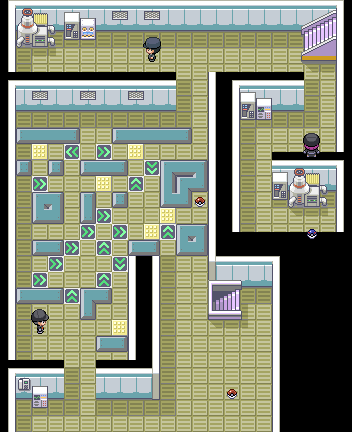
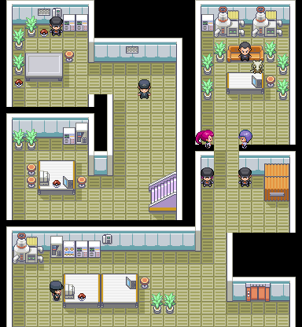
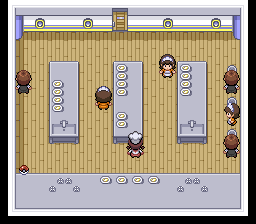
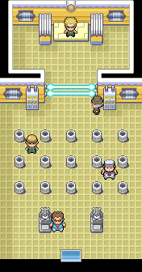
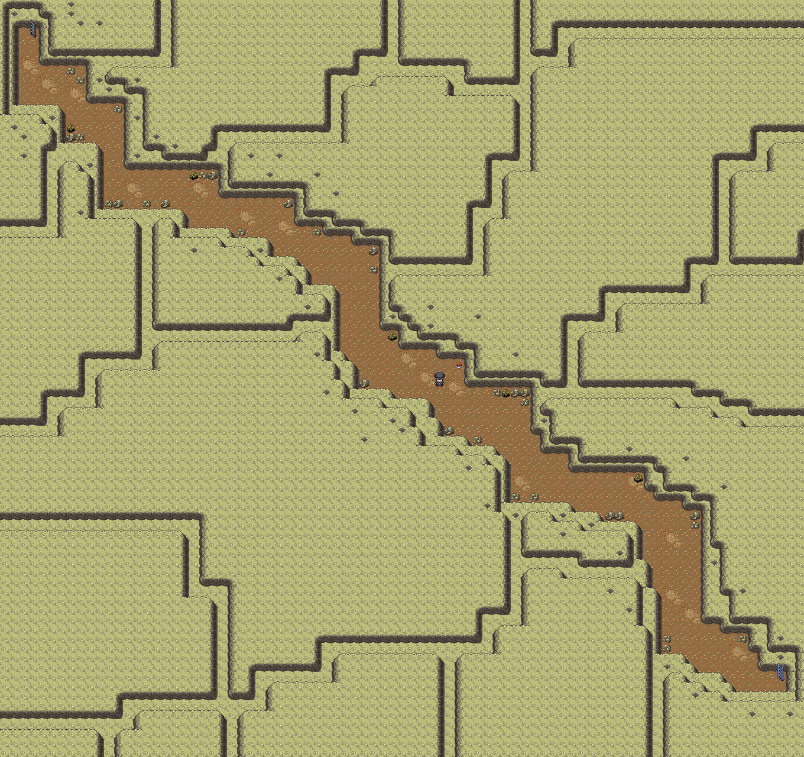

> [← Previous](02-misty-and-cerulean-cape.md) · [Main index](../README.md) · [How to use](../HOW-TO-USE-THE-GUIDE.md) · [Next →](04-erika-and-rocket-hideout.md)

[English] · [Español](../../es/guia/03-lt-surge-y-ciudad-carmin.md)

**POKÉMON CLASSIC**

**v1.5**

**VOLUME 3**

**Vermilion City, S.S. Anne and Lt. Surge**

Step-by-step tour • Items • Recommended captures • Gym • Checklists

> See [How to Use Guide](../HOW-TO-USE-THE-GUIDE.md) for symbols, essential mechanics, and data criteria common to all volumes.

# Content

- Routes 5 and 6

- Vermilion City

- Route 11

- S.S. Anne

- Lt. Surge's Gym

- Diglett's Cave

| **DATA CRITERIA** Specific items, encounters, and events come from the Pokémon Classic v1.5 guide. Lt. Surge's gear is taken from Pokémon Yellow, unless the hack indicates a change. |
|---|

# Routes 5 and 6

*Route 5: south exit of Cerulean City and access to the underpass.*

*Route 6: final section to Vermilion City.*

| **🎯 OBJECTIVE** Go through the underpass and reach Vermilion City. |
|-----------------------------------------------------------------------------|

## Recommended route

1. Go down Route 5 and visit the Daycare if you want to drop off a Pokémon.

2. Collect or plant the EV reduction berries from Route 5.

3. As the direct access to Saffron City is still blocked, enter the underpass towards Route 6.

4. On Route 6, look for the hidden Rare Candy and the Zidra Berry.

5. Defeat all six trainers and enter Vermilion City.

## ⭐ Pokémon and recommended catches

| **Pokémon / group** | **Availability** | **Value for adventure** |
|---------------------|------|-------------------------------------------------------------|
| Abra | 5-20% | Highly recommended |
| Meowth | Rare | Useful for Payday and collection of objects according to configuration |
| Jigglypuff | 10% approx.         | Good support, but not essential |
| Pidgeotto | Rare | Shortcut to get an evolved flyer |

## ↩ Aquatic encounters

> Come back when you have 🏄 Surf or the indicated 🎣 rod.

| Pokémon | Method | Availability |
|---|---|---|
| Slowpoke | 🏄 Surf | Day, 5-60% |
| Slowbro | 🏄 Surf | Day, 1-4% |
| Psyduck | 🏄 Surf | Night, 5-60% |
| Golduck | 🏄 Surf | Night, 1-4% |
| Magikarp | 🎣 Old Rod | Day and night, 30-70% |
| Goldeen | 🎣 Good Rod | Day, 20-60%; night, 20% |
| Poliwag | 🎣 Good Rod | Day, 20%; night, 20-60% |
| Krabby | 🎣 Super Rod | Day, 40%; night, 1-40% |
| Shellder | 🎣 Super Rod | Day, 1-40%; night, 40% |

## 💎 Items and rewards

| **Item** | **Where / how** | **Priority** |
|-------------------------|--------------------|---------------|
| EV Reducing Berries | Route 5 Plots | Medium |
| Zidra Berry | 🔍 Hidden on Route 6 | High |
| Rare Candy | 🔍 Hidden on Route 6 | High |

## Trainers

| **Trainer** | **Team** |
|---|---|
| Bug Catcher Keigo | Weedle Lv. 16 · Caterpie Lv. 16 · Venonat Lv. 16 |
| Camper Ricky | Squirtle Lv. 20 |
| Picnicker Nancy | Rattata Lv. 16 · Pikachu Lv. 16 |
| Bug Catcher Elijah | Butterfree Lv. 20 |
| Picnicker Isabelle | Pidgey Lv. 16 · Pidgey Lv. 16 · Pidgey Lv. 16 |
| Camper Jeff | Spearow Lv. 16 · Raticate Lv. 16 |

## ⚠ Before continuing

- [ ] Pick up the Rare Candy

- [ ] Arrive with equipment around level 22-24

# Vermilion City

*Town Map from Vermilion City.*

| **🎯 OBJECTIVE** Prepare to visit S.S. Anne and obtain key items. |
|----------------------------------------------------------------------------|

## Recommended route

6. Visit the Pokémon Fan Club and listen to the president to receive the Bike Voucher.

7. Get the Old Rod at the fishing guru's house.

8. Find the Max Ether hidden on the coast, down from the Pokémon Center.

9. Board the S.S. Anne using the Boat Ticket.

10. After winning the third Badge, return to receive Squirtle.

## ⭐ Pokémon and recommended catches

| **Pokémon / group** | **Availability** | **Value for adventure** |
|--------------------------|---------------------------|----------------------------------------------------|
| Squirtle (gift) | After completing Gym 3 | Excellent Water Pokémon |
| Magikarp | Old Rod | Gyarados is worth the investment if you want a physical attacker |
| Horsea / Staryu / Krabby | With better rods | Later options |

## ↩ Aquatic encounters

> Come back when you have 🏄 Surf or use the indicated 🎣 rod.

| Pokémon | Method | Availability |
|---|---|---|
| Horsea | 🏄 Surf | Day, 30-60% |
| Seadra | 🏄 Surf | Day, 1-5% |
| Tentacool | 🏄 Surf | Night, 30-60% |
| Tentacruel | 🏄 Surf | Night, 1-5% |
| Magikarp | 🎣 Old Rod | Day and night, 30-70% |
| Goldeen | 🎣 Good Rod | Day, 20-60%; night, 20% |
| Krabby | 🎣 Good Rod | Day, 20%; night, 20-60% |
| Horsea | 🎣 Super Rod | Day, 40%; night, 4-15% |
| Staryu | 🎣 Super Rod | Day, 4-15%; night, 40% |
| Kingler | 🎣 Super Rod | Day and night, 1% |

## 💎 Items and rewards

| **Item** | **Where / how** | **Priority** |
|-------------|-----------------------------------|------------------------|
| Bike Voucher | Pokémon Fan Club | Mandatory / very high |
| Old Rod | Fisherman's House | Medium |
| Max. Ether | 🔍 Hidden on the coast | High |
| Blastoisite | Postgame after second final victory | Postgame |

## ⚠ Before continuing

- [ ] Get Bike Ticket

- [ ] Get Old Rod

- [ ] Pickup Max. Ether

# Route 11 · Optional detour

Route 11 is located east of Vermilion City. You can explore its land area now and return later to complete the water encounters and collect the Itemfinder.

| **🎯 OBJECTIVE** Explore the route, fight against your trainers and write down your future visit to Cedar. |
|----------------------------------------------------------------------------------------------------------|

## Recommended route

11. Exit Vermilion City to the east and collect Awakening, X Defense, and Great Ball.

12. Look for the hidden Escape Rope and check the berry crops.

13. Defeat all ten trainers before returning to Vermilion City.

14. After getting the fourth Badge, return to the second floor of the checkpoint and talk to Cedar to receive the Itemfinder.

## ⭐ Pokémon and recommended catches

| Pokémon | Day | Night | Value for adventure |
|---|---|---|---|
| Pidgey | 10-20% | 10% | Already known Flying Alternative |
| Pidgeotto | 4-20% | 10% | Allows you to save training compared to Pidgey |
| Ekans | 10% | — | Physical Poison Option |
| Drowzee | 10% | 4-20% | Good option Psychic before Sabrina |
| Rattata | 1-10% | 1-20% | Low priority at this point |
| Raticate | 1% | 1-10% | Evolution available directly |
| Sandshrew | — | 10% | Ground Type Useful Against Lt. Surge |

## ↩ Aquatic encounters

> Come back when you have 🏄 Surf or the indicated 🎣 rod.

| Pokémon | Method | Availability |
|---|---|---|
| Slowpoke | 🏄 Surf | Day, 5-60% |
| Slowbro | 🏄 Surf | Day, 1-4% |
| Psyduck | 🏄 Surf | Night, 5-60% |
| Golduck | 🏄 Surf | Night, 1-4% |
| Magikarp | 🎣 Old Rod | Day and night, 30-70% |
| Goldeen | 🎣 Good Rod | Day, 20-60%; night, 20% |
| Poliwag | 🎣 Good Rod | Day, 20%; night, 20-60% |
| Shellder | 🎣 Super Rod | Day, 15-40%; night, 40% |
| Krabby | 🎣 Super Rod | Day, 40%; night, 15-40% |
| Horsea | 🎣 Super Rod | Day, 1-4% |
| Tentacool | 🎣 Super Rod | Night, 1-4% |

## 💎 Items and rewards

| Item | Where/how | Priority |
|---|---|---|
| Awakening | Poké Ball visible | Medium |
| X Defense | Poké Ball visible | Low |
| Escape Rope | 🔍 Hidden object | Medium |
| Great Ball | Poké Ball visible | Medium |
| Itemfinder | ↩ Cedar, checkpoint 2F, after the fourth gym | Very high |
| Zreza Berry | Cultivation | Low |
| Zidra Berry | Cultivation | High |

## Trainers

| **Trainer** | **Team** |
|---|---|
| Gambler Hugo | Poliwag Lv. 18 · Horsea Lv. 18 |
| Youngster Eddie | Ekans Lv. 21 |
| Youngster Dave | Nidoran♂ Lv. 18 · Nidorino Lv. 18 |
| Youngster Dillon | Sandshrew Lv. 19 · Zubat Lv. 19 |
| Engineer Bernie | Magnemite Lv. 18 · Magnemite Lv. 18 · Voltorb Lv. 18 |
| Gambler Jasper | Bellsprout Lv. 18 · Oddish Lv. 18 |
| Engineer Braxton | Magnemite Lv. 21 |
| Gambler Darian | Growlithe Lv. 18 · Vulpix Lv. 18 |
| Youngster Yasu | Rattata Lv. 17 · Rattata Lv. 17 · Raticate Lv. 17 |
| Gambler Dirk | Voltorb Lv. 18 · Magnemite Lv. 18 |

## ⚠ Before continuing
- [ ] Collect the four objects on the route
- [ ] Defeat all ten trainers
- [ ] Return for Itemfinder after the fourth Badge
- [ ] Remember the escapee Rocket available in the post-game

# S.S. Anne

*S.S. Anne: main cover.*

*S.S. Anne: access floor.*

*S.S. Anne: corridors and cabins.*

*S.S. Anne: outer cover.*

*S.S. Anne: additional interior zone.*

*S.S. Anne: captain's cabin and final section.*

| **🎯 OBJECTIVE** Explore the ship completely, defeat the rival and get Cut. |
|---------------------------------------------------------------------------------|

## Recommended route

15. Explore the rooms on the lower floors first and defeat the trainers to gain experience.

16. Check the kitchen: there are three berries in the trash cans and one Great Ball.

17. Collect TM31 and TM44, as well as Stardust, X Attack, Ether and Super Potion.

18. Rest when necessary before going up to the second floor corridor.

19. Defeat the rival.

20. Talk to the Seasick Captain to get HM01 Cut. Do not leave the ship until you have collected everything.

## ↩ Aquatic encounters

> Come back when you have 🏄 Surf or use the indicated 🎣 rod.

| Pokémon | Method | Availability |
|---|---|---|
| Horsea | 🏄 Surf | Day, 30-60% |
| Seadra | 🏄 Surf | Day, 1-5% |
| Tentacool | 🏄 Surf | Night, 30-60% |
| Tentacruel | 🏄 Surf | Night, 1-5% |
| Magikarp | 🎣 Old Rod | Day and night, 30-70% |
| Goldeen | 🎣 Good Rod | Day, 20-60%; night, 20% |
| Krabby | 🎣 Good Rod | Day, 20%; night, 20-60% |
| Horsea | 🎣 Super Rod | Day, 40%; night, 4-15% |
| Staryu | 🎣 Super Rod | Day, 4-15%; night, 40% |
| Kingler | 🎣 Super Rod | Day and night, 1% |

## 💎 Items and rewards

| **Item** | **Where / how** | **Priority** |
|--------------------------|-----------------------------|---------------|
| Hyper Potion | 🔍 Hidden, B1F runner | High |
| Great Ball | Kitchen | Medium |
| Atania, Zreza and Meloch Berries | Kitchen trash cans | Medium |
| TM31 | Room 2, floor 1 | High |
| Stardust | Room 2, floor 2 | Medium |
| X Attack | Room 4, floor 2 | Low |
| TM44 | Room 2, B1F | High |
| Ether | Room 3, B1F | Medium |
| Superpotion | Room 5, B1F | Medium |
| HM01 Cut | Captain | Mandatory |

## Trainers

| **Trainer** | **Team** |
|---|---|
| Rival, 2F runner | Spearow Lv. 19 · Rattata Lv. 16 · Sandshrew Lv. 18 · Eevee Lv. 20 |
| Sailor Trevor and Sailor Edmond, cover | **Trevor:** Machop Lv. 17 · Tentacool Lv. 17 **Edmond:** Machop Lv. 18 · Shellder Lv. 18 |
| Lass Ann and Youngster Tyler | **Ann:** Pidgey Lv. 18 · Nidoran♀ Lv. 18 **Tyler:** Nidoran♂ Lv. 21 |
| Gentleman Arthur and Gentleman Thomas | **Thomas:** Growlithe Lv. 18 · Growlithe Lv. 18 **Arthur:** Nidoran♂ Lv. 19 · Nidoran♀ Lv. 19 |
| Fisherman Dale and Gentleman Brooks | **Brooks:** Pikachu Lv. 23 **Dale:** Goldeen Lv. 17 · Tentacool Lv. 17 · Goldeen Lv. 17 |
| Lady Dawn and Gentleman Lamar | **Lamar:** Growlithe Lv. 17 · Ponyta Lv. 17 **Dawn:** Rattata Lv. 18 · Pikachu Lv. 18 |
| B1F trainers: Barny, Phillip, Huey, Dylan, Duncan and Leonard | **Phillip:** Machop Lv. 20 **Huey:** Tentacool Lv. 18 · Staryu Lv. 18 **Leonard:** Shellder Lv. 21 **Dylan:** Horsea Lv. 17 · Horsea Lv. 17 · Horsea Lv. 17 **Duncan:** Horsea Lv. 17 · Shellder Lv. 17 · Tentacool Lv. 17 **Barny:** Tentacool Lv. 17 · Staryu Lv. 17 · Shellder Lv. 17 |

| **NOTICE** The S.S. Anne becomes unavailable upon completion of the event. Collect all the objects before delivering the final objective and leaving. |
|--------------------------------------------------------------------------------------------------------------------------------------------------------------|

## ⚠ Before continuing

- [ ] Pick up both TMs

- [ ] Defeat the rival

- [ ] Get Cut

# 🏆 GYM: Lt. Surge

*Interior of Vermilion City's Gym.*

| **RECOMMENDED LEVEL CAP** 28. The highest level Pokémon on Pokémon Yellow's team is taken as a reference. |
|-----------------------------------------------------------------------------------------------------------------|

| **Pokémon** | **Level** | **Type** | **Main hazard** |
|-------------|-----------|-----------|----------------------------------------|
| Raichu | 28 | Electric | High speed and strong electrical damage |

## Combat plan

- Capture Diglett or Dugtrio in the nearby cave: the Ground type is immune to Electric attacks.

- Nidoking/Nidoqueen also work very well if they have already evolved.

- Do not use Water or Flying Pokémon unless they can defeat it immediately.

- The gym uses the classic trash can switch puzzle: when you find the first one, try the adjacent trash cans.

| **REWARD** Thunder Badge and TM34 from Pokémon Classic. |
|----------------------------------------------------------|

# Diglett's Cave

*Town Map complete from Diglett's Cave.*

| **🎯 OBJECTIVE** Get a Ground type option and open shortcuts to previous areas. |
|------------------------------------------------------------------------------------------|

## Recommended route

21. Enter from the outskirts of Vermilion City after getting Cut.

22. Capture a Diglett; Dugtrio is rare, but can appear already evolved.

23. Pick up the Smooth Rock.

24. Cross the cave to return to the eastern area of ​​Route 2 and explore accesses that were previously blocked.

## ⭐ Pokémon and recommended catches
| **Pokémon / group** | **Availability** | **Value for adventure** |
|---------------------|---------------------------------------|--------------------------------------------------------------|
| Diglett | Very common, levels 1-20 depending on area | The best immediate response against Lt. Surge |
| Dugtrio | 1-4% | Very powerful, although it may be above the rest of the team |

## 💎 Items and rewards

| **Item** | **Where / how** | **Priority** |
|---------|---------------------------|---------------|
| Smooth Rock | Poké Ball inside the cave | Medium |

| **VOLUME CLOSING** With Cut and three Badges, the next objective is to advance along routes 9 and 10, cross Rock Tunnel and reach Lavender Town. |
|-------------------------------------------------------------------------------------------------------------------------------------------------------------|

## ⚠ Before continuing

- [ ] Have Cut

- [ ] Get the Thunder Badge

- [ ] Receive Squirtle at Vermilion City

---

> [← Previous](02-misty-and-cerulean-cape.md) · [General index](../README.md) · [How to use](../HOW-TO-USE-THE-GUIDE.md) · [Next →](04-erika-and-rocket-hideout.md)
