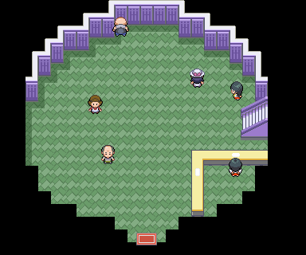
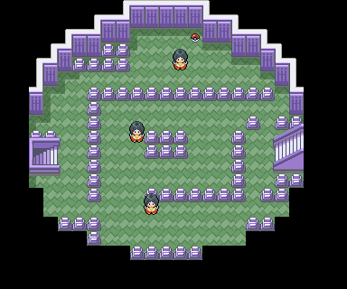
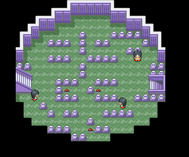
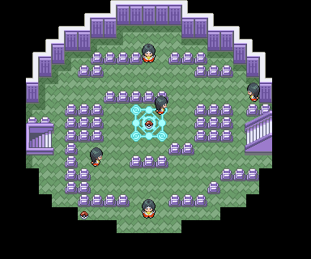
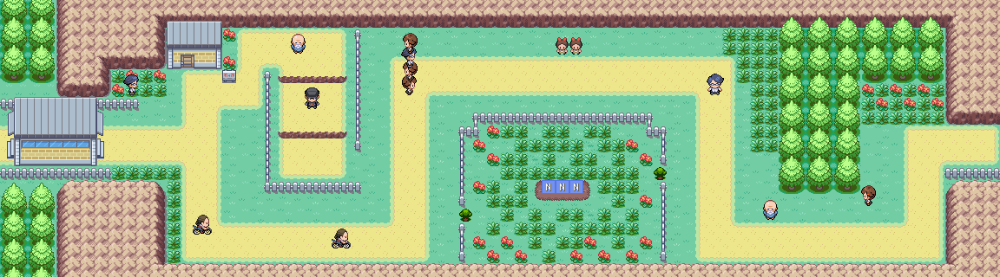
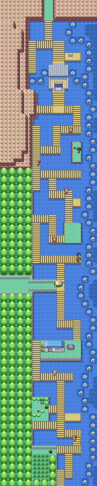
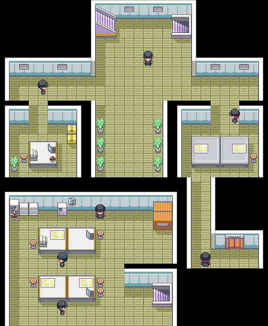
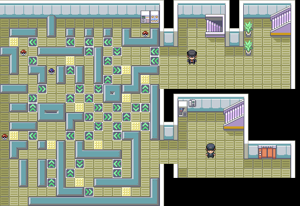
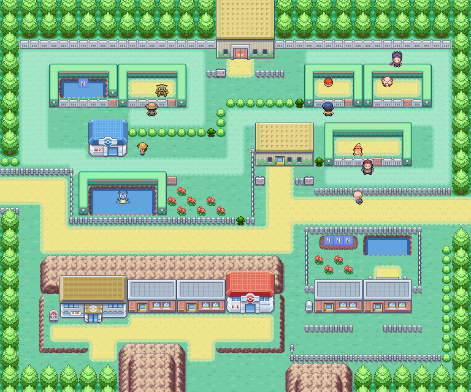

> [← Previous](03-lt-surge-and-vermilion-city.md) · [Main index](../README.md) · [How to use](../HOW-TO-USE-THE-GUIDE.md) · [Next →](05-pokemon-tower-koga-and-safari-zone.md)

[English] · [Español](../../es/guia/04-erika-y-guarida-rocket.md)

**POKÉMON CLASSIC**

**v1.5**

**VOLUME 4**

**Rock Tunnel, Lavender Town and Celadon City**

Step-by-step tour • Items • Recommended captures • Gyms • Checklists

> See [How to Use Guide](../HOW-TO-USE-THE-GUIDE.md) for symbols, essential mechanics, and data criteria common to all volumes.

# Content

- Preparations after the third Badge

- Route 9

- Route 10

- Rock Tunnel

- Lavender Town

- Routes 8 and 7

- Celadon City

- Casino and Rocket Hideout

- Erika's Gym

| **RECOMMENDED ORDER** This volume follows the most natural path: Cerulean City → Route 9 → Route 10 → Rock Tunnel → Lavender Town → Route 8 → underpass → Route 7 → Celadon City. |
|---------------------------------------------------------------------------------------------------------------------------------------------------------------------------|

# Preparations

| **🎯 OBJECTIVE** Use Cut to collect earrings and get equipment ready for a long trainer and cave section. |
|-----------------------------------------------------------------------------------------------------------------------|

## Recommended route

1. Redeem the Bike Voucher at Cerulean City if you have not already done so.

2. Buy Repellents, Super Potions, Antidotes and Escape Ropes.

3. Bring a Pokémon capable of using Flash if you have obtained the equivalent ability or resource; The tunnel can be traveled without it, but it will be much more uncomfortable.

4. Keep a space free if you want to capture Charmander inside the Rock Tunnel.

| **GUIDELINE LEVEL** Start Route 9 near level 24-26 and try to exit Rock Tunnel around 28-30. |
|---------------------------------------------------------------------------------------------------------------------------------|

## ⚠ Before continuing

- [ ] Buy supplies

- [ ] Carry Escape Rope

- [ ] Prepare Poké Balls

# Route 9

*Town Map of Route 9.*

| **🎯 OBJECTIVE** Open the way to the Rock Tunnel and take advantage of the high density of trainers. |
|-------------------------------------------------------------------------------------------------|

## Recommended route

5. Cut the bush east of Cerulean City.

6. Defeat all trainers; experience is important before the tunnel.

7. Pick up the visible TM40 and Burn Heal.

8. Look for the hidden Ether and Rare Candy.

9. Continue towards Route 10.

## ⭐ Pokémon and recommended catches

| **Pokémon / group** | **Availability** | **Value for adventure** |
|---------------------|------|-------------------------------------------------------|
| Nidoran♀ / Nidoran♂ | Common | It is still a good time to form Nidoking or Nidoqueen |
| Nidorino / Nidorina | 5% day | They save training |
| Raticate | Common at night | Strong short term |
| Fearow | 1% day | Good physical flyer |

## 💎 Items and rewards

| **Item** | **Where / how** | **Priority** |
|---------------|---------------|---------------|
| Ether | 🔍 Hidden | Medium |
| TM40 | Poké Ball | High |
| Burn Heal | Poké Ball | Medium |
| Atania Berry | 🔍 Hidden | Low |
| Rare Candy | 🔍 Hidden | High |

## Trainers

| **Trainer** | **Team** |
|---|---|
| Picnicker Alicia | Oddish Lv. 18 · Bellsprout Lv. 18 · Oddish Lv. 18 · Bellsprout Lv. 18 |
| Hiker Jeremy | Machop Lv. 20 · Onix Lv. 20 |
| Camper Chris | Growlithe Lv. 21 · Charmander Lv. 21 |
| Bug Catcher Brent | Beedrill Lv. 19 · Beedrill Lv. 19 |
| Camper Drew | Rattata Lv. 19 · Sandshrew Lv. 19 · Ekans Lv. 19 · Sandshrew Lv. 19 |
| Bug Catcher Conner | Caterpie Lv. 20 · Weedle Lv. 20 · Venonat Lv. 20 |
| Hiker Brice | Geodude Lv. 20 · Machop Lv. 20 · Geodude Lv. 20 |
| Picnicker Caitlin | Meowth Lv. 23 |
| Hiker Alan | Geodude Lv. 21 · Onix Lv. 21 |

## ⚠ Before continuing

- [ ] Collect TM40

- [ ] Find Rare Candy

- [ ] Defeat all trainers

# Route 10

*Complete route 10, including the entrance to Rock Tunnel.*

| **🎯 OBJECTIVE** Prepare just before Rock Tunnel and collect very valuable items. |
|---------------------------------------------------------------------------------------|

## Recommended route

10. Visit the Pokémon Center and heal the team.

11. After the third Badge, talk to Cedar in the Center to receive the Everstone.

12. Pick up the visible Luminous Ball; It is especially valuable to Pikachu.

13. Look for the Super Potion and the Max. hidden ether.

14. Talk to the berry NPC to receive a daily berry.

15. Enter Rock Tunnel with the team healed.

## ⭐ Pokémon and recommended catches

| **Pokémon / group** | **Availability** | **Value for adventure** |
|---------------------|------|-------------------------------------|
| Magnemite | 10-20% | Excellent Electric/Steel type |
| Machop | 1-4% | Good Attacker Fight |
| Dratini | 1% with Surf during the day | Too weird to stop now |
| Nidoran | 10% | Alternative if you don't have one yet |

## ↩ Aquatic encounters

> Come back when you have 🏄 Surf or the indicated 🎣 rod.

| Pokémon | Method | Availability |
|---|---|---|
| Slowpoke | 🏄 Surf | Day, 5-60% |
| Slowbro | 🏄 Surf | Day, 4% |
| Dratini | 🏄 Surf | Day, 1% |
| Poliwag | 🏄 Surf | Night, 5-60% |
| Poliwhirl | 🏄 Surf | Night, 1-4% |
| Magikarp | 🎣 Old Rod | Day and night, 30-70% |
| Goldeen | 🎣 Good Rod | Day, 20-60%; night, 20% |
| Poliwag | 🎣 Good Rod / Super Rod | Day, 20% with Good Rod; night, 20-60% with Good Rod or 15-40% with Super Rod |
| Horsea | 🎣 Super Rod | Day and night, 40% |
| Slowpoke | 🎣 Super Rod | Day, 15-40% |
| Krabby | 🎣 Super Rod | Day and night, 4% |
| Kingler | 🎣 Super Rod | Day and night, 1% |

## 💎 Items and rewards

| **Item** | **Where / how** | **Priority** |
|----------------|----------------------------------------|-----------------------|
| Superpotion | 🔍 Hidden | Medium |
| Max. Ether | 🔍 Hidden | High |
| Luminous Ball | Poké Ball | Very high for Pikachu |
| Everstone | Cedar, Pokémon Center, after Gym 3 | High |
| Random Berry | Daily NPC | Medium |

## Trainers

| **Trainer** | **Team** |
|---|---|
| Picnicker Heidi | Pikachu Lv. 20 · Clefairy Lv. 20 |
| Pokemaniac Mark | Rhyhorn Lv. 29 · Lickitung Lv. 29 |
| Picnicker Carol | Pidgey Lv. 21 · Pidgeotto Lv. 21 |
| Hiker Clark | Geodude Lv. 21 · Onix Lv. 21 |
| Hiker Trent | Onix Lv. 19 · Graveler Lv. 19 |
| Pokemaniac Herman | Cubone Lv. 20 · Slowpoke Lv. 20 |

| **PIKACHU** Check if the Luminous Ball works as an equipped item in your version; If so, it can greatly increase its potency. |
|-------------------------------------------------------------------------------------------------------------------------------------------|

## ⚠ Before continuing

- [ ] Get Luminous Ball

- [ ] Get Everstone

- [ ] Heal and save

# Rock Tunnel

*Rock Tunnel, floor 1.*

*Rock Tunnel, basement 1.*

| **🎯 OBJECTIVE** Cross the cave, collect the Power Stone and reach Lavender Town. |
|---------------------------------------------------------------------------------|

## Recommended route

16. Proceed through the first floor checking the detours to find Repellent, Escape Rope and Pearl.

17. In B1F collect Revive, Power Stone and Max. Ether.

18. Defeat the trainers to maintain the team's level.

19. Capture Charmander if you didn't get it before or want another copy.

20. Keep at least one Escape Rope for safety.

21. Look for the south exit to lower Route 10 and Lavender Town.

## ⭐ Pokémon and recommended catches

| **Pokémon / group** | **Availability** | **Value for adventure** |
|---------------------|------|-----------------------------------------------------------|
| Geodude | 5-20% and Rock Hit | Rock/Earth type solid |
| Machop | 1-10% | Good Fight coverage |
| Zubat | 10% | Crobat does not exist in the classic Pokédex; moderate usefulness |
| Onix | 5% | Very defensive, little damage |
| Charmander | 4% | Priority catch if you don't have one |
| Graveler | Rock Hit | Can save evolution |

## 💎 Items and rewards

| **Item** | **Where / how** | **Priority** |
|-------------------|-------------------|---------------------------------------------------------------|
| Repellent | 1F | Medium |
| Escape Rope | 1F | High |
| Pearl | 1F | Medium |
| Relive | B1F | High |
| Power Stone | B1F | Very high; serves for evolutions that previously required trade |
| Max. Ether | B1F | High |
| Aerodactylite | B1F, postgame | Postgame |
| Tutor Rock Slide | Rock Tunnel | Optional; field tutor |

## Trainers

| **Trainer** | **Team** |
|---|---|
| Pokemaniac Ashton | Cubone Lv. 23 · Slowpoke Lv. 23 |
| Hiker Lenny and other trainers distributed throughout the two floors | Geodude Lv. 19 · Machop Lv. 19 · Geodude Lv. 19 · Geodude Lv. 19 |

| **POWER STONE** Save it until you decide which trade evolution you want to prioritize, such as Kadabra, Machoke, Graveler, or Haunter. |
|---------------------------------------------------------------------------------------------------------------------------------------------|

## ⚠ Before continuing

- [ ] Pick up Power Stone

- [ ] Capture Charmander if missing

- [ ] Leave with sufficient resources

# Lavender Town

*Town Map from Lavender Town.*

| **🎯 OBJECTIVE** Learn about the Pokémon Tower conflict and prepare the detour to Celadon City. |
|------------------------------------------------------------------------------------------|

## Recommended route

22. Heal the team and visit the city buildings.

23. Enter Pokémon Tower to activate the available events, but you won't be able to complete it yet without the proper scope.

24. Talk to the inhabitants to find out the situation of Mr. Fuji and Team Rocket.

25. Exit west on Route 8.

| **STORY LOCK** Pokémon Tower is pending. The item needed to identify the ghosts is obtained by defeating Team Rocket in Celadon City. |
|-------------------------------------------------------------------------------------------------------------------------------------------------------------|

## ⚠ Before continuing

- [ ] Activate the Tower event

- [ ] Prepare the trip to Celadon City

# Route 8

*Town Map from Route 8.*

| **🎯 OBJECTIVE** Cross the coach route and access the underpass. |
|--------------------------------------------------------------------------|

## Recommended route

26. Defeat numerous trainers to gain experience.

27. Look for the hidden Leppa, Lum and Rawst berries.

28. Catch Growlithe by day or Vulpix by night if you want a Fire type.

29. Since the Saffron City gate is still blocked, use the underpass that leads to Route 7.

## ⭐ Pokémon and recommended catches

| **Pokémon / group** | **Availability** | **Value for adventure** |
|--------------------------|--------------------------|----------------------------------------|
| Growlithe | 10% day | Arcanine is one of the best Fire types |
| Vulpix | 10% at night | Ninetales is fast and useful |
| Abra / Kadabra | Abra is common; Kadabra 1-4% | Excellent Psychic-type Pokémon |
| Jigglypuff | Up to 20% at night | Optional support |

## 💎 Items and rewards

| **Item** | **Where / how** | **Priority** |
|---------|--------|---------------|
| Leppa Berry | 🔍 Hidden | Medium |
| Lum Berry | 🔍 Hidden | High |
| Rawst Berry | 🔍 Hidden | Low |

## Trainers

| **Coach** | **Zone / reference** | **Team** |
|-------------------|-----------------------|---|
| Lass Julia | Route 8 | Clefairy Lv. 22 · Clefairy Lv. 22 |
| Gambler Rich | Route 8 | Growlithe Lv. 24 · Vulpix Lv. 24 |
| Pokemaniac Glenn | Route 8 | Grimer Lv. 22 · Muk Lv. 22 · Grimer Lv. 22 |
| Twins Eli and Anne | Double combat | Clefairy Lv. 22 · Jigglypuff Lv. 22 |
| Lass Paige | Route 8 | Nidoran♀ Lv. 23 · Nidorina Lv. 23 |
| Pokemaniac Leslie | Route 8 | Koffing Lv. 26 |
| Lass Andrea | Route 8 | Meowth Lv. 24 · Meowth Lv. 24 · Meowth Lv. 24 |
| Lass Megan | Route 8 | Pidgey Lv. 19 · Rattata Lv. 19 · Nidoran♂ Lv. 19 · Meowth Lv. 19 · Pikachu Lv. 19 |
| Biker Jaren | Route 8 | Grimer Lv. 24 · Grimer Lv. 24 |
| Biker Ricardo | Route 8 | Koffing Lv. 22 · Koffing Lv. 22 · Grimer Lv. 23 |
| Gambler Stan | Route 8 | Poliwag Lv. 22 · Poliwag Lv. 22 · Poliwhirl Lv. 22 |
| Pokemaniac Aidan | Route 8 | Voltorb Lv. 20 · Koffing Lv. 20 · Voltorb Lv. 20 · Magnemite Lv. 20 |

## ⚠ Before continuing

- [ ] Capture Growlithe or Vulpix if you are interested

- [ ] Collect Lum Berry

- [ ] Use the underpass

# Route 7

*Town Map from Route 7.*

| **🎯 OBJECTIVE** Enter Celadon City and get one last capture before the city. |
|------------------------------------------------------------------------------------------|

## Recommended route
30. Pick up the hidden Wepear Berry and check the Leppa Berry plot.

31. Look for Growlithe by day or Vulpix by night.

32. Enter Celadon City.

## ⭐ Pokémon and recommended catches

| **Pokémon / group** | **Availability** | **Value for adventure** |
|---------------------|------|-------------------------------------|
| Growlithe | 1-4% of day | Highly recommended |
| Vulpix | 1-4% at night | Highly recommended |
| Abra | Up to 10% | Good last attempt to capture it |
| Pidgeotto | 1-5% | Evolved Flyer |

## 💎 Items and rewards

| **Item** | **Where / how** | **Priority** |
|-------------|---------------|---------------|
| Wepear Berry | 🔍 Hidden | Low |
| Leppa Berry | Plot | Medium |

## ⚠ Before continuing

- [ ] Enter Celadon City with free space in your backpack

# Celadon City

*Town Map from Celadon City.*

| **🎯 OBJECTIVE** Obtain key items, explore the department stores and discover the Rocket activity. |
|------------------------------------------------------------------------------------------|

## Recommended route

33. Explore the Department Stores and purchase available evolutionary stones, combat items, and MT.

34. Talk to the man at the restaurant to receive the Wallet.

35. Collect the visible Ether and the PP More hidden behind the tree that requires Cut.

36. Obtain the Tea, which will later allow access to Saffron.

37. Investigate the Casino and get the Rocket Evidence Bag.

38. Before or after the lair, challenge Erika's Gym depending on your team level.

## ↩ Aquatic encounters

>Celadon City's pond only has documented fishing encounters.

| Pokémon | Method | Availability |
|---|---|---|
| Magikarp | 🎣 Old Rod | Day and night, 30-70% |
| Goldeen | 🎣 Good Rod | Day, 20-60%; night, 20% |
| Poliwag | 🎣 Good Rod | Day, 20%; night, 20-60% |
| Slowpoke | 🎣 Super Rod | Day, 40%; night, 1-15% |
| Poliwhirl | 🎣 Super Rod | Day, 1-15%; night, 40% |

## 💎 Items and rewards

| **Item** | **Where / how** | **Priority** |
|-------------------------|----------------------------|----------------------------|
| Ether | Poké Ball | Medium |
| PP More | 🔍 Hidden behind tree by Cut | High |
| Wallet | Restaurant man | Mandatory for the casino |
| Rocket Test Bag | City/Casino Event | Mandatory |
| Tea | Celadon City | Very high |
| Tutor Soft-Boiled | House on the other side of the pond | Optional |

| **PURCHASES** Prioritize evolutionary stones for the Pokémon you already have prepared. Don't evolve too early or you would lose important moves per level. |
|----------------------------------------------------------------------------------------------------------------------------------------------------------|

## ⚠ Before continuing

- [ ] Get Wallet

- [ ] Get Tea

- [ ] Collect PP More

- [ ] Locate the lair

# Rocket Hideout

*Rocket Hideout, plant B1F.*

*Rocket Hideout, B2F plant.*

*Rocket Hideout, plant B3F.*

*Rocket Hideout, plant B4F.*

| **🎯 OBJECTIVE** Defeat Giovanni, obtain the necessary visor and loot the exclusive TMs. |
|------------------------------------------------------------------------------------------|

## Recommended route

39. Activate the secret entrance to the Casino and go down to B1F.

40. Defeat the Rocket Thieves: Several deliver exclusive TMs.

41. Solve the arrow floors and collect the Elevator Key in B4F.

42. Explore all the floors before the final fight to collect the Moonstone, Rare Candy, and numerous TMs.

43. Defeat Jessie and James in double combat.

44. Defeat Giovanni and get the story item needed to return to Pokémon Tower.

## 💎 Items and rewards

| **Item** | **Where / how** | **Priority** |
|--------------------|---------------------|---------------|
| TM13 and TM23 | Rocket B1F Thieves | Very high |
| Escape Rope | B1F | High |
| Hyper Potion | B1F | High |
| PP More | 🔍 Hidden in plant | High |
| TM24 | B2F Thief | Very high |
| Moonstone | B2F | Very high |
| TM12 | B2F | High |
| TM30 | B3F Thief | Very high |
| Nugget | 🔍 Hide B3F | Medium |
| Rare Candy | B3F | High |
| Black Glasses | B3F | High |
| TM21 | B3F | High |
| TM35 and TM36 | B4F Thieves | Very high |
| Calcium / Max. Ether | B4F | High |
| TM49 | B4F | High |
| Elevator Key | B4F | Mandatory |

## Trainers
| **Coach** | **Zone / reference** | **Team** |
|-----------------|--------------------------|---|
| Rocket Grunt ×5 | B1F | **Grunt 1:** Drowzee Lv. 21 · Machop Lv. 21 **Grunt 2:** Raticate Lv. 21 · Raticate Lv. 21 **Grunt 3:** Grimer Lv. 20 · Koffing Lv. 20 · Koffing Lv. 20 **Grunt 4:** Rattata Lv. 19 · Raticate Lv. 19 · Raticate Lv. 19 · Rattata Lv. 19 **Grunt 5:** Grimer Lv. 22 · Koffing Lv. 22 |
| Rocket Grunt ×1 | B2F | Zubat Lv. 17 · Koffing Lv. 17 · Grimer Lv. 17 · Zubat Lv. 17 · Raticate Lv. 17 |
| Rocket Grunt ×2 | B3F | **Grunt 1:** Rattata Lv. 20 · Raticate Lv. 20 · Drowzee Lv. 20 **Grunt 2:** Machop Lv. 21 · Machop Lv. 21 |
| Rocket Grunt ×3 | B4F | **Grunt 1:** Sandshrew Lv. 23 · Ekans Lv. 23 · Sandslash Lv. 23 **Grunt 2:** Ekans Lv. 23 · Sandshrew Lv. 23 · Arbok Lv. 23 **Grunt 3:** Koffing Lv. 21 · Zubat Lv. 21 |
| Jessie and James | Double combat | Koffing Lv. 21 · Ekans Lv. 21 · Meowth Lv. 22 · Lickitung Lv. 22 |
| Giovanni | Final Lair Battle | Onix Lv. 25 · Rhyhorn Lv. 24 · Kangaskhan Lv. 29 |

| **WARNING** The lair contains many TMs that should not be lost. Walk through each floor before leaving the building. |
|---------------------------------------------------------------------------------------------------------------------|

## ⚠ Before continuing

- [ ] Get Elevator Key

- [ ] Collect Moonstone and Rare Candy

- [ ] Defeat Giovanni

# 🏆 GYM: Erika

*Interior of Celadon City's Gym.*

| **RECOMMENDED LEVEL CAP** 32. The highest level Pokémon on Pokémon Yellow's team is taken as a reference. |
|-----------------------------------------------------------------------------------------------------------------|

| **Pokémon** | **Level** | **Type** | **Main hazard** |
|-------------|------------|---------------|-------------------------------|
| Tangela | 30 | Plant | High Defense and status movements |
| Weepinbell | 32 | Plant/Poison | States and attacks Plant |
| Gloom | 32 | Plant/Poison | Sleeping pill, poison and resistance |

## Gym trainers

| **Trainer** | **Team** |
|---|---|
| Lass Lisa | Oddish Lv. 23 · Gloom Lv. 23 |
| Lass Kay | Bellsprout Lv. 23 · Weepinbell Lv. 23 |
| Picnicker Tina | Bulbasaur Lv. 24 · Ivysaur Lv. 24 |
| Beauty Bridget | Oddish Lv. 21 · Bellsprout Lv. 21 · Oddish Lv. 21 · Bellsprout Lv. 21 |
| Beauty Tamia | Bellsprout Lv. 24 · Bellsprout Lv. 24 |
| Beauty Lori | Exeggcute Lv. 24 |
| Cooltrainer Mary | Bellsprout Lv. 22 · Oddish Lv. 22 · Weepinbell Lv. 22 · Gloom Lv. 22 · Ivysaur Lv. 22 |

## Combat plan

- Charmander/Charmeleon, Growlithe/Arcanine or Vulpix/Ninetales make combat much easier.

- Flying and Psychic Pokémon are also effective against their Grass/Poison types.

- Carry Antidotes and Awakening or Lum Berries: the biggest danger is status changes.

- Avoid relying on Water, Earth or Plant attacks.

- Defeat the seven gym trainers to gain experience before Erika.

| **REWARD** Rainbow Badge and TM19 from Pokémon Classic. |
|---------------------------------------------------------------|

| **NEXT VOLUME** Using Giovanni's visor, return to Lavender Town to complete Pokémon Tower. Then you can advance towards Fuchsia and continue with the story. |
|---------------------------------------------------------------------------------------------------------------------------------------------------------------------------|

---

> [← Previous](03-lt-surge-and-vermilion-city.md) · [General index](../README.md) · [How to use](../HOW-TO-USE-THE-GUIDE.md) · [Next →](05-pokemon-tower-koga-and-safari-zone.md)
