> [← Previous](04-erika-and-rocket-hideout.md) · [Main index](../README.md) · [How to use](../HOW-TO-USE-THE-GUIDE.md) · [Next →](06-silph-sabrina-and-cycling-road.md)

[English] · [Español](../../es/guia/05-torre-pokemon-koga-y-zona-safari.md)

**POKÉMON CLASSIC**

**v1.5**

**VOLUME 5**

**Pokémon Tower, eastern routes and Fuchsia City**

Step by Step Walkthrough • Maps • Items • Trainers • Gyms

> See [How to use the guide](../HOW-TO-USE-THE-GUIDE.md) for symbols, essential mechanics, and data criteria common to all volumes.

# Content

- Pokémon Tower and Poké Flute

- Route 12 and Snorlax

- Routes 13, 14 and 15

- Fuchsia City

- Safari Zone

- Koga Gym

| **DATA CRITERIA** Maps, items, encounters and trainers come from the Pokémon Classic v1.5 starter guide. The Koga team uses Pokémon Yellow levels because the hack document does not detail their template. |
|---------------------------------------------------------------------------------------------------------------------------------------------------------------------------------------------------------------------------------|

# Pokémon Tower

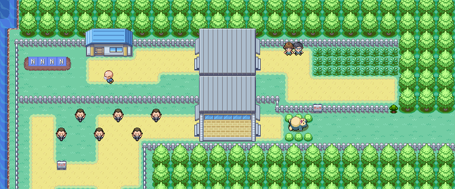

*Pokémon Tower, floor 1.*

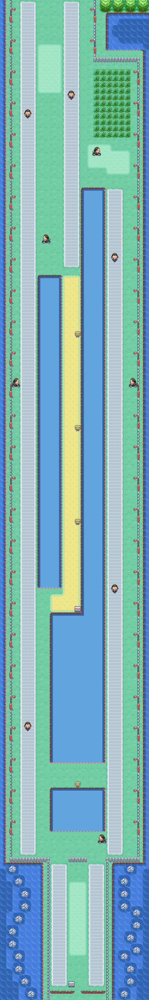

*Pokémon Tower, floor 2.*

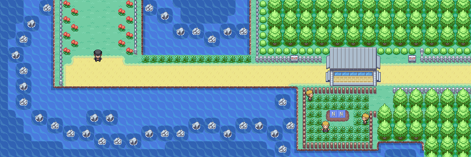

*Pokémon Tower, floor 3.*

*Pokémon Tower, floor 4.*

*Pokémon Tower, floor 5.*

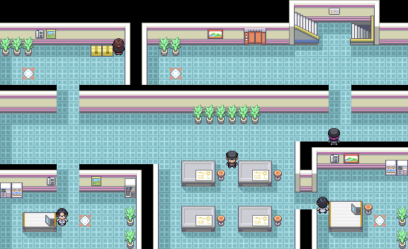

*Pokémon Tower, floor 6.*

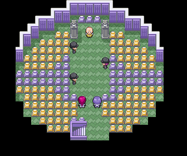

*Pokémon Tower, floor 7.*

| **🎯 OBJECTIVE** Free the tower, rescue Mr. Fuji and get the Poké Flute. |
|---------------------------------------------------------------------------------|

## Recommended route

1. Enter with the Scope Silph obtained from Giovanni in the Rocket Hideout.

2. Defeat the rival on the second floor and advance by searching each floor before using the stairs.

3. Capture Gastly if you want a Ghost/Poison attacker; Haunter is very strange.

4. On the fifth floor, take advantage of the purification area to heal the team.

5. On the seventh floor, defeat Jessie and James and the three Rocket recruits.

6. Rescue Mr. Fuji and return to him to receive the Poké Flute.

## ⭐ Pokémon and recommended catches

| **Pokémon / group** | **Availability** | **Value for adventure** |
|---------------------|------|------------------------------------------|
| Gastly | 5-20% in 3F-6F | Highly recommended; fast and useful with statuses |
| Cubone | 1-4% in 3F-6F | Rare, good Earth attacker |
| Haunter | 1% in 3F-6F | Exceptional catch if it appears |

## 💎 Items and rewards

| **Item** | **Where / how** | **Priority** |
|----------------------------------|-------------------------|---------------|
| TM42 | NPC Cueball, 1F | High |
| Escape Rope | Poké Ball, 3F | Medium |
| Elixir / Great Ball / Awakening | 4F | Medium |
| Great Mushroom | 🔍 Hidden, 5F | Medium |
| Pure Amulet / Nugget | 5F | High |
| Precision X / Rare Candy | 6F | High |
| Poké Flute | Mr. Fuji's Reward | Mandatory |

## Trainers

| **Coach** | **Zone / reference** | **Team** |
|---------------------------------------|-----------------------|---|
| Rival | 2F | **Jolteon:** Fearow Lv. 25 · Vulpix Lv. 23 · Shellder Lv. 22 · Sandshrew Lv. 20 · Eevee Lv. 24 **Flareon:** Fearow Lv. 25 · Shellder Lv. 22 · Magnemite Lv. 22 · Sandshrew Lv. 20 · Eevee Lv. 24 **Vaporeon:** Fearow Lv. 25 · Vulpix Lv. 23 · Magnemite Lv. 22 · Sandshrew Lv. 20 · Eevee Lv. 24 |
| Channeler Hope, Carly and Patricia | 3F | **Hope:** Gastly Lv. 23 **Patricia:** Gastly Lv. 22 **Carly:** Gastly Lv. 24 |
| Channeler Laurel, Jody and Paula | 4F | **Jody:** Gastly Lv. 22 **Laurel:** Gastly Lv. 23 · Gastly Lv. 23 **Paula:** Gastly Lv. 24 |
| Channeler Ruth, Tammy, Karina and Janae | 5F | **Tammy:** Haunter Lv. 23 **Ruth:** Gastly Lv. 22 **Karina:** Gastly Lv. 24 **Janae:** Gastly Lv. 22 |
| Channeler Angelica, Jennifer and Emilia | 6F | **Jennifer:** Gastly Lv. 24 **Emilia:** Gastly Lv. 24 **Angelica:** Gastly Lv. 22 · Gastly Lv. 22 · Gastly Lv. 22 |
| Jessie and James | Double combat, 7F | Ekans Lv. 26 · Koffing Lv. 26 · Lickitung Lv. 28 · Meowth Lv. 28 |
| Rocket Grunt ×3 | 7F | **Grunt 1:** Zubat Lv. 25 · Zubat Lv. 25 · Golbat Lv. 25 **Grunt 2:** Koffing Lv. 26 · Drowzee Lv. 26 **Grunt 3:** Zubat Lv. 23 · Rattata Lv. 23 · Raticate Lv. 23 · Zubat Lv. 23 |

| **RECOMMENDED CAPTURE** Gastly provides useful immunities, status moves, and a very powerful evolutionary line. |
|-------------------------------------------------------------------------------------------------------|

## ⚠ Before continuing

- [ ] Get the Poké Flute

- [ ] Pick up the Rare Candy and the TM42

- [ ] Defeat all 7F Rockets

# Route 12

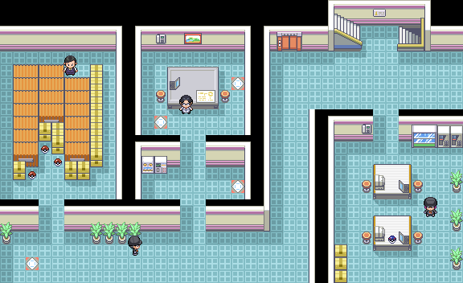

*Town Map complete Route 12.*

| **🎯 OBJECTIVE** Awakening Snorlax, get the Super Rod and open the path to Fuchsia. |
|------------------------------------------------------------------------------------------|

## Recommended route

7. Use the Poké Flute against Snorlax. Save before: it is a unique and very valuable capture.

8. Explore the fishing platforms and collect TM48, Iron and hidden items.

9. Talk to the Fisher Guru's younger brother to receive the Super Rod.

10. Continue south and defeat all the trainers before entering Route 13.

## ⭐ Pokémon and recommended catches

| **Pokémon / group** | **Availability** | **Value for adventure** |
|---------------------|---------------------------------------|----------------------------|
| Snorlax | Static encounter; requires Poké Flute | Maximum priority |
| Farfetch'd | 10% day | Optional |
| Pinsir | 1% day/night | Very rare |
| Slowpoke / Slowbro | Surf, later | Good Water/Psychic |

## ↩ Aquatic encounters

> Come back when you have 🏄 Surf or the indicated 🎣 rod.

| Pokémon | Method | Availability |
|---|---|---|
| Slowpoke | 🏄 Surf | Day, 5-60% |
| Slowbro | 🏄 Surf | Day, 1-4% |
| Tentacool | 🏄 Surf | Night, 5-60% |
| Tentacruel | 🏄 Surf | Night, 1-4% |
| Magikarp | 🎣 Old Rod | Day and night, 30-70% |
| Goldeen | 🎣 Good Rod | Day, 20-60%; night, 20% |
| Poliwag | 🎣 Good Rod | Day, 20%; night, 20-60% |
| Horsea | 🎣 Super Rod | Day, 1-40% |
| Seadra | 🎣 Super Rod | Day, 40% |
| Tentacool | 🎣 Super Rod | Night, 1-40% |
| Tentacruel | 🎣 Super Rod | Night, 40% |

## 💎 Items and rewards

| **Item** | **Where / how** | **Priority** |
|---------------|----------------------|---------------|
| TM48 | Great Ball | High |
| Hyper Potion | 🔍 Hidden | Medium |
| Iron | Poké Ball | Medium |
| Rare Candy | 🔍 Hidden | High |
| Super Rod | Fisherman's House | Very high |

## Trainers

| **Coach** | **Zone / reference** | **Team** |
|------------------------------------|------------------------|---|
| Fisherman Ned, Chip, Hank and Elliot | Fishing walkways | **Chip:** Tentacool Lv. 24 · Goldeen Lv. 24 **Elliot:** Poliwag Lv. 21 · Shellder Lv. 21 · Goldeen Lv. 21 · Horsea Lv. 21 **Ned:** Goldeen Lv. 22 · Poliwag Lv. 22 · Goldeen Lv. 22 **Hank:** Goldeen Lv. 27 |
| School Kid Jess and Gia | Double combat | Nidorino Lv. 24 · Nidorina Lv. 24 |
| Rocker Luca | Central section | Voltorb Lv. 29 · Electrode Lv. 29 |
| Camper Justin | Southern section | Nidoran♂ Lv. 29 · Nidorino Lv. 29 |
| Fisherman Andrew | End of the route | Magikarp Lv. 24 · Magikarp Lv. 24 |

| **BEFORE FIGHTING SNORLAX** Save the game and carry several Ultra Ball or Great Ball. Paralyzing or putting it to sleep makes capturing it much easier. |
|---------------------------------------------------------------------------------------------------------------------------------------------|

## ⚠ Before continuing

- [ ] Capture or defeat Snorlax

- [ ] Get the Super Rod

- [ ] Collect TM48 and Rare Candy

# Route 13

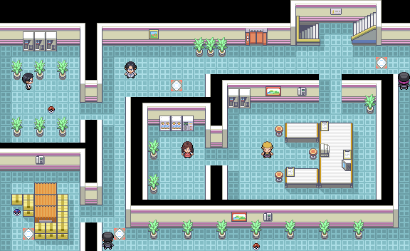

*Town Map of Route 13.*

| **🎯 OBJECTIVE** Go through the maze of fences and keep your equipment up to date. |
|---------------------------------------------------------------------------------------------|

## Recommended route

11. Follow the path between fences and check each detour: several trainers are outside the direct path.

12. Find the Max PP. hidden before leaving the route.

13. Take the opportunity to capture Ditto if you want to breed later; its appearance is 1% during the day.
14. Continue towards Route 14.

## ⭐ Pokémon and recommended catches

| **Pokémon / group** | **Availability** | **Value for adventure** |
|-------------------------|-----------------|----------------------------|
| Ditto | 1% day | Useful for parenting |
| Pinsir | 1% day | Very rare |
| Gloom | 5% at night | Save Oddish evolution |
| Pidgeotto / Weepinbell | Frequent | Optional |

## ↩ Aquatic encounters

> Come back when you have 🏄 Surf or the indicated 🎣 rod.

| Pokémon | Method | Availability |
|---|---|---|
| Slowpoke | 🏄 Surf | Day, 5-60% |
| Slowbro | 🏄 Surf | Day, 1-4% |
| Tentacool | 🏄 Surf | Night, 5-60% |
| Tentacruel | 🏄 Surf | Night, 1-4% |
| Magikarp | 🎣 Old Rod | Day and night, 30-70% |
| Goldeen | 🎣 Good Rod | Day, 20-60%; night, 20% |
| Poliwag | 🎣 Good Rod | Day, 20%; night, 20-60% |
| Horsea | 🎣 Super Rod | Day, 1-40% |
| Seadra | 🎣 Super Rod | Day, 40% |
| Tentacool | 🎣 Super Rod | Night, 1-40% |
| Tentacruel | 🎣 Super Rod | Night, 40% |

## 💎 Items and rewards

| **Item** | **Where / how** | **Priority** |
|----------------------------|----------------|---------------|
| PP Max.                   | 🔍 Hidden | High |
| Razz, Iapapa and Bluk Berries | Berry Plots | Low |

## Trainers

| **Coach** | **Zone / reference** | **Team** |
|--------------------------|---------------------------|---|
| Alma Picnicker | Starting zone | Goldeen Lv. 28 · Poliwag Lv. 28 · Horsea Lv. 28 |
| Rocker Sebastian | Labyrinth | Pidgey Lv. 29 · Pidgeotto Lv. 29 |
| Picnicker Susie | Labyrinth | Pidgey Lv. 24 · Meowth Lv. 24 · Rattata Lv. 24 · Pikachu Lv. 24 · Meowth Lv. 24 |
| Beauty Lola and Sheila | Labyrinth | **Sheila:** Clefairy Lv. 29 · Meowth Lv. 29 **Lola:** Rattata Lv. 27 · Pikachu Lv. 27 · Rattata Lv. 27 |
| Picnicker Valerie and Gwen | Middle section | **Gwen:** Pidgey Lv. 27 · Meowth Lv. 27 · Pidgey Lv. 27 · Pidgeotto Lv. 27 **Valerie:** Poliwag Lv. 30 · Poliwag Lv. 30 |
| Rocker Robert | Southern section | Pidgey Lv. 26 · Pidgeotto Lv. 26 · Spearow Lv. 26 · Fearow Lv. 26 |
| Biker Jared | Southern section | Koffing Lv. 28 · Koffing Lv. 28 · Koffing Lv. 28 |
| Rocker Perry | Output | Spearow Lv. 25 · Pidgey Lv. 25 · Pidgey Lv. 25 · Spearow Lv. 25 · Spearow Lv. 25 |

## ⚠ Before continuing

- [ ] Collect Max PP.

- [ ] Defeat all ten trainers

- [ ] Decide if you are looking for Ditto

# Route 14

*Town Map of Route 14.*

| **🎯 OBJECTIVE** Continue towards Fuchsia and collect the Large Root. |
|-----------------------------------------------------------------------------|

## Recommended route

15. Travel the route from north to south and defeat the Birdkeepers before entering the biker area.

16. Pick up the Large Root of the visible Poké Ball.

17. Look for the hidden Pinap Berry.

18. Continue towards Route 15.

## ⭐ Pokémon and recommended catches

| **Pokémon / group** | **Availability** | **Value for adventure** |
|---------------------|------|-----------------------------------------|
| Eevee | 5% day/night | Interesting to get another evolution |
| Venomoth | 1% at night | Rare and already evolved |
| Weepinbell / Gloom | 10% depending on schedule | Optional |

## 💎 Items and rewards

| **Item** | **Where / how** | **Priority** |
|-------------|-----------------|--------------------------------|
| Big Root | Poké Ball | High in drainage strategies |
| Pinap Berry | 🔍 Hidden | Low |

## Trainers

| **Coach** | **Zone / reference** | **Team** |
|-------------------------------------------------|-----------------------|---|
| Birdkeeper Carter, Mitch, Beck, Marlon and Donald | Northern half | **Carter:** Pidgey Lv. 28 · Doduo Lv. 28 · Pidgeotto Lv. 28 **Beck:** Pidgeotto Lv. 29 · Fearow Lv. 29 **Marlon:** Spearow Lv. 28 · Doduo Lv. 28 · Fearow Lv. 28 **Donald:** Farfetch'd Lv. 33 **Mitch:** Pidgey Lv. 26 · Spearow Lv. 26 · Pidgey Lv. 26 · Fearow Lv. 26 |
| Twins Jan and Kiri | Double combat | Charmander Lv. 29 · Squirtle Lv. 29 |
| Biker Lukas, Gerald, Malik and Isaac | South half | **Isaac:** Grimer Lv. 28 · Grimer Lv. 28 · Koffing Lv. 28 **Malik:** Koffing Lv. 29 · Grimer Lv. 29 **Gerald:** Koffing Lv. 29 · Muk Lv. 29 **Lukas:** Koffing Lv. 26 · Koffing Lv. 26 · Grimer Lv. 26 · Koffing Lv. 26 |
| Hex Maniac Camran | Final | Flareon Lv. 32 · Jolteon Lv. 32 · Vaporeon Lv. 32 · Eevee Lv. 35 |

## ⚠ Before continuing

- [ ] Collect Big Root

- [ ] Defeat all trainers

# Route 15

*Town Map of Route 15.*

| **🎯 OBJECTIVE** Reach Fuchsia City and prepare future access to Exp. Share |
|------------------------------------------------------------------------------------------|

## Recommended route

19. Advance through the two levels of the route to fight with all the trainers.

20. Pick up the TM18 and check the berry patches.

21. Note 2F Checkpoint: Cedar will deliver the Exp. Share after getting the 6th Badge.

22. Enter Fuchsia City and heal the team.

## ⭐ Pokémon and recommended catches

| **Pokémon / group** | **Availability** | **Value for adventure** |
|---------------------|------|----------------------------|
| Taurus | 1% day/night | Excellent physical attacker |
| Venomoth | 1% at night | Rare |
| Weepinbell / Gloom | 10% | Optional |

## 💎 Items and rewards

| **Item** | **Where / how** | **Priority** |
|---------------------|----------------------------------------------|-------------|
| TM18 | Great Ball | High |
| Exp. Share | Cedar, 2F post, after gym 6 | ↩ Return later |
| Mago and Magost Berries | Plots | Low |

## Trainers

| **Coach** | **Zone / reference** | **Team** |
|--------------------------------|----------------------|---|
| Biker Ernest and Alex | Starting zone | **Alex:** Koffing Lv. 28 · Grimer Lv. 28 · Weezing Lv. 28 **Ernest:** Koffing Lv. 25 · Koffing Lv. 25 · Weezing Lv. 25 · Koffing Lv. 25 · Grimer Lv. 25 |
| Beauty Grace and Olivia | Upper section | **Olivia:** Bulbasaur Lv. 29 · Ivysaur Lv. 29 **Grace:** Pidgeotto Lv. 29 · Wigglytuff Lv. 29 |
| Picnicker Kindra | Middle section | Gloom Lv. 28 · Oddish Lv. 28 · Oddish Lv. 28 |
| Birdkeeper Chester and Edwin | Middle section | **Edwin:** Pidgeotto Lv. 26 · Farfetch'd Lv. 26 · Doduo Lv. 26 · Pidgey Lv. 26 **Chester:** Dodrio Lv. 28 · Doduo Lv. 28 · Doduo Lv. 28 |
| Picnicker Yazmin and Becky | Lower section | **Becky:** Pikachu Lv. 29 · Raichu Lv. 29 **Yazmin:** Bellsprout Lv. 29 · Oddish Lv. 29 · Tangela Lv. 29 |
| Blackbelt Ron and Triathlete Mya | Double combat | Hitmonchan Lv. 29 · Hitmonlee Lv. 29 |
| Picnicker Celia | Final | Clefairy Lv. 33 |
| School Kid Conan | Final | Bulbasaur Lv. 29 · Squirtle Lv. 29 · Charmander Lv. 29 · Ponyta Lv. 29 · Krabby Lv. 29 · Omastar Lv. 40 |

| **RETURN LATER** After defeating Sabrina, return to the checkpoint to receive the Exp. Share |
|----------------------------------------------------------------------------------------------------------|

## ⚠ Before continuing

- [ ] Collect TM18

- [ ] Register the location of Exp. Share

- [ ] Get to Fuchsia

# Fuchsia City

*Town Map from Fuchsia City.*

| **🎯 OBJECTIVE** Get the rods, prepare the Safari Zone and locate the Guard's house. |
|------------------------------------------------------------------------------------------|

## Recommended route

23. Heal the team and buy Ultra Ball, Antidotes and cures.

24. Look for the Maximum Revive hidden in the flowers in the fenced yard with a pond.

25. Pick up the Good Rod at the Fisher Guru's house.

26. Visit the Guard's house: you will need to recover his Gold Teeth in Safari Zone.

27. Enter the Safari Zone with space in your backpack and plan a route to the Secret House.

## ↩ Aquatic encounters

> Aquatic encounters documented within Fuchsia City are exclusively fishing.

| Pokémon | Method | Availability |
|---|---|---|
| Magikarp | 🎣 Old Rod | Day and night, 30-70% |
| Goldeen | 🎣 Good Rod | Day, 20-60%; night, 20% |
| Poliwag | 🎣 Good Rod | Day, 10%; night, 20-60% |
| Slowpoke | 🎣 Super Rod | Day, 40%; night, 1-15% |
| Poliwhirl | 🎣 Super Rod | Day, 1-15%; night, 40% |

## 💎 Items and rewards

| **Item** | **Where / how** | **Priority** |
|----------------|----------------------------------------------|---------------|
| Maximum Revive | 🔍 Hidden in the flowers of the fenced yard | High |
| Good Rod | House of the Fisherman Guru | High |
| HM Strength | Warden's house, after returning Golden Teeth | Mandatory |

| **MOVEMENT TUTOR** The person next to Kangaskhan teaches Substitute. |
|---------------------------------------------------------------------------------|

## ⚠ Before continuing

- [ ] Get the Good Rod

- [ ] Locate the Guard's house

- [ ] Prepare space for Safari Zone

# Safari Zone

*Safari Zone: central area.*

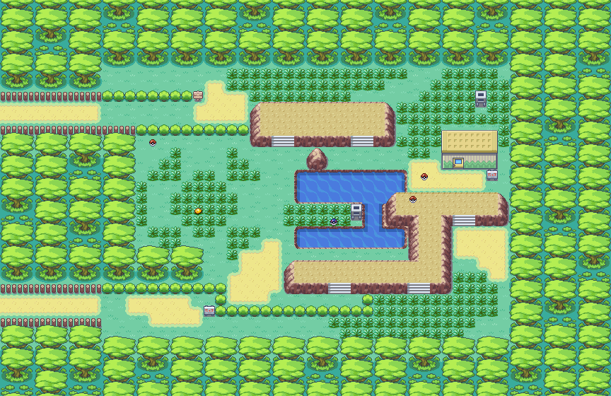

*Safari Zone: eastern area.*
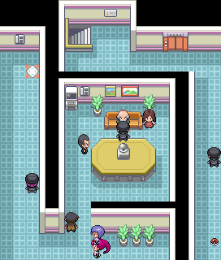

*Safari Zone: northern area.*

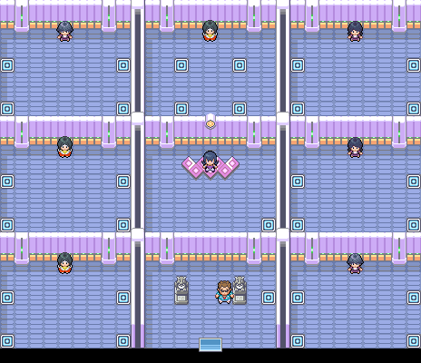

*Safari Zone: western area.*

| **🎯 OBJECTIVE** Obtain Surf and the Gold Teeth, as well as collect the unique items. |
|------------------------------------------------------------------------------------------|

## Recommended route

28. Enter and head to the central area first to collect the Leaf Stone and the Nugget.

29. Cross to the eastern area and collect the second Leaf Stone, TM11, Ultimate Potion, and Restore All.

30. Go north to collect Quick Claw, TM47 and Protein.

31. Reach the western area: collect Maximum Revive, Gold Teeth, TM32 and the hidden Revive.

32. Enter the Secret House to the west and receive HM Surf.

33. After exiting, return the Gold Teeth to the Fuchsia Guard to obtain Strength.

## ⭐ Pokémon and recommended catches

| **Pokémon / group** | **Availability** | **Value for adventure** |
|---------------------|------|---------------------------------------|
| Chansey | 1% center; 4% this | Very rare, huge HP and Special Defense |
| Scyther | 1% this; 4% north | Great physical attacker |
| Pinsir | 1% north; 4% west | Great physical attacker |
| Kangaskhan | 5-10% north | Highly recommended |
| Taurus | 10% east/west | Excellent attacker |
| Dratini / Dragonair | Super Rod | Very rare and valuable |

## ↩ Aquatic encounters

> The source guide documents the same aquatic table for the Central, Eastern, Northern and Western zones of the Safari Zone.

| Pokémon | Method | Availability |
|---|---|---|
| Slowpoke | 🏄 Surf | 5-60% |
| Slowbro | 🏄 Surf | 1-4% |
| Magikarp | 🎣 Old Rod | 30-70% |
| Poliwag | 🎣 Good Rod | 20-60% |
| Goldeen | 🎣 Super Rod | 15-40% |
| Seaking | 🎣 Super Rod | 40% |
| Dratini | 🎣 Super Rod | 4% |
| Dragonair | 🎣 Super Rod | 1% |

## 💎 Items and rewards

| **Item** | **Where / how** | **Priority** |
|--------------------------------|---------------------------|---------------|
| Leaf Stone ×2 | Center hidden and visible | High |
| Nugget | Center | Medium |
| TM11 | This | High |
| Max Potion / Restore All | This | High |
| Quick Claw / TM47 / Protein | North | High |
| Revive Maximum / TM32 | West | High |
| Gold Teeth | West | Mandatory |
| HM Surf | Secret House, west | Mandatory |

| **PRIORITY ROUTE** On the first visit, prioritize Gold Teeth and Surf. Rare catches can be attempted on subsequent visits. |
|-------------------------------------------------------------------------------------------------------------------------------------------|

## ⚠ Before continuing

- [ ] Get HM Surf

- [ ] Collect Gold Teeth

- [ ] Get HM Strength upon exit

- [ ] Collect TM11, TM47 and TM32

# 🏆 GYM: Koga

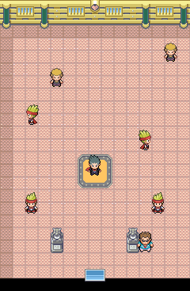

*Interior of Koga's Gym.*

| **RECOMMENDED LEVEL CAP** 50. The highest level Pokémon on Pokémon Yellow's team is taken as a reference. |
|-----------------------------------------------------------------------------------------------------------------|

| **Pokémon** | **Level** | **Type** | **Main hazard** |
|-------------|--------|--------------|---------------------------------|
| Venonat | 44 | Bug/Poison | Toxic and Sleepy |
| Venonat | 46 | Bug/Poison | Psychoray and Supersonic |
| Venonat | 48 | Bug/Poison | Psychic and Sleeping Aid |
| Venomoth | 50 | Bug/Poison | Psychic, Toxic and Double Team |

## Combat plan

- The level jump is big: prepare the team around level 50 if you respect Pokémon Yellow's cap.

- Psychic attacks are the most direct option against all your Pokémon.

- Fire and Flying type attacks work well for Bug type, but be careful with Psychic.

- Carry Antidotes, Awaken and Restore All to neutralize Toxic and Sleeping.

- Venomoth can stack Double Team: he attacks forcefully before his evasion increases too much.

| **REWARD** Soul Badge and TM06 from Pokémon Classic. |
|----------------------------------------------------|

| **NEXT VOLUME** After getting Surf and Soul Badge, you can tour Cycling Road and then unlock Saffron City and Silph Co. |
|---------------------------------------------------------------------------------------------------------------------------------------------|

---

> [← Previous](04-erika-and-rocket-hideout.md) · [General index](../README.md) · [How to use](../HOW-TO-USE-THE-GUIDE.md) · [Next →](06-silph-sabrina-and-cycling-road.md)