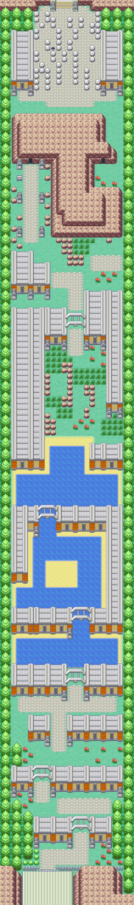
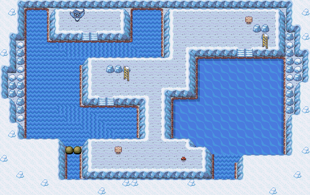
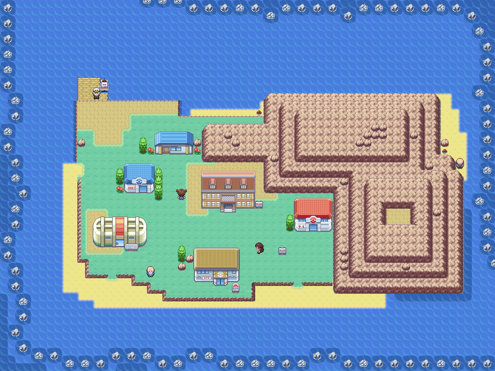
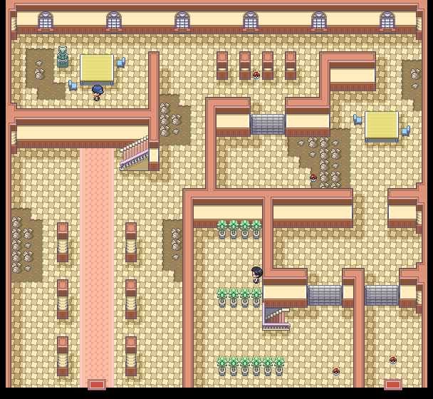
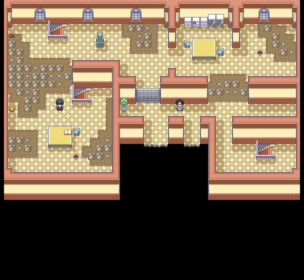
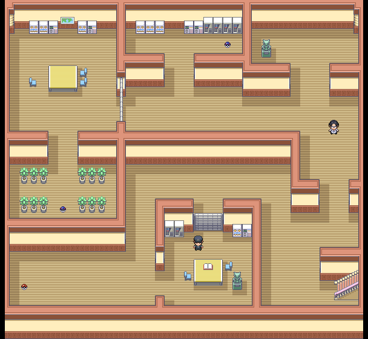
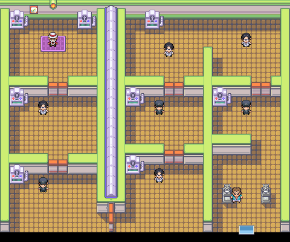
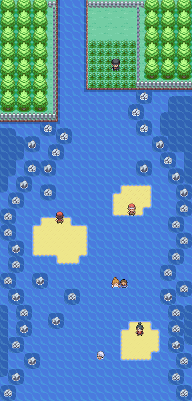

> [← Previous](06-silph-sabrina-and-cycling-road.md) · [Main index](../README.md) · [How to use](../HOW-TO-USE-THE-GUIDE.md) · [Next →](08-giovanni.md)

[English] · [Español](../../es/guia/07-islas-espuma-articuno-y-blaine.md)

**POKÉMON CLASSIC**

**v1.5**

**VOLUME 7**

**Sea routes, Seafoam Islands and Cinnabar Island**

Step-by-Step Walkthrough • Maps • Items • Trainers • Key Battles

> See [How to use the guide](../HOW-TO-USE-THE-GUIDE.md) for symbols, essential mechanics, and data criteria common to all volumes.

# Content

- Route 19

- Route 20

- Seafoam Islands and Articuno

- Cinnabar Island

- Pokémon Mansion

- Blaine's Gym

- Route 21 and return to Pallet Town

| **DATA CRITERIA** Maps, encounters, items and trainers are taken from the starter guide. Blaine's equipment and levels follow Pokémon Yellow, because the hack source only specifies his trainers and TM38. |
|--------------------------------------------------------------------------------------------------------------------------------------------------------------------------------------------------------------------------------|

# Route 19

*Town Map complete Route 19.*

| **🎯 OBJECTIVE** Leave Fuchsia City to the south and cross the first maritime section. |
|---------------------------------------------------------------------------------------------|

## Recommended route

1. Use Surf from the beach south of Fuchsia City.

2. Defeat all the swimmers; The route is linear, but some are separated from the direct route.

3. If you want a Kingler, Horsea or Staryu, take advantage of the Super Rod before advancing.

4. Continue west to Route 20 and the Seafoam Islands entrance.

## ⭐ Pokémon and recommended catches

| **Pokémon / group** | **Availability** | **Value for adventure** |
|-------------------------|-----------------------------------|------------------------------------|
| Horsea / Seadra | Surf by day; Seadra 1-5% | Good water line |
| Tentacool / Tentacruel | Surf at night | Very common and resistant |
| Staryu | Super Rod, 4-15% day / 40% night | Highly recommended if you are looking for Starmie |
| Kingler | Super Rod, 1% | Queer; great physical attack |

## ↩ Aquatic encounters

> Use 🏄 Surf to navigate or the appropriate 🎣 rod to fish.

| Pokémon | Method | Availability |
|---|---|---|
| Horsea | 🏄 Surf | Day, 30-60% |
| Seadra | 🏄 Surf | Day, 1-5% |
| Tentacool | 🏄 Surf | Night, 30-60% |
| Tentacruel | 🏄 Surf | Night, 1-5% |
| Magikarp | 🎣 Old Rod | Day and night, 30-70% |
| Goldeen | 🎣 Good Rod | Day, 20-60%; night, 20% |
| Krabby | 🎣 Good Rod | Day, 20%; night, 20-60% |
| Horsea | 🎣 Super Rod | Day, 40%; night, 4-15% |
| Staryu | 🎣 Super Rod | Day, 4-15%; night, 40% |
| Kingler | 🎣 Super Rod | Day and night, 1% |

## Trainers

| **Coach** | **Zone / reference** |
|-------------------------|------------------------|
| Tuber Richie | North zone |
| Tuber Lizzie | North zone |
| Swimmer Tony | Initial section |
| Swimmer David | Central section |
| Swimmer Douglas | Central section |
| Swimmer Matthew | Central section |
| Swimmer Lia and Tuber Luc | Double combat |
| Swimmer Alice | Southern section |
| Swimmer Connie | Southern section |
| Swimmer Axle | Final section |
| Swimmer Anya | Final section |

## ⚠ Before continuing

- [ ] Defeat all eleven trainers

- [ ] Bring cures before entering Seafoam Islands

# Route 20

*Town Map of Route 20.*

| **🎯 OBJECTIVE** Travel the sea and enter Seafoam Islands. |
|----------------------------------------------------|

## Recommended route

5. Go west from Route 19.

6. Look for the hidden Stardust along the route.

7. Defeat the trainers before entering the cave to avoid having to go back.

8. Enter Seafoam Islands; You will need Surf and Strength to complete the course comfortably.

## ⭐ Pokémon and recommended catches

| **Pokémon / group** | **Availability** | **Value for adventure** |
|-------------------------|-----------------------------------|-----------------------------|
| Horsea / Seadra | Surf by day | Optional |
| Tentacool / Tentacruel | Surf at night | Optional |
| Staryu | Super Rod, especially at night | Highly recommended |

## ↩ Aquatic encounters

> Use 🏄 Surf to navigate or the appropriate 🎣 rod to fish.

| Pokémon | Method | Availability |
|---|---|---|
| Horsea | 🏄 Surf | Day, 30-60% |
| Seadra | 🏄 Surf | Day, 1-5% |
| Tentacool | 🏄 Surf | Night, 30-60% |
| Tentacruel | 🏄 Surf | Night, 1-5% |
| Magikarp | 🎣 Old Rod | Day and night, 30-70% |
| Goldeen | 🎣 Good Rod | Day, 20-60%; night, 20% |
| Krabby | 🎣 Good Rod | Day, 20%; night, 20-60% |
| Horsea | 🎣 Super Rod | Day, 40%; night, 4-15% |
| Staryu | 🎣 Super Rod | Day, 4-15%; night, 40% |
| Kingler | 🎣 Super Rod | Day and night, 1% |

## 💎 Items and rewards

| **Item** | **Where / how** | **Priority** |
|---------------|----------------------------------|---------------|
| Stardust | 🔍 Hidden object | Medium |
| Slowbronite | Postgame, after the second Champion | Postgame |

## Trainers
| **Coach** | **Zone / reference** |
|---------------------------------------|-----------------------|
| Swimmer Barry | Eastern section |
| Swimmer Darrin | Eastern section |
| Swimmer Shirley | Eastern section |
| Camper (name pending in source) | Central island |
| Camper Irene | Central island |
| Swimmer Tiffany | Central section |
| Dragon Tamer Roger | Central section |
| Swimmer Nora | Western section |
| Swimmer Dean | Western section |
| Picnicker Missy | Western Islet |
| Swimmer Melissa | End of the route |

| **SOURCE NOTE** One of the coaches appears as “Camper Camper” in the original guide; uncertainty is preserved instead of inventing a name. |
|--------------------------------------------------------------------------------------------------------------------------------------------------------------|

## ⚠ Before continuing

- [ ] Collect Stardust

- [ ] Defeat the trainers

- [ ] Enter with Surf and Strength available

# Seafoam Islands

*Seafoam Islands, floor 1.*

*Seafoam Islands, basement 1.*

*Seafoam Islands, basement 2.*

*Seafoam Islands, basement 3.*

*Seafoam Islands, basement 4 and Articuno area.*

| **🎯 OBJECTIVE** Cross the five floors, divert the current and capture Articuno. |
|------------------------------------------------------------------------------------------|

## Recommended route

9. Push the rocks with Strength into the holes to block the lower water currents.

10. Explore each floor before going down: several objects are on detours that are easy to miss.

11. In B4F, save your game before interacting with Articuno.

12. Capture Articuno if you want an exceptional Ice Pokémon for the League.

13. Look for the western exit to continue towards Cinnabar Island.

## ⭐ Pokémon and recommended catches

| **Pokémon / group** | **Availability** | **Value for adventure** |
|---------------------|------|---------------------------|
| Squirtle | 4% on land | Rare and very valuable catch |
| Jynx | 1% on land | Strange; Ice/Psychic |
| Lapras | 1% using Surf | Very rare |
| Dewgong | 4-5% using Surf | Good Water/Ice wall |
| Articuno | Static in B4F | Legendary; top priority |

## ↩ Aquatic encounters

| Pokémon | Method | Availability |
|---|---|---|
| Seel | 🏄 Surf | 30-60% |
| Dewgong | 🏄 Surf | 4-5% |
| Lapras | 🏄 Surf | 1% |
| Magikarp | 🎣 Old Rod | 30-70% |
| Staryu | 🎣 Good Rod | 60% |
| Shellder | 🎣 Good Rod | 20% |
| Krabby | 🎣 Super Rod | 40% |
| Kingler | 🎣 Super Rod | 1-15% |

## 💎 Items and rewards

| **Item** | **Where / how** | **Priority** |
|----|-----|---------------|
| Antifreeze | 1F | Medium |
| Eternal Ice | 🔍 Hidden, 1F | High |
| Icy Melt | 🔍 Hidden, B1F | High |
| Water Stone | B1F | High |
| Relive | B1F | Medium |
| Power Stone | B2F | Very high |
| Big Pearl | B2F | Medium |
| Nugget | 🔍 Hidden, B3F | Medium |
| Water Stone | 🔍 Hidden, B4F | High |
| Ultra Ball | B4F | High |
| Gyaradosite | Postgame | Postgame |

## Trainers

| **Coach** | **Zone / reference** |
|--------------------|-----------------------|
| Black Belt Michael | Cave interior |

| **BEFORE ARTICUNO** Save the game and carry Ultra Ball, heals and a status move. Articuno can be a decisive piece against Lance. |
|-------------------------------------------------------------------------------------------------------------------------------------------------|

## ⚠ Before continuing

- [ ] Block currents

- [ ] Collect Power Stone and Water Stones

- [ ] Capture or defeat Articuno

- [ ] Exit through Cinnabar Island

# Cinnabar Island

*Town Map from Cinnabar Island.*

| **🎯 OBJECTIVE** Explore the island, collect the coastal objects and prepare access to the gym. |
|---------------------------------------------------------------------------------------------|

## Recommended route

14. Search the Pokémon Center and explore the two beaches.

15. Pick up Light Clay on the upper beach and Shell Bell on the right beach.

16. Talk to the NPCs and check the buildings before entering Pokémon Mansion.

17. The key to open the gym is obtained during the tour of the mansion.

18. After completing the mansion, return to Blaine's gym.

## ⭐ Pokémon and recommended catches

| **Pokémon / group** | **Availability** | **Value for adventure** |
|---------------------|------------------------|-------------------------------|
| Staryu / Starmie | Surf by day | Excellent Water/Psychic line |
| Dratini | 1% using Surf during the day | Very rare |
| Gyarados | 1% using Surf at night | Rare |
| Kingler / Seadra | Super Rod | Optional |

## ↩ Aquatic encounters

> Use 🏄 Surf to navigate or the indicated 🎣 rod to fish around Cinnabar Island.

| Pokémon | Method | Availability |
|---|---|---|
| Horsea | 🏄 Surf | Day, 60% |
| Staryu | 🏄 Surf | Day, 30% |
| Seadra | 🏄 Surf | Day, 5% |
| Starmie | 🏄 Surf | Day, 4% |
| Dratini | 🏄 Surf | Day, 1% |
| Tentacool | 🏄 Surf | Night, 60% |
| Psyduck | 🏄 Surf | Night, 30% |
| Tentacruel | 🏄 Surf | Night, 5% |
| Golduck | 🏄 Surf | Night, 4% |
| Gyarados | 🏄 Surf | Night, 1% |
| Magikarp | 🎣 Old Rod | Day and night, 30-70% |
| Goldeen | 🎣 Good Rod | Day, 20-60%; night, 20% |
| Krabby | 🎣 Good Rod | Day, 20%; night, 20-60% |
| Horsea | 🎣 Super Rod | Day, 40%; night, 4-15% |
| Staryu | 🎣 Super Rod | Day, 4-15%; night, 40% |
| Kingler | 🎣 Super Rod | Day, 1% |
| Seadra | 🎣 Super Rod | Night, 1% |

## 💎 Items and rewards

| **Item** | **Where / how** | **Priority** |
|------------|---------------------------|---------------|
| Light Clay | Poké Ball, top beach | High |
| Shell Bell | Poké Ball, right beach | Very high |

## Trainers

| **Coach** | **Zone / reference** |
|----------------|-----------------------|
| Gambler Ryan | Cinnabar Island |

## ⚠ Before continuing

- [ ] Pick up Light Clay

- [ ] Pick up Shell Bell

- [ ] Heal and prepare equipment for the mansion

# Pokémon Mansion

*Pokémon Mansion, floor 1.*

*Pokémon Mansion, floor 2.*

*Pokémon Mansion, floor 3.*

*Pokémon Mansion, basement 1.*

| **🎯 OBJECTIVE** Explore the four floors, collect important TMs, and find the key to the gym. |
|------------------------------------------------------------------------------------------|

## Recommended route

19. Move forward by activating the statues to open and close doors.

20. Explore 1F and 2F before using the drop gaps.

21. On 3F pick up the hidden Rare Candy and go down the correct area.

22. In B1F, register all the rooms and collect TM14 and TM22.

23. Examine the old sea map on the wall; It is related to later content.

24. Complete the course and return to the gym.

## ⭐ Pokémon and recommended catches
| **Pokémon / group** | **Availability** | **Value for adventure** |
|---------------------|------|----------------------------|
| Ponyta | 20% in 1F-3F | Rapid fire |
| Magmar | 10% in 1F-3F | Good special attacker |
| Vulpix / Growlithe | 10% / 5% | Good lines of fire |
| Muk / Weezing | 4% / 1% | Resistant |
| Ditto | 1% in B1F | Useful for parenting |

## 💎 Items and rewards

| **Item** | **Where / how** | **Priority** |
|-------------------------|------------------|---------------|
| Escape Rope | 1F | Medium |
| Protein | 1F | Medium |
| Fuel | 1F | Medium |
| Black Mud | 1F | High |
| Zinc / Calcium / More PS | 2F | Medium |
| Coal | 3F | High |
| Max Potion | 3F | High |
| Iron | 3F | Medium |
| Rare Candy | 🔍 Hidden, 3F | High |
| Restore All | B1F | High |
| Elixir | 🔍 Hidden, B1F | High |
| TM14 | B1F | Very high |
| TM22 | B1F | Very high |
| Old Sea Map | Wall, B1F | Important |
| Charizardite X/Y | Postgame | Postgame |

## Trainers

| **Coach** | **Zone / reference** |
|-------------------|-----------------------|
| Youngster Johnson | 1F |
| Scientist Ted | 1F |
| Burglar Arnie | 2F |
| Burglar Simon | 3F |
| Scientist Braydon | 3F |
| Burglar Lewis | B1F |
| Scientist Ivan | B1F |

| **KEY ITEMS** Don't leave without checking B1F: TM14, TM22, and the Old Sea Map are there. |
|---------------------------------------------------------------------------------------------|

## ⚠ Before continuing

- [ ] Collect TM14 and TM22

- [ ] Pick up the hidden Rare Candy

- [ ] Examine the Old Sea Map

- [ ] Open the gym

# 🏆 GYM: Blaine

*Interior of Blaine's Gym.*

| **RECOMMENDED LEVEL CAP** 54. The highest level Pokémon on Pokémon Yellow's team is taken as a reference. |
|-----------------------------------------------------------------------------------------------------------------|

| **Pokémon** | **Level** | **Type** | **Main hazard** |
|-------------|-----------|----------|---------------------------------------|
| Ninetales | 48 | Fire | Confusion, burns and Fire attacks |
| Rapidash | 50 | Fire | High Speed ​​and Fire Spin |
| Arcanine | 54 | Fire | High attack and powerful coverage |

## Gym trainers

| **Coach** | **Reference** |
|-------------------|------------------------|
| Burglar Quinn | Initial room |
| Scientist Erik | Gym tour |
| Scientist Avery | Gym tour |
| Burglar Ramon | Gym tour |
| Scientist Derek | Gym tour |
| Burglar Dusty | Gym tour |
| Scientist Zac | Before Blaine |
| Gym Leader Blaine | Final combat |

## Combat plan

- Water attacks are the safest response; Lapras, Blastoise, Starmie or Gyarados work very well.

- Ground and Rock are also effective, but watch the speed of Rapidash and Arcanine.

- Fire Spin can immobilize you for several turns: take enough heals and avoid prolonging the fight.

- Arcanine is the biggest danger. Save your best Water or Earth attacker for last.

- Do not use Grass, Bug or Ice Pokémon unless they are clearly faster and can ensure the KO.

| **REWARD** Volcano Badge and TM38 from Pokémon Classic. |
|----------------------------------------------------------|

# Route 21

*Route 21 South.*

*Route 21 North and access to Pallet Town.*

| **🎯 OBJECTIVE** Return to Pallet Town by sea and close the Kanto circuit. |
|--------------------------------------------------------------------------|

## Recommended route

25. Exit Cinnabar Island to the north.

26. In the southern part defeat fishermen, jugglers and swimmers.

27. In the northern part look for the hidden Pearl and explore the grass area.

28. Eevee appears with 10% on land; Tangela is rarer.

29. Continue to Pallet Town and use Fly to return to Viridian City.

## ⭐ Pokémon and recommended catches

| **Pokémon / group** | **Availability** | **Value for adventure** |
|-------------------------|-----------------------|---------------------------------------------|
| Eevee | 10% on Route 21 North | Highly recommended if you still want another evolution |
| Tangela | 1-4% | Rare |
| Horsea / Seadra | Surf by day | Optional |
| Tentacool / Tentacruel | Surf at night | Optional |

## ↩ Aquatic encounters

> Use 🏄 Surf to navigate or the appropriate 🎣 rod to fish.

| Pokémon | Method | Availability |
|---|---|---|
| Horsea | 🏄 Surf | Day, 30-60% |
| Seadra | 🏄 Surf | Day, 1-5% |
| Tentacool | 🏄 Surf | Night, 30-60% |
| Tentacruel | 🏄 Surf | Night, 1-5% |
| Magikarp | 🎣 Old Rod | Day and night, 30-70% |
| Goldeen | 🎣 Good Rod | Day, 20-60%; night, 20% |
| Krabby | 🎣 Good Rod | Day, 20%; night, 20-60% |
| Horsea | 🎣 Super Rod | Day, 40%; night, 4-15% |
| Staryu | 🎣 Super Rod | Day, 4-15%; night, 40% |
| Kingler | 🎣 Super Rod | Day and night, 1% |

## 💎 Items and rewards

| **Item** | **Where / how** | **Priority** |
|---------|-----------------------|---------------|
| Pearl | 🔍 Hidden, Route 21 North | Medium |

## Trainers

| **Coach** | **Zone / reference** |
|--------------------------|---------------------------|
| Fisherman Claude | Route 21 South |
| Fisherman Nolan | Route 21 South |
| Juggler Johan | Route 21 South |
| Swimmer Jack | Route 21 South |
| Swimmer Roland | Route 21 South |
| Swimmer Jerome | Route 21 South |
| Fisherman Wade | Route 21 North |
| Fisherman Ronald | Route 21 North |
| Swimmer Lil and Tuber Ian | Double combat, Route 21 North |
| Cooltrainer Anri | Route 21 North |
| Swimmer Spencer | Route 21 North |

## ⚠ Before continuing

- [ ] Collect the hidden Pearl

- [ ] Defeat the trainers

- [ ] Get to Pallet Town

- [ ] Return to Viridian City

| **NEXT VOLUME** With seven Badges, Viridian City's Gym is open again. Then there will be the final path to Pokémon League. |
|--------------------------------------------------------------------------------------------------------------------------------------------------------------|

---

> [← Previous](06-silph-sabrina-and-cycling-road.md) · [General index](../README.md) · [How to use](../HOW-TO-USE-THE-GUIDE.md) · [Next →](08-giovanni.md)