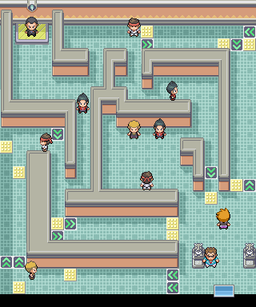

> [← Previous](07-seafoam-islands-articuno-and-blaine.md) · [Main index](../README.md) · [How to use](../HOW-TO-USE-THE-GUIDE.md) · [Next →](09-victory-road-and-pokemon-league.md)

[English] · [Español](../../es/guia/08-giovanni.md)

**POKÉMON CLASSIC**

**v1.5**

**VOLUME 8**

**Viridian City and Giovanni**

Gym • Team • Coaches • Strategy • Eighth Badge

> See [How to use the guide](../HOW-TO-USE-THE-GUIDE.md) for symbols, essential mechanics, and data criteria common to all volumes.

# Content

- Viridian City Gym

- Giovanni's Team

- Preparation and reward

| **DATA CRITERIA** Trainers and rewards come from the starter guide. Giovanni's exact team and levels were verified for Pokémon Classic v1.5. |
|---|

# 🏆 GYM: Giovanni

*Interior of Giovanni's Gym.*

| **RECOMMENDED LEVEL CAP** 50. This matches the highest level on Giovanni's Pokémon Classic v1.5 team. |
|------------------------------------------------------------------------------------------------------|

| **Pokémon** | **Level** | **Type** | **Main hazard** |
|-------------|--------|---------------|--------------------------|
| Rhyhorn | 45 | Ground/Rock | Take Down, Rock Blast, Scary Face and Earthquake |
| Dugtrio | 42 | Ground | Slash, Sand Tomb, Mud-Slap and Earthquake |
| Nidoqueen | 44 | Poison/Ground | Body Slam, Double Kick, Poison Sting and Earthquake |
| Nidoking | 45 | Poison/Ground | Thrash, Double Kick, Poison Sting and Earthquake |
| Rhyhorn | 50 | Ground/Rock | Take Down, Rock Blast, Scary Face and Earthquake |

## Gym trainers

| **Coach** | **Reference** | **Team** |
|---------------------|----------------|---|
| Rocker Cole | Gym | Arbok Lv. 39 · Tauros Lv. 39 |
| Black Belt Kiyo | Gym | Machoke Lv. 43 |
| Cooltrainer Samuel | Gym | Sandslash Lv. 37 · Sandslash Lv. 37 · Rhyhorn Lv. 38 · Nidorino Lv. 39 · Nidoking Lv. 39 |
| Cooltrainer Yuji | Gym | Sandslash Lv. 38 · Graveler Lv. 38 · Onix Lv. 38 · Graveler Lv. 38 · Marowak Lv. 38 |
| Black Belt Atsushi | Gym | Machop Lv. 40 · Machoke Lv. 40 |
| Rocker Jason | Gym | Rhyhorn Lv. 43 |
| Cooltrainer Warren | Gym | Marowak Lv. 37 · Marowak Lv. 37 · Rhyhorn Lv. 38 · Nidorina Lv. 39 · Nidoqueen Lv. 39 |
| Black Belt Takashi | Gym | Machoke Lv. 38 · Machop Lv. 38 · Machoke Lv. 38 |

## Combat plan

- Water and Ice cover almost all of his team; Lapras is especially useful.

- Grass works against Dugtrio and both Rhyhorn, but Nidoqueen and Nidoking can have dangerous coverage.

- Both Rhyhorn have a quadruple weakness to Water and Grass; take them down quickly.

- Keep the team around level 50 to respect Pokémon Classic v1.5's cap.

| **REWARD** Earth Badge, TM26 and Macho Brace in the position where Giovanni was. |
|------------------------------------------------------------------------------------------|

---
> [← Previous](07-seafoam-islands-articuno-and-blaine.md) · [General index](../README.md) · [How to use](../HOW-TO-USE-THE-GUIDE.md) · [Next →](09-victory-road-and-pokemon-league.md)
