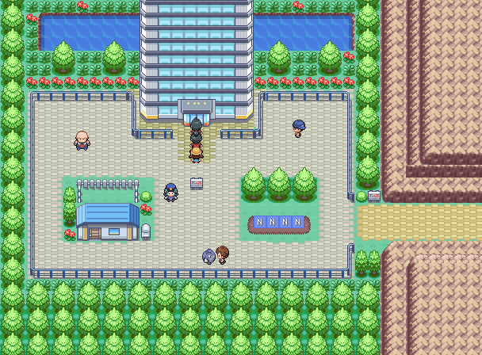

> [← Previous](10-postgame-zapdos-mewtwo-and-mew.md) · [Main index](../README.md) · [How to use](../HOW-TO-USE-THE-GUIDE.md) · [Next →](12-mega-evolution-and-100-percent.md)

[English] · [Español](../../es/guia/11-postgame-team-rocket-y-rematches.md)

**POKÉMON CLASSIC**

**v1.5**

**VOLUME 11**

**Team Rocket, Battle Points and repeatable activities**

*Step-by-step walkthrough • Original Maps • Tables • Checklists*

> See [How to Use the Guide](../HOW-TO-USE-THE-GUIDE.md) for symbols, essential mechanics, and data criteria common to all volumes.

# What remains to be done

| **CONTENTS OF THIS VOLUME** |
|--------------------------------------------------------------------------------------------------------------------------------------------------------------------------------|
| Second takeover of Silph Co., leader rematches, battles for Battle Points, reused Battle Tower, daily Rocket Fugitives quest, and special trainers/challenges. |

- The original guide confirms these systems and their locations. Gym rematch teams were verified for Pokémon Classic v1.5; exact Battle Point payouts are still not documented here.

- This section preserves exactly what the source does document and marks missing details as unspecified.

# Second takeover of Silph Co.

| **🎯 OBJECTIVE** |
|-------------------------------------------------------------------------------------------------|
| Return to the building to complete the Team Rocket epilogue and unlock repeatable battles. |

*Silph Co., 1F. See the [maps for all eleven floors in Volume 6](06-silph-sabrina-and-cycling-road.md#silph-co).*

## Step-by-step walkthrough

1. Return to Saffron City and enter Silph Co.

2. The guide points out a “Second Rocket Take-over” in the postgame.

3. Three additional Rocket Grunts appear in 1F and another postgame Rocket Grunt appears in 3F.

4. Move through the building using the elevators and teleportation panels you already know.

5. Defeat the Postgame Rocket Leader.

6. You can then face the President of Silph in a battle that awards Battle Points and supports rematch.

7. The guide lists a Master Ball as a daily reward for defeating the Silph President in 11F.

## 💎 Important objects

| **Item** | **Location** | **Priority** |
|-------------|---------------------------------------------------|---------------|
| Master Ball | Silph President's Daily Reward, 11F | Maximum |
| Alakazite | Mr. Psychic, after winning the League for the second time | Mega |

## Trainers/fights

| **Coach** | **Zone or function** | **Team** |
|-------------------------|-------------------------------------|---|
| Rocket Grunts ×3 | 1F, postgame | **Grunt 1:** Golbat Lv. 50 · Sandslash Lv. 50 · Kingler Lv. 50 · Raticate Lv. 50 **Grunt 2:** Raticate Lv. 50 · Onix Lv. 50 · Victreebel Lv. 50 · Tauros Lv. 50 **Grunt 3:** Golem Lv. 50 · Kangaskhan Lv. 50 · Poliwrath Lv. 50 · Fearow Lv. 50 |
| Rocket Grunt | 3F, postgame | Golbat Lv. 50 · Sandslash Lv. 50 · Kingler Lv. 50 · Raticate Lv. 50 · Magmar Lv. 50 |
| Postgame Rocket Leader | End of the new assault | Arbok Lv. 55 · Rhyhorn Lv. 55 · Scyther Lv. 55 · Raticate Lv. 55 · Muk Lv. 55 |
| Silph President | Combat for Battle Points / rematch | Tauros Lv. 60 · Snorlax Lv. 60 · Chansey Lv. 60 · Lapras Lv. 60 · Alakazam Lv. 60 · Persian Lv. 60 |

> [!NOTE]
> These battle teams were verified for Pokémon Classic v1.5.

## Checklist

**☐** Complete the second take

**☐** Defeat the Rocket Leader

**☐** Unlock the President's rematch

**☐** Collect daily reward when applicable

# Rematches for Battle Points

| **HOW IT WORKS** |
|------------------|
| The Gym Leaders and rival offer Battle Point rematches in their Gyms. All eight teams contain six Pokémon. |

| **Rival / Leader** | **Location** | **Rematch team** |
|---------------------|--------------|------------------|
| Brock | Pewter City Gym | Onix · Golem · Omastar · Kabutops · Aerodactyl · Rhydon (all Lv. 65) |
| Misty | Cerulean City Gym | Starmie · Golduck · Seaking · Lapras · Slowbro · Blastoise (all Lv. 65) |
| Lt. Surge | Vermilion City Gym | Raichu · Magneton · Electabuzz · Electrode · Jolteon · Electrode (all Lv. 65) |
| Erika | Celadon City Gym | Tangela · Vileplume · Victreebel · Venusaur · Exeggutor · Parasect (all Lv. 65) |
| Koga | Fuchsia City Gym | Weezing · Muk · Venomoth · Scyther · Golbat · Tentacruel (all Lv. 65) |
| Sabrina | Saffron City Gym | Alakazam · Mr. Mime · Hypno · Slowbro · Jynx · Exeggutor (all Lv. 65) |
| Blaine | Cinnabar Island Gym | Arcanine · Ninetales · Charizard · Magmar · Flareon · Rapidash (all Lv. 65) |
| Rival | Viridian City Gym | **Jolteon:** Sandslash · Exeggutor · Alakazam · Ninetales · Cloyster (Lv. 65) · Jolteon (Lv. 70) **Flareon:** Sandslash · Exeggutor · Alakazam · Magneton · Cloyster (Lv. 65) · Flareon (Lv. 70) **Vaporeon:** Sandslash · Exeggutor · Alakazam · Magneton · Ninetales (Lv. 65) · Vaporeon (Lv. 70) |

| **Other rematch** | **Location** | **Team** |
|-------------------|--------------|----------|
| Silph President | Silph Co. 11F | Tauros · Snorlax · Chansey · Lapras · Alakazam · Persian (all Lv. 60) |

> [!NOTE]
> Viridian City Gym does not contain a Giovanni rematch: the rival takes that slot. The Eevee evolution and two variable party members depend on your first battles against him.

- Start with the initial leaders to measure the difficulty and continue towards the last gyms.

- Use points in the Battle Tower, which in this version functions mainly as a store.

- The guide's FAQ indicates that in the postgame you can purchase an IV-maximizing item with Battle Points.

## Checklist

**☐** Complete each rematch at least once

**☐** Note which fights restart daily
**☐** Save Battle Points for the IV item

# BattleTower

| **🎯 OBJECTIVE** |
|-----------------------------------------------------------------------------|
| Visit the reused tower and spend the Battle Points earned. |

*Original exterior of the Battle Tower.*

## Step-by-step walkthrough

8. Go outside the Indigo Plateau and enter the Battle Tower area.

9. Collect the Cueball Punk Red Card if you didn't get it before.

10. The original tower is broken and could not be repaired; Pokémon Classic reuses it as a shop to spend Battle Points.

11. Check all the sellers and compare prices before you spend.

12. Prioritize the IV-maximizing postgame item if you're looking to optimize your team.

13. The guide does not list the complete inventory or prices, so it is best to check them directly in your version of the game.

## 💎 Important objects

| **Item** | **Location** | **Priority** |
|--------------------------|----------|---------------|
| Red Card | Cueball Punk, outdoor | Optional |
| IV-maximizing item | Battle Points Store | Very high |

| **SOURCE LIMITATION** |
|-------------------------------------------------------------------------------------------------------|
| A complete list of products or prices is not documented. This volume does not fill those gaps with external data. |

## Checklist

**☐** Visit all sellers

**☐** Buy the IV upgrade when you have points

**☐** Keep points for rare items

# Rocket Fugitives: daily route

| **DAILY MISSION** |
|---------------------------------------------------------------------------------------------------------------------------------------------------------------------------|
| The guide describes a daily mission to locate Rocket fugitives. Many maps indicate possible spawn points; The specific selection may vary depending on the day. |

| **Zone** | **Guide Hint** |
|---------------------------|---------------------------------------------|
| Route 1 | Near the exit towards Viridian City |
| Route 2 | North of Diglett's Cave entrance |
| Route 2 | Near the Ziuela/Lum berry |
| Pewter City | Next to the museum, upper right corner |
| Route 4 | In the grass |
| Route 4 | Near Cerulean Cave |
| Route 5 | Grass on the Nursery |
| Route 6 | Top Right Berry Patch |
| Route 7 | Location indicated as a post-game event |
| Route 8 | Location indicated as a post-game event |
| Vermilion City / S.S. Anne | Rocket Fugitive Event |
| Diglett's Cave | Inside the cave |
| Celadon City | To the right of the Pokémon Center, between trees |
| Route 10 | Postgame location indicated on the route |
| Route 11 | Postgame Event |
| Route 12 | Postgame Event |
| Route 13 | Postgame Event |
| Route 14 | Postgame Event |
| Route 15 | Postgame Event |
| Route 16 | Postgame Event |
| Route 17 | Postgame Event |
| Route 18 | Postgame Event |
| Route 19 | Postgame Event |
| Route 20 | Postgame Event |
| Route 21 north | Postgame Event |
| Route 21 south | Postgame Event |
| Route 22 | Postgame Event |

- Talk to NPCs related to the quest to find out if there is an active objective.

- Use Fly to first check cities and points near Pokémon Centers.

- Then follow the short routes and leave the caves or water routes for last.

- The guide does not specify the exact point, frequency or reward in all cases; the available wording is preserved.

## Checklist

**☐** Check urban points

**☐** Review routes 1-8

**☐** Review routes 10-18

**☐** Review water routes 19-21

**☐** Review Route 22

# Special trainers and extra activities

| **🎯 OBJECTIVE** |
|-----------------------------------------------------------------------------|
| Complete the secondary challenges that the guide distributes throughout Kanto. |

## Step-by-step walkthrough

14. Visit Cooltrainer Erin's house in Viridian Forest and talk to her during the post-game.

15. Return to the Saffron City Karate Dojo: it is used for EV training and allows you to prove your worth to obtain Hitmonchan and Hitmonlee. Bring Fresh Water to restore the trainer team.
16. Check the movement tutors on the second floor of the Pokémon Centers and the field tutors that you left pending.

17. Replay the Silph President battle for the daily reward when available.

18. Check out Lass Kairi on Faraway Island after you've captured the island encounter and completed the first championship.

19. Use DexNav to search for rare Pokémon, abilities, and high IVs during daily tasks.

## 💎 Important objects

| **Item** | **Location** | **Priority** |
|-------------------------|---------------------------------------------|-------------------|
| Hitmonchan and Hitmonlee | Saffron City Dojo | Gifts / challenge |
| Fresh Water | Necessary to restore the Dojo team | Utility |
| Master Ball daily | Silph President | Repeatable |

## Trainers/fights

| **Coach** | **Zone or function** | **Team** |
|------------------------|------------------------|---|
| Cooltrainer Erin | Viridian Forest Event | Wartortle Lv. 65 · Haunter Lv. 65 · Clefairy Lv. 65 · Jolteon Lv. 65 · Flareon Lv. 65 · Vaporeon Lv. 72 |
| Dojo Trainers | EV Training | **Master:** Wigglytuff Lv. 37 · Machamp Lv. 37 · Alakazam Lv. 37 · Golem Lv. 37 · Blastoise Lv. 37 · Raichu Lv. 37 **HP:** Wigglytuff Lv. 35 · Wigglytuff Lv. 35 · Wigglytuff Lv. 35 · Wigglytuff Lv. 35 **Attack:** Machamp Lv. 35 · Machamp Lv. 35 · Machamp Lv. 35 · Machamp Lv. 35 **Special Attack:** Alakazam Lv. 35 · Alakazam Lv. 35 · Alakazam Lv. 35 · Alakazam Lv. 35 **Defense:** Golem Lv. 35 · Golem Lv. 35 · Golem Lv. 35 · Golem Lv. 35 **Special Defense:** Blastoise Lv. 35 · Blastoise Lv. 35 · Blastoise Lv. 35 · Blastoise Lv. 35 **Speed:** Raichu Lv. 35 · Raichu Lv. 35 · Raichu Lv. 35 · Raichu Lv. 35 |
| Lass Kairi | Faraway Island | Vaporeon Lv. 75 · Jigglypuff Lv. 65 · Aerodactyl Lv. 65 · Charizard Lv. 65 · Butterfree Lv. 65 · Mew Lv. 65 |
| Silph President | Daily Combat / BP | Tauros Lv. 60 · Snorlax Lv. 60 · Chansey Lv. 60 · Lapras Lv. 60 · Alakazam Lv. 60 · Persian Lv. 60 |

## Checklist

**☐** Complete Erin's Event

**☐** Get both Hitmon

**☐** Review pending tutors

**☐** Complete Kairi Event

---

> [← Previous](10-postgame-zapdos-mewtwo-and-mew.md) · [General index](../README.md) · [How to use](../HOW-TO-USE-THE-GUIDE.md) · [Next →](12-mega-evolution-and-100-percent.md)
