> [← Anterior](../README.md) · [Índice general](../README.md) · [Cómo usar](../COMO-USAR-LA-GUIA.md) · [Siguiente →](02-misty-y-cabo-celeste.md)

[Español] · [English](../../en/guide/01-start-brock-and-mt-moon.md)

**POKÉMON CLASSIC**

**v1.5**

**VOLUMEN 1**

**De Pueblo Paleta a Ciudad Celeste**

Recorrido paso a paso • Mapas • Objetos • Pokémon • Entrenadores • Checklists

> Consulta [Cómo usar la guía](../COMO-USAR-LA-GUIA.md) para conocer los símbolos, las mecánicas esenciales y el criterio de datos común a todos los volúmenes.

# Contenido

- Pueblo Paleta — inicio, PC y entrega del paquete

- Ruta 1 y Ciudad Verde — Primer trayecto y recados de Oak

- Ruta 22 — Capturas tempranas y combates del rival

- Ruta 2 y Bosque Verde — Acceso a Ciudad Plateada

- Ciudad Plateada y Brock — Primera medalla

- Ruta 3 — Camino al Monte Moon

- Monte Moon — Fósil, objetos y Team Rocket

- Ruta 4 y Ciudad Celeste — Salida de la cueva y cierre del volumen

# Pueblo Paleta

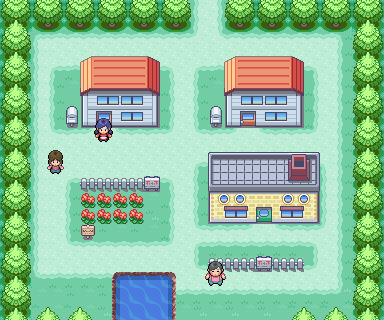

Mapa de Pueblo Paleta extraído de la guía original.

## 🎯 Objetivo

<table>
<colgroup>
<col style="max-width:100%;height:auto" />
</colgroup>
<thead>
<tr class="header">
<th>
<strong>🎯 Salir con Pikachu, entregar el Paquete de Oak y recibir la Pokédex</strong>

La aventura comienza con un pequeño trayecto de ida y vuelta entre Pueblo Paleta y Ciudad Verde.
</th>
</tr>
</thead>
<tbody>
</tbody>
</table>

## Recorrido paso a paso

**1.** Revisa el PC de tu habitación y recoge los regalos de tu padre.

**2.** Sal de casa e intenta abandonar el pueblo por el norte. Continúa la escena inicial hasta recibir a Pikachu.

**3.** Antes de marcharte, habla con los personajes disponibles y revisa el laboratorio.

**4.** Sube por la Ruta 1 hasta Ciudad Verde. En la tienda recibirás el Paquete de Oak durante la primera visita.

**5.** Regresa al laboratorio de Oak para entregar el paquete y recibir la Pokédex.

**6.** Vuelve a dirigirte a Ciudad Verde. A partir de aquí ya puedes comprar Poké Balls y empezar las capturas.

## 💎 Objetos y recompensas

| **Objeto**                | **Cómo se obtiene**               | **Importancia**      |
|---------------------------|-----------------------------------|----------------------|
| PokéGear                  | Progreso inicial en Pueblo Paleta | Sistema clave        |
| Pokédex                   | Tras entregar el Paquete de Oak   | Obligatoria          |
| Regalos del padre         | Revisando el PC de tu habitación  | No olvidarlos        |
| Catching/Oval/Shiny Charm | Cedar, en postgame                | No disponibles ahora |

- [ ] Revisaste el PC.

- [ ] Recibiste a Pikachu.

- [ ] Entregaste el Paquete de Oak.

- [ ] Tienes Pokédex y Poké Balls.

# Ruta 1

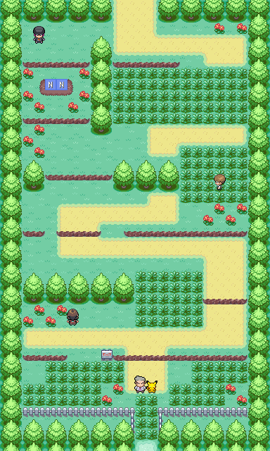

Ruta 1: conecta Pueblo Paleta con Ciudad Verde.

**1.** Habla con el NPC cercano a la salida de Pueblo Paleta para recibir una Poción.

**2.** Recoge las bayas de los dos cultivos: una Oran y una Pecha.

**3.** En la primera subida no necesitas capturar nada; tras recibir la Pokédex, regresa y completa tus primeras capturas.

**4.** Usa los desniveles para bajar rápidamente cuando vuelvas a Pueblo Paleta.

| **Pokémon** | **Día** | **Noche** | **Valor ahora**                          |
|-------------|---------|-----------|------------------------------------------|
| Pidgey      | 10-20 % | 1-10 %    | Buen volador temprano; no imprescindible |
| Rattata     | 1-5 %   | 10-20 %   | Útil al inicio, pero fácil de sustituir  |

<table>
<colgroup>
<col style="max-width:100%;height:auto" />
</colgroup>
<thead>
<tr class="header">
<th>
<strong>⭐ Captura recomendada</strong>

Pidgey es cómodo para el principio, pero el Volumen 1 ofrece opciones más valiosas en Ruta 22, Bosque Verde y Ruta 2.
</th>
</tr>
</thead>
<tbody>
</tbody>
</table>

## 💎 Objetos confirmados

- Poción — entregada por un NPC cerca de la salida de Pueblo Paleta.

- Baya Oran — cultivo.

- Baya Pecha — cultivo.

# Ciudad Verde

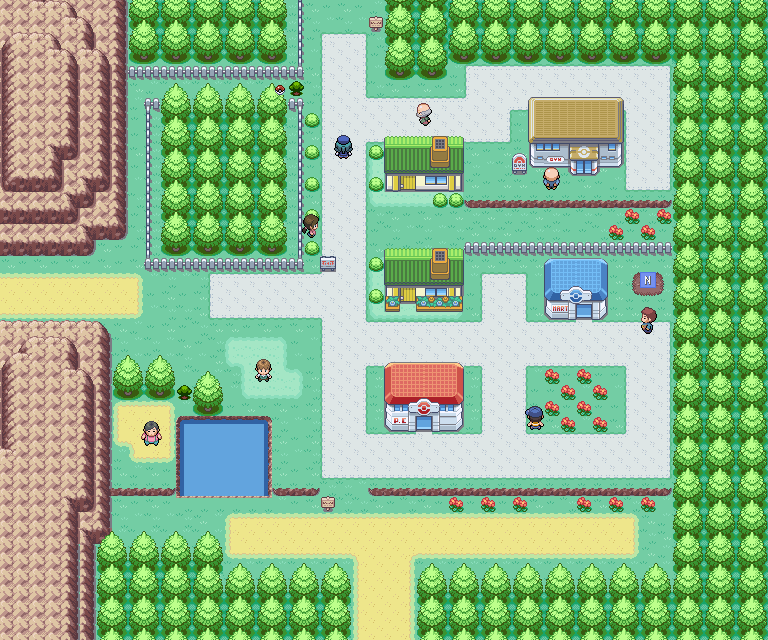

Ciudad Verde. La zona de agua y el tutor de Dream Eater se aprovechan más adelante.

**1.** En tu primera visita, entra en la tienda y recoge el Paquete de Oak.

**2.** Tras devolverlo, vuelve a la ciudad, cura al equipo y compra Poké Balls, Pociones y algún Antídoto.

**3.** Recoge la Poción visible en forma de Poké Ball.

**4.** Antes de entrar al Bosque Verde, haz el desvío opcional a Ruta 22 para capturar Pokémon mejores y enfrentarte al rival.

| **Contenido**     | **Disponible ahora** | **Notas**                         |
|-------------------|----------------------|-----------------------------------|
| Paquete de Oak    | Sí, primera visita   | Debes devolverlo en Pueblo Paleta |
| Poción visible    | Sí                   | Recógela antes de salir           |
| Cultivo vacío     | Sí                   | Podrás plantar una baya           |
| Tutor Dream Eater | No                   | Está al otro lado del agua        |
| Pesca y Surf      | No                   | Regresa con cañas/Surf            |

<table>
<colgroup>
<col style="max-width:100%;height:auto" />
</colgroup>
<thead>
<tr class="header">
<th>
<strong>🛒 Preparación de compras</strong>

Lleva al menos 5-8 Poké Balls, varias Pociones y 2 Antídotos. El Bosque Verde tiene Pokémon de tipo Veneno y dos Antídotos recogibles, pero conviene entrar preparado.
</th>
</tr>
</thead>
<tbody>
</tbody>
</table>

## ↩ Encuentros acuáticos

> Vuelve cuando dispongas de 🏄 Surf o de la 🎣 caña indicada.

| Pokémon | Método | Disponibilidad |
|---|---|---|
| Slowpoke | 🏄 Surf | Día, 30-60 % |
| Slowbro | 🏄 Surf | Día, 1-4 % |
| Psyduck | 🏄 Surf | Noche, 5-60 % |
| Golduck | 🏄 Surf | Noche, 1-4 % |
| Magikarp | 🎣 Caña Vieja | Día y noche, 30-70 % |
| Goldeen | 🎣 Caña Buena | Día, 20-60 %; noche, 20 % |
| Poliwag | 🎣 Caña Buena | Día, 20 %; noche, 20-60 % |
| Shellder | 🎣 Supercaña | Día, 1-40 %; noche, 40 % |
| Krabby | 🎣 Supercaña | Día, 40 %; noche, 1-40 % |

# Ruta 22

Ruta 22, al oeste de Ciudad Verde.

## ⭐ Por qué debes venir ahora

<table>
<colgroup>
<col style="max-width:100%;height:auto" />
</colgroup>
<thead>
<tr class="header">
<th>
<strong>⭐ La mejor zona para ampliar el equipo antes de Brock</strong>

Aquí aparecen Nidoran♀, Nidoran♂ y Mankey. La fuente también registra dos combates del rival: uno opcional y otro obligatorio.
</th>
</tr>
</thead>
<tbody>
</tbody>
</table>

**1.** Sal de Ciudad Verde por el oeste y recorre la hierba antes de avanzar demasiado.

**2.** Captura un Mankey si quieres una respuesta directa contra Pokémon de tipo Roca.

**3.** Captura Nidoran♂ o Nidoran♀ si te interesa entrenar una evolución con gran cobertura durante toda la aventura.

**4.** Cura y guarda antes de aproximarte a la zona del rival. La guía fuente no detalla los equipos, así que conviene entrar con varios Pokémon entrenados.

**5.** Tras explorar y combatir, regresa a Ciudad Verde; la Liga permanece bloqueada para esta fase.

| **Pokémon** | **Frecuencia**           | **Recomendación**                      |
|-------------|--------------------------|----------------------------------------|
| Nidoran♀    | 5-20 % día/noche         | Muy buena opción a largo plazo         |
| Nidoran♂    | 5-20 % día/noche         | Muy buena opción a largo plazo         |
| Mankey      | 10 % de día              | Especialmente útil antes de Brock      |
| Spearow     | 10 % de día              | Atacante volador temprano              |
| Rattata     | 1-4 % día / 1-10 % noche | Prescindible si ya tienes alternativas |

<table>
<colgroup>
<col style="max-width:100%;height:auto" />
</colgroup>
<thead>
<tr class="header">
<th>
<strong>⚠ Datos no publicados</strong>

La guía fuente solo identifica “Rival Optional” y “Rival Mandatory”; no incluye niveles, movimientos ni composición. Esta edición no los inventa.
</th>
</tr>
</thead>
<tbody>
</tbody>
</table>

- [ ] Capturaste al menos una respuesta para Brock.

- [ ] Curaste tras los combates del rival.

- [ ] Compraste Antídotos antes del Bosque Verde.

# Ruta 2 — tramo sur

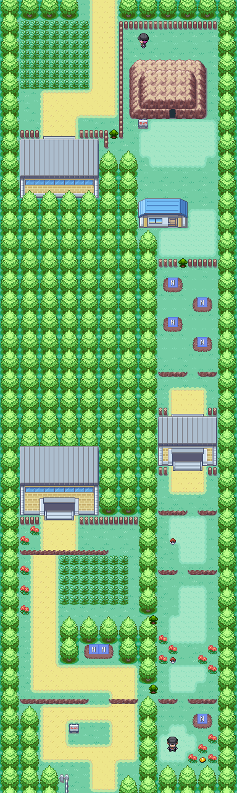

Ruta 2 completa. En esta etapa solo podrás recorrer los tramos conectados por el Bosque Verde.

| **Objeto**      | **Estado**                             |
|-----------------|----------------------------------------|
| Éter            | Poké Ball visible                      |
| Antiparalizador | Poké Ball visible                      |
| HM Flash        | Cedar después del Gimnasio 2           |
| Pidgeotita      | Tras completar por segunda vez la Liga |

| **Pokémon** | **Día** | **Noche** |
|-------------|---------|-----------|
| Rattata     | 2 %     | 10-20 %   |
| Pidgey      | 5-20 %  | 10 %      |
| Nidoran♂    | 1-10 %  | 1-10 %    |
| Nidoran♀    | 1-4 %   | 1-5 %     |
| Mr. Mime    | —       | 10 %      |

<table>
<colgroup>
<col style="max-width:100%;height:auto" />
</colgroup>
<thead>
<tr class="header">
<th>
<strong>⭐ Oportunidad nocturna</strong>

Mr. Mime aparece por la noche según la fuente. Es una captura rara y opcional; no necesitas retrasar la historia si prefieres continuar.
</th>
</tr>
</thead>
<tbody>
</tbody>
</table>

# Bosque Verde

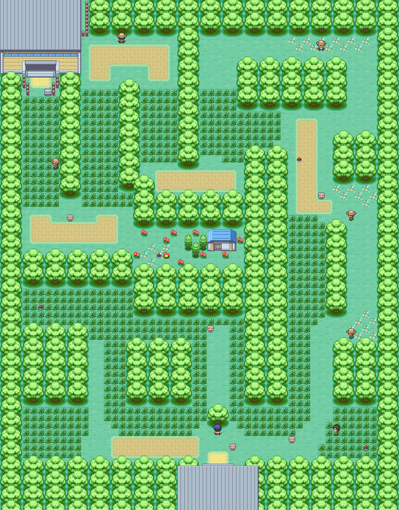

Bosque Verde. El mapa muestra el recorrido principal, objetos y entrenadores.

**1.** Al entrar, revisa la zona izquierda del primer árbol: hay un Antídoto oculto.

**2.** Recorre todos los desvíos para recoger Poké Ball, dos Pociones y otro Antídoto.

**3.** Busca la Miracle Seed oculta; será útil cuando consigas un Pokémon de tipo Planta.

**4.** Derrota a los cinco Cazabichos para ganar experiencia antes del gimnasio.

**5.** Antes de la salida hacia Ciudad Plateada, recoge la Poción oculta situada frente al último entrenador.

| **Pokémon** | **Frecuencia**      | **Comentario**                               |
|-------------|---------------------|----------------------------------------------|
| Caterpie    | 10-20 % día/noche   | Evoluciona rápido; Butterfree aporta estados |
| Weedle      | 10-20 % día/noche   | Evolución temprana ofensiva                  |
| Metapod     | 5-10 % día/noche    | Menos cómodo que criar Caterpie              |
| Kakuna      | 5-10 % día/noche    | Menos cómodo que criar Weedle                |
| Pikachu     | 1 % día / 4 % noche | Redundante con tu compañero                  |
| Bulbasaur   | 4 % día / 1 % noche | Captura rara y excelente para Brock          |

| **Objeto**   | **Tipo**                           |
|--------------|------------------------------------|
| Antídoto     | 🔍 Oculto, izquierda del primer árbol |
| Miracle Seed | 🔍 Oculto                             |
| Poké Ball    | Visible                            |
| Poción x2    | Visibles                           |
| Antídoto     | Visible                            |
| Poción       | 🔍 Oculta frente al último entrenador |
| Beedrillita  | Solo postgame                      |

## Entrenadores

- Bug Catcher Rick

- Bug Catcher Doug

- Bug Catcher Anthony

- Bug Catcher Charlie

- Bug Catcher Sammy

<table>
<colgroup>
<col style="max-width:100%;height:auto" />
</colgroup>
<thead>
<tr class="header">
<th>
<strong>⭐ Captura destacada</strong>

Bulbasaur es raro, pero facilita mucho el primer gimnasio. No es obligatorio: Mankey también cubre esa función y requiere menos tiempo de búsqueda.
</th>
</tr>
</thead>
<tbody>
</tbody>
</table>

- [ ] Recogiste los dos objetos ocultos principales.

- [ ] Derrotaste a los cinco entrenadores.

- [ ] Sales con el equipo curado y varias Pociones.

# Ciudad Plateada y Brock

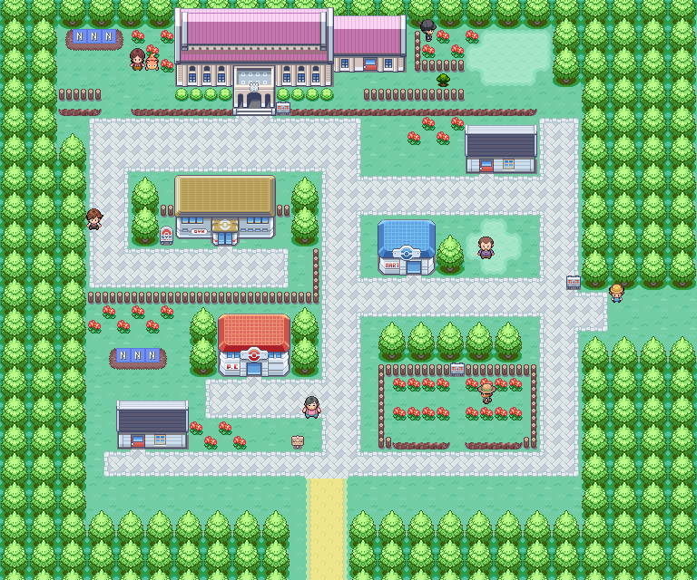

Ciudad Plateada. El gimnasio está en la zona norte y el museo en la parte superior.

# Antes del gimnasio

**1.** Cura al equipo y revisa la ciudad antes de entrar al gimnasio.

**2.** Busca la Poké Ball oculta en la hierba clara de la esquina superior derecha.

**3.** Revisa los cultivos: Oran, Persim y Pecha, además de tres parcelas vacías.

**4.** Puedes “cuidar” al Slowpoke de su dueño para recibir una baya aleatoria.

**5.** El museo contiene el Old Amber, pero parte de su contenido se desarrollará más adelante.

| **Objeto/actividad**         | **Cómo obtenerlo**                                   |
|------------------------------|------------------------------------------------------|
| Poké Ball oculta             | Hierba clara de la esquina superior derecha          |
| Baya aleatoria               | Ayudando al dueño de Slowpoke                        |
| Old Amber                    | Museo de Ciudad Plateada                             |
| Fósil Helix o Dome del museo | ↩ Más adelante, tras volver con noticias de Aerodactyl |

| **🏆 GIMNASIO DE CIUDAD PLATEADA** |
|------------------------------------|

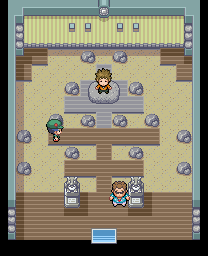

Interior del Gimnasio de Ciudad Plateada.

# 🏆 Brock

| **LEVEL CAP RECOMENDADO** 12. Se toma como referencia el Pokémon de mayor nivel del equipo de Pokémon Amarillo. |
|---------------------------------------------------------------------------------------------------------------|

| **Pokémon** | **Nivel** | **Tipo**      | **Peligro principal**               |
|-------------|-----------|---------------|--------------------------------------|
| Geodude     | 10        | Roca/Tierra   | Gran Defensa física                  |
| Onix        | 12        | Roca/Tierra   | Defensa y velocidad elevadas al inicio |

| **Dato**                     | **Información**                                                                                      |
|------------------------------|------------------------------------------------------------------------------------------------------|
| Entrenadores                 | Camper Liam y Líder Brock                                                                            |
| Recompensa en Pokémon Classic | TM39                                                                                                |
| Rematch                      | Combate por Battle Points en el posjuego                                                             |
| Referencia usada             | Pokémon Amarillo para Pokémon y niveles; guía de Pokémon Classic para recompensas y cambios del hack |

<table>
<colgroup>
<col style="max-width:100%;height:auto" />
</colgroup>
<thead>
<tr class="header">
<th>ℹ Referencia de combate 
La guía de Pokémon Classic no publica el equipo completo de Brock. Como el hack reproduce Pokémon Amarillo, esta guía usa como referencia a Geodude Nv. 10 y Onix Nv. 12. El level cap recomendado es 12. Las recompensas y cambios se mantienen según la documentación específica de Pokémon Classic.</th>
</tr>
</thead>
<tbody>
</tbody>
</table>

## Preparación recomendada (editorial)

- Usa a Mankey o Bulbasaur como respuesta principal frente a los Pokémon de tipo Roca asociados a Brock.

- No dependas exclusivamente de Pikachu: sus ataques eléctricos no son una buena respuesta contra combinaciones Roca/Tierra.

- Si aplicas un límite de nivel, usa el nivel 12 de Onix como referencia. Es un valor heredado de Pokémon Amarillo, no un cap publicado por la documentación de Pokémon Classic.

- Guarda antes de Brock y lleva varias Pociones.

- [ ] Venciste a Camper Liam.

- [ ] Derrotaste a Brock.

- [ ] Recibiste la TM39.

- [ ] Curaste y abasteciste al equipo antes de Ruta 3.

# Ruta 3

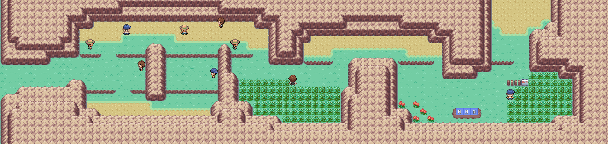

Ruta 3: recorrido lineal hacia la entrada del Monte Moon.

**1.** Sal de Ciudad Plateada por el este y avanza derrotando a los ocho entrenadores.

**2.** Revisa la ruta en busca de una Baya Oran oculta.

**3.** Los cultivos contienen Persim, Pecha y Oran.

**4.** Captura Sandshrew si quieres un tipo Tierra temprano; Mankey vuelve a aparecer de día.

**5.** Cura en el Centro Pokémon próximo a la entrada del Monte Moon y compra Antídotos, Antiparalizadores y Cuerdas Huida.

| **Pokémon** | **Frecuencia**            |
|-------------|---------------------------|
| Spearow     | 5-20 % día/noche          |
| Rattata     | 5-10 % día / 1-20 % noche |
| Sandshrew   | 1-10 % día/noche          |
| Mankey      | 1-10 % de día             |

| **Entrenadores**   |     |
|--------------------|-----|
| Lass Janice        |     |
| Bug Catcher Colton |     |
| Youngster Ben      |     |
| Bug Catcher Greg   |     |
| Youngster Calvin   |     |
| Lass Sally         |     |
| Bug Catcher James  |     |
| Lass Robin         |     |

<table>
<colgroup>
<col style="max-width:100%;height:auto" />
</colgroup>
<thead>
<tr class="header">
<th>
<strong>⚠ Punto de preparación</strong>

Monte Moon es más largo que las rutas anteriores y contiene cuatro Reclutas Rocket más un combate doble contra Jessie y James.
</th>
</tr>
</thead>
<tbody>
</tbody>
</table>

# Monte Moon

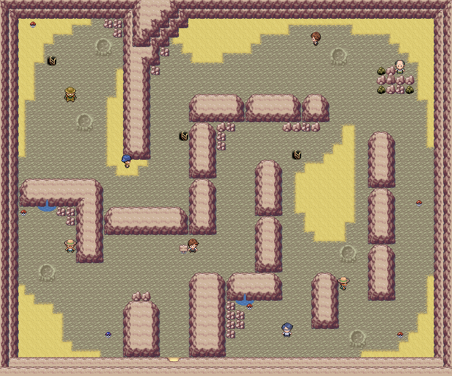

Monte Moon, planta 1.

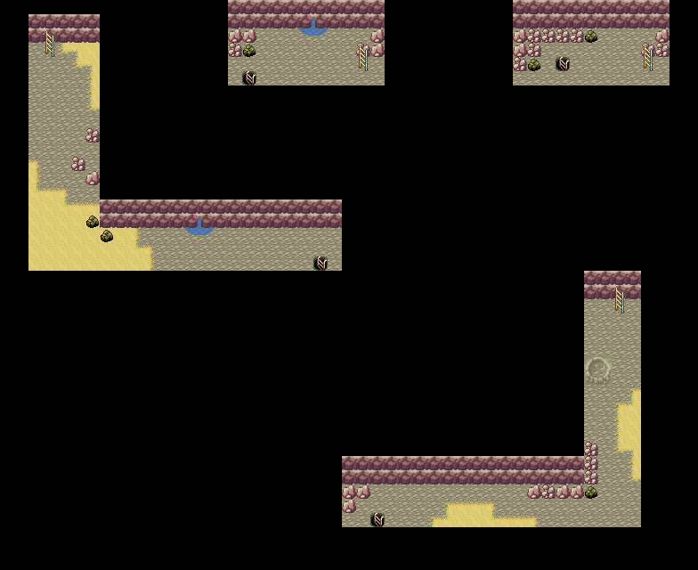

Monte Moon, sótano 1: pequeños corredores conectados desde la planta principal.

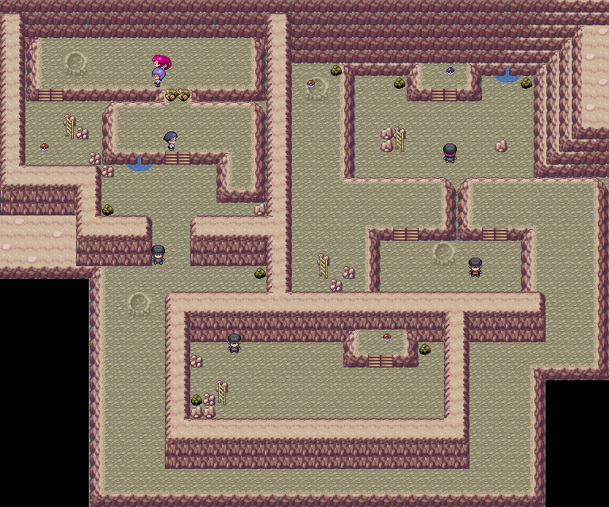

Monte Moon, sótano 2: zona de Rocket y fósiles.

## 🎯 Objetivo principal

<table>
<colgroup>
<col style="max-width:100%;height:auto" />
</colgroup>
<thead>
<tr class="header">
<th>
<strong>🎯 Atravesar la cueva, elegir un fósil y derrotar al Team Rocket</strong>

Explora cada planta antes de salir: aquí hay dos Piedras Luna, varias MT y objetos que merece la pena recoger.
</th>
</tr>
</thead>
<tbody>
</tbody>
</table>

## Recorrido recomendado

**1.** Explora por completo la planta 1 antes de bajar. Recoge TM09, Antiparalizador, Poción, Caramelo Raro, Cuerda Huida y Piedra Luna.

**2.** En B1F revisa las rocas: la fuente registra tres Tiny Mushroom y tres Big Mushroom.

**3.** En B2F derrota a los cuatro Reclutas Rocket y recoge los objetos de los desvíos.

**4.** Busca el Éter oculto y golpea/revisa la roca que contiene otra Piedra Luna.

**5.** Antes de abandonar la cueva tendrás que elegir entre Fósil Helix y Fósil Dome. El otro no se obtiene en este momento.

**6.** Prepárate para el combate doble contra Jessie y James antes de alcanzar la salida.

| **Planta** | **Objetos confirmados**                                                                   |
|------------|-------------------------------------------------------------------------------------------|
| 1F         | TM09, Antiparalizador, Poción, Caramelo Raro, Cuerda Huida, Piedra Luna                   |
| B1F        | Tiny Mushroom x3 y Big Mushroom x3 en rocas                                               |
| B2F        | Fósil Helix o Dome, Éter oculto, TM46, Revivir, Star Piece, Piedra Luna en roca, Antídoto |

| **Pokémon** | **Frecuencia/forma**      |
|-------------|---------------------------|
| Zubat       | 10-20 %                   |
| Geodude     | 10 % / también Rock Smash |
| Paras       | 5 %                       |
| Sandshrew   | 4 % / también Rock Smash  |
| Clefairy    | 1 %                       |

## Entrenadores confirmados

- Bug Catcher Kent (1F)

- Lass Iris (1F)

- Pokemaniac Jovan (1F)

- Bug Catcher Robby (1F)

- Lass Miriam (1F)

- Youngster Josh (1F)

- Hiker Marcos (1F)

- Rocket Grunts x4 (B2F)

- Jessie y James — combate doble

<table>
<colgroup>
<col style="max-width:100%;height:auto" />
</colgroup>
<thead>
<tr class="header">
<th>
<strong>💎 No salgas sin estas piezas</strong>

Las dos Piedras Luna son especialmente valiosas para Nidorino, Nidorina, Clefairy o Jigglypuff. También conviene llevarse TM46 y el Caramelo Raro.
</th>
</tr>
</thead>
<tbody>
</tbody>
</table>

- [ ] Recogiste la Piedra Luna de 1F.

- [ ] Encontraste el Éter oculto.

- [ ] Recogiste la segunda Piedra Luna de la roca.

- [ ] Elegiste un fósil.

- [ ] Derrotaste a Jessie y James.

# Ruta 4 — salida del Monte Moon

**1.** Al salir de la cueva, registra primero los objetos antes de saltar desniveles que puedan impedirte volver atrás.

**2.** Busca la Great Ball, Razz Berry y Persim Berry ocultas.

**3.** Recoge la TM05 visible.

**4.** Los tutores de Mega Punch y Mega Kick están disponibles en esta ruta.

**5.** Continúa hacia Ciudad Celeste y cura al equipo. Aquí termina el Volumen 1.

| **Objeto/servicio** | **Localización**   |
|---------------------|--------------------|
| Great Ball          | 🔍 Oculta             |
| Razz Berry          | 🔍 Oculta             |
| TM05                | Great Ball visible |
| Persim Berry        | 🔍 Oculta             |
| Tutor Mega Punch    | Ruta 4             |
| Tutor Mega Kick     | Ruta 4             |

| **Pokémon** | **Frecuencia**           |
|-------------|--------------------------|
| Spearow     | 5-20 % día / 20 % noche  |
| Rattata     | 10 % día / 1-10 % noche  |
| Mankey      | 1-10 % de día            |
| Sandshrew   | 5-10 % día/noche         |
| Ekans       | 1-4 % día / 1-20 % noche |

<table>
<colgroup>
<col style="max-width:100%;height:auto" />
</colgroup>
<thead>
<tr class="header">
<th>
<strong>⚠ No podrás volver inmediatamente</strong>

En los juegos de Kanto, los desniveles de Ruta 4 suelen convertir la salida en un punto de no retorno temporal. Recoge todo antes de saltar hacia Ciudad Celeste.
</th>
</tr>
</thead>
<tbody>
</tbody>
</table>

Ciudad Celeste. El Volumen 2 continuará desde esta ciudad.

## ↩ Encuentros acuáticos

> Vuelve cuando dispongas de 🏄 Surf o de la 🎣 caña indicada.

| Pokémon | Método | Disponibilidad |
|---|---|---|
| Psyduck | 🏄 Surf | Día y noche, 60 % |
| Poliwag | 🏄 Surf | Día y noche, 30 % |
| Staryu | 🏄 Surf | Día y noche, 5 % |
| Starmie | 🏄 Surf | Día y noche, 4 % |
| Dratini | 🏄 Surf | Día y noche, 1 % |
| Magikarp | 🎣 Caña Vieja | Día y noche, 30-70 % |
| Psyduck | 🎣 Caña Buena | Día y noche, 60 % |
| Poliwag | 🎣 Caña Buena | Día y noche, 20 % |
| Staryu | 🎣 Caña Buena | Día y noche, 20 % |
| Starmie | 🎣 Supercaña | Día y noche, 40 % |
| Poliwhirl | 🎣 Supercaña | Día y noche, 40 % |
| Dratini | 🎣 Supercaña | Día y noche, 4-15 % |
| Dragonair | 🎣 Supercaña | Día y noche, 1 % |

# Primera visita a Ciudad Celeste

**1.** Cura al equipo y revisa la tienda.

**2.** En el patio trasero de bayas hay un Caramelo Raro oculto junto a la valla.

**3.** La TM28 Dig se obtiene al derrotar al miembro Rocket en el patio de la casa vigilada por Officer Jenny; este evento se desarrollará en el siguiente volumen.

**4.** Los cultivos contienen Wepear, Nanab y Pinap.

**5.** No necesitas explorar todavía las zonas de agua: los encuentros de Surf y pesca quedarán para más adelante.

| **Contenido temprano** | **Estado**                                               |
|------------------------|----------------------------------------------------------|
| Caramelo Raro oculto   | Disponible en el patio de bayas, junto a la valla        |
| TM28 Dig               | Evento Rocket de Ciudad Celeste                          |
| Venusaurita            | Solo después de completar por segunda vez Liga y Campeón |
| Encuentros acuáticos   | ↩ Más adelante con cañas/Surf                              |

<table>
<colgroup>
<col style="max-width:100%;height:auto" />
</colgroup>
<thead>
<tr class="header">
<th>
<strong>📘 Fin del Volumen 1</strong>

El siguiente volumen cubrirá Ciudad Celeste, Puente Pepita, Ruta 24, Ruta 25, Bill y el Gimnasio de Misty.
</th>
</tr>
</thead>
<tbody>
</tbody>
</table>

| **RESUMEN RÁPIDO DEL VOLUMEN 1** |
|----------------------------------|

# ⭐ Capturas especialmente recomendables

| **Pokémon**         | **Dónde**           | **Por qué**                                   |
|---------------------|---------------------|-----------------------------------------------|
| Mankey              | Ruta 22 o Ruta 3    | Respuesta temprana frente a Roca              |
| Nidoran♂ / Nidoran♀ | Ruta 22 o Ruta 2    | Gran potencial a largo plazo                  |
| Bulbasaur           | Bosque Verde        | Raro y muy útil para Brock                    |
| Caterpie            | Bosque Verde        | Butterfree se obtiene pronto y aporta estados |
| Sandshrew           | Ruta 3 / Monte Moon | Tipo Tierra temprano                          |
| Clefairy            | Monte Moon, 1 %     | Raro; aprovecha las Piedras Luna              |

# 💎 Objetos que no conviene perder

- Regalos del PC en Pueblo Paleta

- Miracle Seed oculta en Bosque Verde

- Poké Ball oculta en Ciudad Plateada

- TM39 de Brock

- TM09 y Piedra Luna en 1F de Monte Moon

- TM46, Éter oculto y segunda Piedra Luna en B2F

- Fósil Helix o Dome

- TM05 y tres objetos ocultos en Ruta 4

- Caramelo Raro oculto en Ciudad Celeste

# Medallas y progreso

| **Hito**                  | **Estado al terminar**                                                               |
|---------------------------|--------------------------------------------------------------------------------------|
| Medalla de Brock          | Conseguida                                                                           |
| Team Rocket en Monte Moon | Derrotado                                                                            |
| Fósil                     | Elegido                                                                              |
| Ciudad Celeste            | Alcanzada                                                                            |
| Datos exactos de Brock    | Geodude Nv. 10 y Onix Nv. 12; level cap recomendado 12 (referencia Pokémon Amarillo) |

<table>
<colgroup>
<col style="max-width:100%;height:auto" />
</colgroup>
<thead>
<tr class="header">
<th>
<strong>📚 Fuente y alcance</strong>

Documento elaborado a partir de “Pokemon Classic - Player Help”, revisión 29/07/2026. Se han omitido la Pokédex completa y los learnsets. Los mapas originales se conservan. Las recomendaciones editoriales están separadas de los datos confirmados.
</th>
</tr>
</thead>
<tbody>
</tbody>
</table>

---

> [← Anterior](../README.md) · [Índice general](../README.md) · [Cómo usar](../COMO-USAR-LA-GUIA.md) · [Siguiente →](02-misty-y-cabo-celeste.md)
