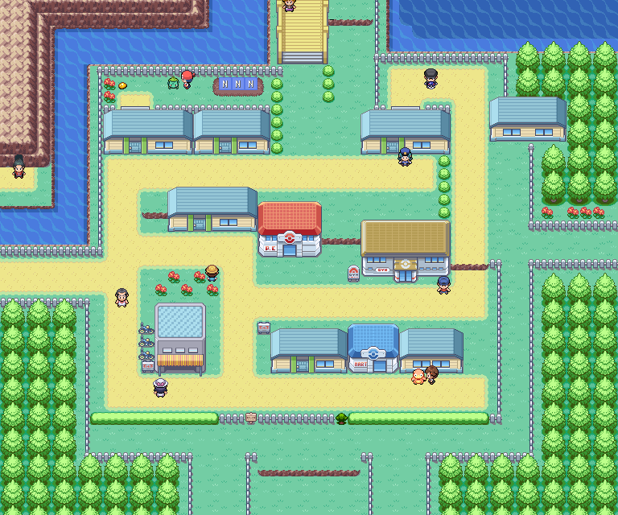
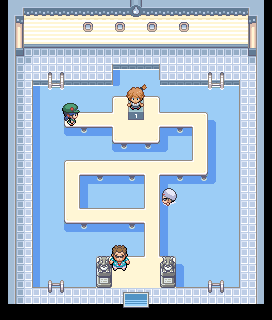
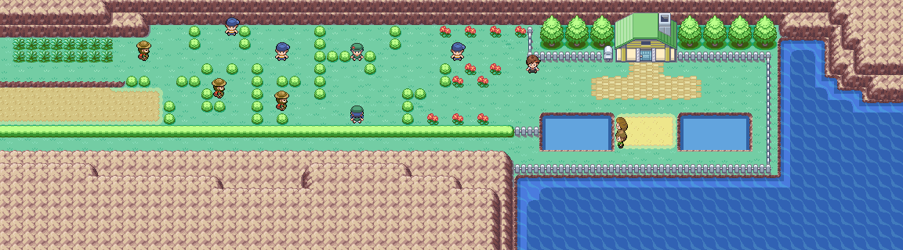

> [← Anterior](01-inicio-brock-y-monte-moon.md) · [Índice general](../README.md) · [Cómo usar](../COMO-USAR-LA-GUIA.md) · [Siguiente →](03-lt-surge-y-ciudad-carmin.md)

[Español] · [English](../../en/guide/02-misty-and-cerulean-cape.md)

**POKÉMON CLASSIC**

**v1.5**

**VOLUMEN 2**

**Ciudad Celeste, Misty y Cabo Celeste**

Recorrido paso a paso • Objetos • Capturas recomendadas • Gimnasio • Checklists

> Consulta [Cómo usar la guía](../COMO-USAR-LA-GUIA.md) para conocer los símbolos, las mecánicas esenciales y el criterio de datos común a todos los volúmenes.

# Contenido

- Ciudad Celeste y el robo de la MT28

- Gimnasio de Misty

- Ruta 24 y Puente Pepita

- Ruta 25 y Bill

| **CRITERIO DE DATOS** Los objetos, encuentros y eventos específicos proceden de la guía de Pokémon Classic v1.5. El equipo de Misty se ha verificado para esta versión. |
|---|

# Ciudad Celeste

*Mapa de Ciudad Celeste extraído de la guía original.*

| **🎯 OBJETIVO** Resolver los eventos de la ciudad, prepararte para Misty y abrir el camino hacia el norte. |
|---------------------------------------------------------------------------------------------------------|

## Recorrido recomendado

1.  Recupera a tu equipo en el Centro Pokémon y revisa la tienda.

2.  Busca el Caramelo Raro oculto en el patio de bayas, junto a la valla.

3.  Visita el gimnasio cuando tu equipo ronde los niveles 18-21; también puedes completar primero las rutas 24 y 25 para ganar experiencia.

4.  Tras avanzar por el norte, vuelve a la casa vigilada por la agente y derrota al Rocket del patio para conseguir la MT28 Excavar.

5.  Cuando tengas mucha amistad con el Pokémon situado primero en el equipo, habla con la criadora del patio para recibir a Bulbasaur.

## ⭐ Pokémon y capturas recomendadas

| **Pokémon / grupo** | **Disponibilidad**               | **Valor para la aventura**                             |
|---------------------|----------------------------------|--------------------------------------------------------|
| Bulbasaur (regalo)  | Patio de bayas, con amistad alta | Excelente opción Planta/Veneno para el resto del juego |
| Dratini / Dragonair | Pesca avanzada, más adelante     | Muy raros; no merece retrasar la historia ahora        |
| Goldeen / Poliwag   | Surf o pesca posterior           | Opcionales; no son necesarios para Misty               |

## ↩ Encuentros acuáticos

> Vuelve cuando dispongas de 🏄 Surf o de la 🎣 caña indicada.

| Pokémon | Método | Disponibilidad |
|---|---|---|
| Goldeen | 🏄 Surf | Día, 30-60 % |
| Seaking | 🏄 Surf | Día, 1-5 % |
| Poliwag | 🏄 Surf | Noche, 30-60 % |
| Poliwhirl | 🏄 Surf | Noche, 1-5 % |
| Magikarp | 🎣 Caña Vieja | Día y noche, 30-70 % |
| Goldeen | 🎣 Caña Buena / Supercaña | Día, 20-60 % con Caña Buena o 40 % con Supercaña; noche, 20 % con Caña Buena |
| Poliwag | 🎣 Caña Buena / Supercaña | Día, 20 % con Caña Buena; noche, 20-60 % con Caña Buena o 40 % con Supercaña |
| Seaking | 🎣 Supercaña | Día, 15 % |
| Poliwhirl | 🎣 Supercaña | Noche, 15 % |
| Dratini | 🎣 Supercaña | Día y noche, 4 % |
| Dragonair | 🎣 Supercaña | Día y noche, 1 % |

## 💎 Objetos y recompensas

| **Objeto**    | **Dónde / cómo**                                     | **Prioridad** |
|---------------|------------------------------------------------------|---------------|
| Caramelo Raro | 🔍 Oculto junto a la valla del patio de bayas           | Alta          |
| MT28 Excavar  | Derrota al miembro Rocket detrás de la casa vigilada | Muy alta      |
| Bulbasaur     | Regalo por amistad alta                              | Muy alta      |
| Venusaurita   | Solo tras completar dos veces Liga y Campeón         | Posjuego      |

## Entrenadores

| **Entrenador** | **Zona / referencia**                                                | **Equipo** |
|----------------|----------------------------------------------------------------------|---|
| Miembro Rocket | Patio trasero de la casa vigilada; entrega la MT28 al ser derrotado. | Machop Nv. 17 · Drowzee Nv. 17 |
| Rival          | Acceso norte, antes del Puente Pepita.                               | Spearow Nv. 18 · Sandshrew Nv. 15 · Rattata Nv. 15 · Eevee Nv. 17 |

| **CONSEJO** No gastes Excavar a ciegas: además de ser un buen ataque de tipo Tierra, puede ayudarte a salir de algunas cuevas. |
|--------------------------------------------------------------------------------------------------------------------------------|

## ⚠ Antes de continuar

- [ ] Recoger el Caramelo Raro

- [ ] Conseguir la MT28

- [ ] Decidir si quieres usar a Bulbasaur

# 🏆 GIMNASIO: Misty

*Interior del Gimnasio de Ciudad Celeste.*

| **LEVEL CAP RECOMENDADO** 21. Se toma como referencia el Pokémon de mayor nivel del equipo de Pokémon Classic v1.5. |
|----------------------------------------------------------------------------------------------------------------------|

| **Pokémon** | **Nivel** | **Tipo**      | **Peligro principal**               |
|-------------|-----------|---------------|-------------------------------------|
| Staryu      | 18        | Agua          | Velocidad y ataques de Agua         |
| Starmie     | 21        | Agua/Psíquico | Muy rápido y con estadísticas altas |

## Entrenadores del gimnasio

| **Entrenador** | **Equipo** |
|---|---|
| Picnicker Diana | Goldeen Nv. 19 |
| Swimmer Luis | Horsea Nv. 16 · Shellder Nv. 16 |

## Plan de combate

- Pikachu es la respuesta natural, pero evita llegar varios niveles por debajo de Starmie.

- Bellsprout u Oddish de las rutas del norte resisten Agua y pueden usar cambios de estado.

- No dependas de un único Pokémon: Starmie puede superar en velocidad a gran parte del equipo.

- Lleva Pociones y cura antes de iniciar el combate.

| **RECOMPENSA** Medalla Cascada y MT03 de Pokémon Classic. |
|-----------------------------------------------------------|

# Ruta 24 · Puente Pepita

*Ruta 24 y Puente Pepita.*

| **🎯 OBJETIVO** Superar la cadena de entrenadores, derrotar al Rocket y ampliar el equipo. |
|-----------------------------------------------------------------------------------------|

## Recorrido recomendado

6.  Cruza el puente derrotando a los cinco entrenadores consecutivos.

7.  Vence al reclutador disfrazado del Team Rocket al final del puente.

8.  Explora la hierba: Abra es una captura excelente, aunque puede escapar usando Teletransporte.

9.  Recoge la MT45 y habla con los personajes de la zona.

10. Derrota a Jessie y James y al Rocket adicional antes de continuar hacia la Ruta 25.

11. Recoge al Charmander estático cuando esté disponible.

## ⭐ Pokémon y capturas recomendadas

| **Pokémon / grupo**            | **Disponibilidad** | **Valor para la aventura**                                             |
|--------------------------------|--------------------|------------------------------------------------------------------------|
| Abra                           | 10% de día         | Alakazam es extraordinario; usa sueño/parálisis o una Poké Ball rápida |
| Bellsprout / Oddish            | Día / noche        | Muy útiles contra Misty y para estados alterados                       |
| Charmander                     | Encuentro estático | Gran incorporación de tipo Fuego                                       |
| Pidgeotto / Weepinbell / Gloom | Muy raros          | Captura de comodidad, no imprescindible                                |

## ↩ Encuentros acuáticos

> Vuelve cuando dispongas de 🏄 Surf o de la 🎣 caña indicada.

| Pokémon | Método | Disponibilidad |
|---|---|---|
| Goldeen | 🏄 Surf | Día, 30-60 % |
| Seaking | 🏄 Surf | Día, 1-5 % |
| Poliwag | 🏄 Surf | Noche, 30-60 % |
| Poliwhirl | 🏄 Surf | Noche, 1-5 % |
| Magikarp | 🎣 Caña Vieja | Día y noche, 30-70 % |
| Goldeen | 🎣 Caña Buena | Día, 20-60 %; noche, 20 % |
| Poliwag | 🎣 Caña Buena | Día, 20 %; noche, 20-60 % |
| Poliwhirl | 🎣 Supercaña | Día, 40 %; noche, 4-15 % |
| Seaking | 🎣 Supercaña | Día, 4-15 %; noche, 40 % |
| Dratini | 🎣 Supercaña | Día y noche, 1 % |

## 💎 Objetos y recompensas

| **Objeto** | **Dónde / cómo**              | **Prioridad** |
|------------|-------------------------------|---------------|
| MT45       | Poké Ball especial en la ruta | Alta          |
| Charmander | Encuentro estático            | Muy alta      |

## Entrenadores

| **Entrenador**    | **Zona / referencia**         | **Equipo** |
|-------------------|-------------------------------|---|
| Bug Catcher Cale  | 1.º combate del Puente Pepita | Caterpie Nv. 10 · Weedle Nv. 10 · Metapod Nv. 10 · Kakuna Nv. 10 |
| Lass Ali          | 2.º combate del Puente Pepita | Pidgey Nv. 12 · Oddish Nv. 12 · Bellsprout Nv. 12 |
| Youngster Timmy   | 3.º combate del Puente Pepita | Sandshrew Nv. 14 · Ekans Nv. 14 |
| Lass Reli         | 4.º combate del Puente Pepita | Nidoran♂ Nv. 16 · Nidoran♀ Nv. 16 |
| Camper Ethan      | 5.º combate del Puente Pepita | Mankey Nv. 18 |
| Rocket disfrazado | Final del puente              | Ekans Nv. 15 · Zubat Nv. 15 |
| Camper Shane      | Zona norte de la ruta         | Rattata Nv. 14 · Ekans Nv. 14 |
| Rocket Grunt      | Evento Rocket                 | Ekans Nv. 15 · Zubat Nv. 15 |
| Jessie y James    | Combate doble                 | Ekans Nv. 17 · Meowth Nv. 17 · Koffing Nv. 17 · Lickitung Nv. 17 |

## ⚠ Antes de continuar

- [ ] Superar todo el Puente Pepita

- [ ] Capturar Abra si te interesa

- [ ] Recoger Charmander y MT45

# Ruta 25 · Casa de Bill

*Ruta 25 y camino hacia la casa de Bill.*

| **🎯 OBJETIVO** Ayudar a Bill y conseguir el acceso a la S.S. Anne. |
|------------------------------------------------------------------|

## Recorrido recomendado

12. Recorre el pasillo de entrenadores y usa los huecos entre árboles para acceder a los objetos.

13. Recoge los objetos ocultos antes de entrar en la casa.

14. Ayuda a Bill con su experimento.

15. Recibe el Ticket Barco y el DexNAV.

16. Regresa a Ciudad Celeste; ya puedes dirigirte al sur.

## ⭐ Pokémon y capturas recomendadas

| **Pokémon / grupo**        | **Disponibilidad**       | **Valor para la aventura**                    |
|----------------------------|--------------------------|-----------------------------------------------|
| Abra                       | 10%                      | Captura prioritaria si no apareció en Ruta 24 |
| Bellsprout / Oddish        | Comunes según hora       | Buenas opciones de tipo Planta                |
| Venonat / Gloom / Venomoth | Nocturnos, algunos raros | Opcionales                                    |

## ↩ Encuentros acuáticos

> Vuelve cuando dispongas de 🏄 Surf o de la 🎣 caña indicada.

| Pokémon | Método | Disponibilidad |
|---|---|---|
| Goldeen | 🏄 Surf | Día, 30-60 % |
| Seaking | 🏄 Surf | Día, 1-5 % |
| Poliwag | 🏄 Surf | Noche, 30-60 % |
| Poliwhirl | 🏄 Surf | Noche, 1-5 % |
| Magikarp | 🎣 Caña Vieja | Día y noche, 30-70 % |
| Psyduck | 🎣 Caña Buena | Día, 20-60 % |
| Poliwag | 🎣 Caña Buena / Supercaña | Día, 20 % con Caña Buena; noche, 40 % con Supercaña |
| Goldeen | 🎣 Caña Buena / Supercaña | Día, 40 % con Supercaña; noche, 20 % con Caña Buena |
| Seaking | 🎣 Supercaña | Día, 4-15 % |
| Golduck | 🎣 Supercaña | Día, 1 % |
| Staryu | 🎣 Caña Buena | Noche, 20-60 % |
| Poliwhirl | 🎣 Supercaña | Noche, 4-15 % |
| Starmie | 🎣 Supercaña | Noche, 1 % |

## 💎 Objetos y recompensas

| **Objeto**   | **Dónde / cómo** | **Prioridad**                 |
|--------------|------------------|-------------------------------|
| Elixir       | 🔍 Oculto           | Media                         |
| Baya Aranja  | 🔍 Oculta           | Baja                          |
| Baya Bluk    | 🔍 Oculta           | Baja                          |
| Éter         | 🔍 Oculto           | Media                         |
| Orbe Tóxico  | Poké Ball        | Alta para estrategias futuras |
| Ticket Barco | Casa de Bill     | Obligatoria                   |
| DexNAV       | Casa de Bill     | Obligatoria                   |

| **DEXNAV** Úsalo para localizar especies ya vistas y buscar mejores IV, habilidades o encuentros ocultos. |
|-----------------------------------------------------------------------------------------------------------|

## ⚠ Antes de continuar

- [ ] Conseguir Ticket Barco

- [ ] Conseguir DexNAV

- [ ] Recoger el Orbe Tóxico

---

> [← Anterior](01-inicio-brock-y-monte-moon.md) · [Índice general](../README.md) · [Cómo usar](../COMO-USAR-LA-GUIA.md) · [Siguiente →](03-lt-surge-y-ciudad-carmin.md)
