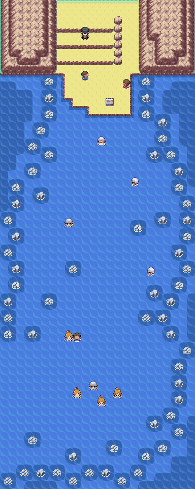
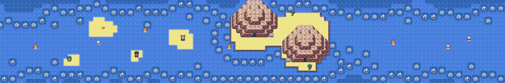
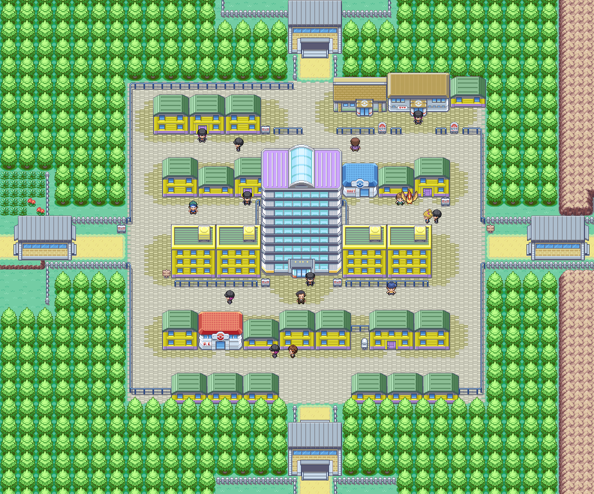
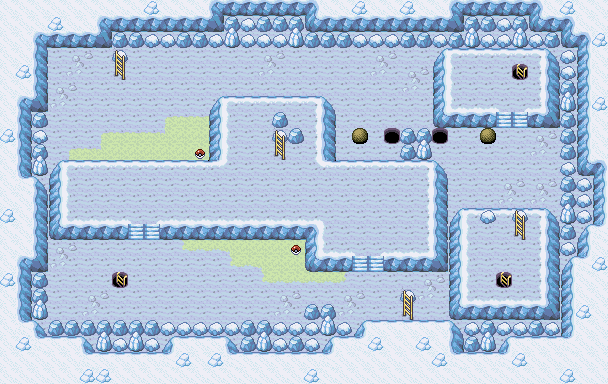
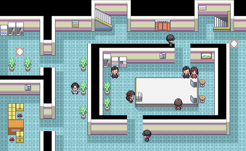
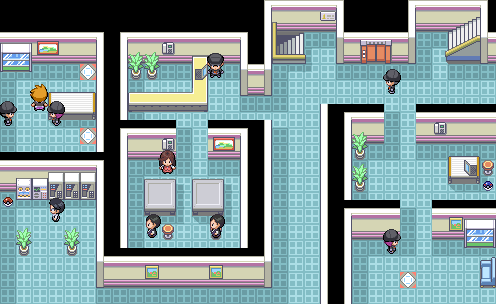
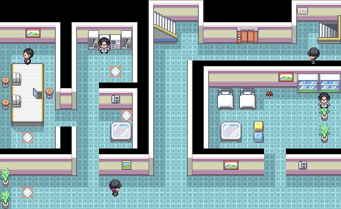
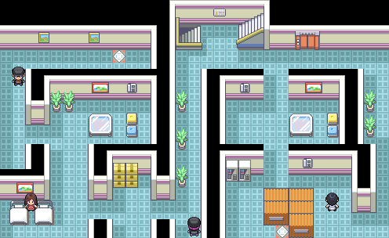
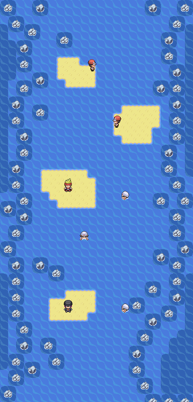

> [← Anterior](05-torre-pokemon-koga-y-zona-safari.md) · [Índice general](../README.md) · [Cómo usar](../COMO-USAR-LA-GUIA.md) · [Siguiente →](07-islas-espuma-articuno-y-blaine.md)

[Español] · [English](../../en/guide/06-silph-sabrina-and-cycling-road.md)

**POKÉMON CLASSIC**

**v1.5**

**VOLUMEN 6**

**Ruta Ciclista, Ciudad Azafrán y Silph S.A.**

Recorrido paso a paso • Mapas • Objetos • Entrenadores • Gimnasios

> Consulta [Cómo usar la guía](../COMO-USAR-LA-GUIA.md) para conocer los símbolos, las mecánicas esenciales y el criterio de datos común a todos los volúmenes.

# Contenido

- Ruta 16 y MO Vuelo

- Rutas 17 y 18

- Ciudad Azafrán y Dojo Karate

- Silph S.A.

- Gimnasio de Sabrina

| **CRITERIO DE DATOS** Los mapas, objetos y entrenadores específicos proceden de la guía inicial de Pokémon Classic v1.5. El equipo de Sabrina se ha verificado para esta versión. |
|-----------------------------------------------------------------------------------------------------------------------------------------------------------------------------------------------------------------------------------|

# Ruta 16

*Mapa de la Ruta 16.*

| **🎯 OBJETIVO** Conseguir Vuelo, despertar al segundo Snorlax y acceder a la Ruta Ciclista. |
|------------------------------------------------------------------------------------------|

## Recorrido recomendado

1.  Entra desde Ciudad Azulona y usa la Poké Flauta frente al segundo Snorlax. Guarda antes si quieres capturarlo.

2.  Cruza el árbol cortable y entra en la casa aislada para recibir la MO Vuelo.

3.  Habla diariamente con el NPC de bayas situado al sur de la casa.

4.  Después de la quinta medalla, visita a Cedar en la segunda planta del puesto para recibir el Moneda Amuleto.

5.  Derrota a los entrenadores y entra en la Ruta 17 con una bicicleta.

## ⭐ Pokémon y capturas recomendadas

| **Pokémon / grupo** | **Disponibilidad** | **Valor para la aventura**                    |
|---------------------|--------------------|-----------------------------------------------|
| Snorlax             | Encuentro estático | Prioridad alta si no capturaste el de Ruta 12 |
| Doduo               | 5-20%              | Buen Pokémon Volador físico                   |
| Muk                 | 1-4% de noche      | Raro y resistente                             |

## 💎 Objetos y recompensas

| **Objeto**     | **Dónde / cómo**                               | **Prioridad** |
|----------------|------------------------------------------------|---------------|
| MO Vuelo       | Casa aislada                                   | Obligatoria   |
| Baya aleatoria | NPC diario                                     | Baja          |
| Moneda Amuleto | Cedar, puesto 2F, después de la quinta medalla | Muy alta      |

## Entrenadores

| **Entrenador**                               | **Zona / referencia** | **Equipo** |
|----------------------------------------------|-----------------------|---|
| School Kids Lea y Jed                        | Combate doble         | Rapidash Nv. 29 · Ninetales Nv. 29 |
| Biker Lao, Koji, Hideo, Luke, Ruben y Camron | Tramo principal       | **Hideo:** Arbok Nv. 33 **Luke:** Mankey Nv. 29 · Machop Nv. 29 **Camron:** Mankey Nv. 29 · Machop Nv. 29 **Lao:** Grimer Nv. 29 · Koffing Nv. 29 **Ruben:** Weezing Nv. 28 · Koffing Nv. 28 · Weezing Nv. 28 **Koji:** Machop Nv. 28 · Mankey Nv. 28 · Machop Nv. 28 |

## ⚠ Antes de continuar

- [ ] Conseguir MO Vuelo

- [ ] Recoger Moneda Amuleto

- [ ] Resolver el encuentro de Snorlax

# Ruta 17 · Ruta Ciclista

*Mapa de la Ruta 17 y Ruta Ciclista.*

| **🎯 OBJETIVO** Descender por la Ruta Ciclista recogiendo todos los objetos ocultos. |
|-----------------------------------------------------------------------------------|

## Recorrido recomendado

6.  Entra montado en bicicleta; la pendiente te empuja hacia el sur.

7.  El DexNAV no funciona en esta ruta, así que las capturas dependen de encuentros normales.

8.  Detente en los márgenes para buscar Restaurar Todo, PP Máx., Caramelo Raro, Revivir Máximo y Elixir ocultos.

9.  Derrota a los diez moteros antes de llegar a la Ruta 18.

## ⭐ Pokémon y capturas recomendadas

| **Pokémon / grupo** | **Disponibilidad** | **Valor para la aventura** |
|---------------------|--------------------|----------------------------|
| Ponyta              | 4-10% de día       | Buena opción Fuego         |
| Dodrio              | 1-4% de día        | Atacante Volador fuerte    |
| Eevee               | 1% de día          | Muy raro                   |
| Muk                 | 1-4% de noche      | Raro                       |

## 💎 Objetos y recompensas

| **Objeto**     | **Dónde / cómo** | **Prioridad** |
|----------------|------------------|---------------|
| Restaurar Todo | 🔍 Oculto           | Alta          |
| PP Máx.        | 🔍 Oculto           | Alta          |
| Caramelo Raro  | 🔍 Oculto           | Alta          |
| Revivir Máximo | 🔍 Oculto           | Alta          |
| Elixir         | 🔍 Oculto           | Media         |

## Entrenadores

| **Entrenador**                              | **Zona / referencia** | **Equipo** |
|---------------------------------------------|-----------------------|---|
| Biker Isaiah, Virgil, Raul, Billy y Nikolas | Mitad norte           | **Nikolas:** Voltorb Nv. 29 · Voltorb Nv. 29 **Raul:** Mankey Nv. 29 · Primeape Nv. 29 **Virgil:** Weezing Nv. 28 · Koffing Nv. 28 · Weezing Nv. 28 **Billy:** Muk Nv. 33 **Isaiah:** Machop Nv. 29 · Machamp Nv. 29 |
| Biker Jamal, Zeek, Corey, Jaxon y William   | Mitad sur             | **Jaxon:** Weezing Nv. 29 · Muk Nv. 29 **Zeek:** Machoke Nv. 33 **William:** Koffing Nv. 25 · Weezing Nv. 25 · Koffing Nv. 25 · Koffing Nv. 25 · Weezing Nv. 25 **Corey:** Primeape Nv. 29 · Machoke Nv. 29 **Jamal:** Mankey Nv. 26 · Mankey Nv. 26 · Machamp Nv. 26 · Machop Nv. 26 |

| **DEXNAV** La guía original advierte que el DexNAV no funciona en la Ruta Ciclista. |
|-------------------------------------------------------------------------------------|

## ⚠ Antes de continuar

- [ ] Encontrar los cinco objetos ocultos

- [ ] Derrotar a los diez moteros

# Ruta 18

*Mapa de la Ruta 18.*

| **🎯 OBJETIVO** Completar la salida de la Ruta Ciclista y conectar con Ciudad Fucsia. |
|------------------------------------------------------------------------------------|

## Recorrido recomendado

10. Recorre la hierba si buscas Lickitung o Scyther.

11. Derrota a los tres Birdkeeper.

12. Cruza el puesto de control hacia Ciudad Fucsia.

13. Usa Vuelo para regresar a Ciudad Azulona o Lavanda y entrar en Ciudad Azafrán por un puesto de guardia.

## ⭐ Pokémon y capturas recomendadas

| **Pokémon / grupo** | **Disponibilidad** | **Valor para la aventura** |
|---------------------|--------------------|----------------------------|
| Lickitung           | 1% día/noche       | Muy raro                   |
| Scyther             | De día             | Captura valiosa            |
| Doduo               | 1-4%               | Opcional                   |
| Muk                 | 4-10%              | Resistente                 |

## Entrenadores

| **Entrenador**    | **Zona / referencia** | **Equipo** |
|-------------------|-----------------------|---|
| Birdkeeper Wilton | Ruta 18               | Spearow Nv. 29 · Fearow Nv. 29 |
| Birdkeeper Jacob  | Ruta 18               | Spearow Nv. 26 · Spearow Nv. 26 · Fearow Nv. 26 · Spearow Nv. 26 |
| Birdkeeper Ramiro | Ruta 18               | Dodrio Nv. 34 |

## ⚠ Antes de continuar

- [ ] Derrotar a los tres entrenadores

- [ ] Abrir el viaje rápido con Vuelo

# Ciudad Azafrán y Dojo Karate

*Mapa de Ciudad Azafrán.*

| **🎯 OBJETIVO** Explorar la ciudad, superar el dojo y prepararte para el asalto a Silph S.A. |
|-------------------------------------------------------------------------------------------|

## Recorrido recomendado

14. Entra en Ciudad Azafrán por cualquiera de los puestos de guardia.

15. Visita la casa del Sr. Psíquico y registra su ubicación para la Alakazamita del posjuego.

16. Compra Agua Fresca y entra en el Dojo Karate.

17. Derrota a sus entrenadores; el agua permite restaurar sus equipos para repetir los combates como entrenamiento de EV.

18. Tras demostrar tu valía, recibe a Hitmonlee y Hitmonchan.

19. A continuación entra en Silph S.A., ocupada por el Team Rocket.

## ⭐ Pokémon y capturas recomendadas

| **Pokémon / grupo** | **Disponibilidad** | **Valor para la aventura**                   |
|---------------------|--------------------|----------------------------------------------|
| Hitmonlee           | Regalo del Dojo    | Atacante físico rápido                       |
| Hitmonchan          | Regalo del Dojo    | Más versátil; el juego permite obtener ambos |

## 💎 Objetos y recompensas

| **Objeto**             | **Dónde / cómo**                               | **Prioridad** |
|------------------------|------------------------------------------------|---------------|
| Hitmonlee y Hitmonchan | Recompensa del Dojo                            | Alta          |
| Alakazamita            | Casa del Sr. Psíquico, tras el segundo Campeón | Posjuego      |

| **DOJO Y EV** La guía indica que el Dojo puede utilizarse para entrenar EV; lleva Agua Fresca para restaurar a sus entrenadores. |
|----------------------------------------------------------------------------------------------------------------------------------|

## ⚠ Antes de continuar

- [ ] Completar el Dojo

- [ ] Recibir a Hitmonlee y Hitmonchan

- [ ] Preparar curas para Silph S.A.

# Silph S.A.

*Silph S.A., planta 1.*

*Silph S.A., planta 2.*

*Silph S.A., planta 3.*

*Silph S.A., planta 4.*

*Silph S.A., planta 5.*

*Silph S.A., planta 6.*

*Silph S.A., planta 7.*

*Silph S.A., planta 8.*

*Silph S.A., planta 9.*

*Silph S.A., planta 10.*

*Silph S.A., planta 11.*

| **🎯 OBJETIVO** Conseguir la Llave Magnética, liberar el edificio y derrotar a Giovanni. |
|---------------------------------------------------------------------------------------|

## Recorrido recomendado

20. Explora primero las plantas inferiores para reunir objetos y experiencia.

21. En la quinta planta recoge la Llave Magnética; abre las puertas electrónicas de todo el edificio.

22. Visita la segunda planta para el tutor de Onda Trueno.

23. En la séptima planta derrota al rival y recibe a Lapras del empleado.

24. Usa los paneles de teletransporte para alcanzar las plantas superiores.

25. En la undécima planta derrota a Jessie y James y después a Giovanni.

26. Habla con el presidente para recibir la Master Ball.

## ⭐ Pokémon y capturas recomendadas

| **Pokémon / grupo** | **Disponibilidad** | **Valor para la aventura**             |
|---------------------|--------------------|----------------------------------------|
| Lapras              | Regalo, 7F         | Prioridad máxima: Agua/Hielo excelente |

## 💎 Objetos y recompensas

| **Objeto**                                                 | **Dónde / cómo** | **Prioridad**    |
|------------------------------------------------------------|------------------|------------------|
| Ultra Ball                                                 | 🔍 Oculta, 2F       | Media            |
| Proteína / Hiperpoción                                     | 3F               | Media            |
| Hierro / MT41 / Cura Total / Cuerda Huida / Revivir Máximo | 4F               | Alta             |
| Proteína / Elixir / Llave Magnética / MT01                 | 5F               | Muy alta         |
| Carburante / Más PS / Especial X                           | 6F               | Media            |
| MT08 / Zinc / Calcio                                       | 7F               | Alta             |
| Pepita / Hierro                                            | 8F               | Media            |
| Calcio / Máxima Poción                                     | 9F               | Alta             |
| Más PS / Carburante / Caramelo Raro / Ultra Ball           | 10F              | Alta             |
| Zinc / Revivir / Master Ball                               | 11F              | Prioridad máxima |

## Entrenadores

| **Entrenador**                            | **Zona / referencia** | **Equipo** |
|-------------------------------------------|-----------------------|---|
| Rocket Grunt ×2                           | 2F                    | **Recluta 1:** Cubone Nv. 29 · Zubat Nv. 29 **Recluta 2:** Golbat Nv. 25 · Zubat Nv. 25 · Zubat Nv. 25 · Raticate Nv. 25 · Zubat Nv. 25 |
| Scientist Jerry y Connor                  | 2F                    | **Connor:** Grimer Nv. 26 · Weezing Nv. 26 · Koffing Nv. 26 · Weezing Nv. 26 **Jerry:** Magnemite Nv. 28 · Voltorb Nv. 28 · Magneton Nv. 28 |
| Rocket Grunt y Scientist Jose             | 3F                    | **Recluta 1:** Raticate Nv. 28 · Hypno Nv. 28 · Raticate Nv. 28 **Jose:** Electrode Nv. 29 · Weezing Nv. 29 |
| Rocket Grunt ×2 y Scientist Rodney        | 4F                    | **Recluta 1:** Machop Nv. 29 · Drowzee Nv. 29 **Recluta 2:** Ekans Nv. 28 · Zubat Nv. 28 · Cubone Nv. 28 **Rodney:** Electrode Nv. 33 |
| Rocket Grunt ×3 y Scientist Beau          | 5F                    | **Recluta 1:** Arbok Nv. 33 **Recluta 2:** Hypno Nv. 33 **Recluta 3:** Machop Nv. 29 · Machoke Nv. 29 **Beau:** Magneton Nv. 26 · Koffing Nv. 26 · Weezing Nv. 26 · Magnemite Nv. 26 |
| Rocket Grunt ×2 y Scientist Taylor        | 6F                    | **Recluta 1:** Zubat Nv. 28 · Zubat Nv. 28 · Golbat Nv. 28 **Recluta 2:** Raticate Nv. 26 · Arbok Nv. 26 · Koffing Nv. 26 · Golbat Nv. 26 **Taylor:** Voltorb Nv. 25 · Koffing Nv. 25 · Magneton Nv. 25 · Magnemite Nv. 25 · Koffing Nv. 25 |
| Rocket Grunt ×4, Rival y Scientist Joshua | 7F                    | **Recluta 1:** Cubone Nv. 29 · Cubone Nv. 29 **Recluta 2:** Sandshrew Nv. 29 · Sandslash Nv. 29 **Recluta 3:** Raticate Nv. 26 · Zubat Nv. 26 · Golbat Nv. 26 · Rattata Nv. 26 **Recluta 4:** Weezing Nv. 28 · Golbat Nv. 28 · Koffing Nv. 28 **Joshua:** Electrode Nv. 29 · Muk Nv. 29 **Jolteon:** Sandslash Nv. 38 · Ninetales Nv. 35 · Cloyster Nv. 37 · Kadabra Nv. 35 · Jolteon Nv. 40 **Flareon:** Sandslash Nv. 38 · Magneton Nv. 37 · Cloyster Nv. 37 · Kadabra Nv. 35 · Flareon Nv. 40 **Vaporeon:** Sandslash Nv. 38 · Ninetales Nv. 37 · Magneton Nv. 35 · Kadabra Nv. 35 · Vaporeon Nv. 40 |
| Rocket Grunt ×2 y Scientist Parker        | 8F                    | **Recluta 1:** Drowzee Nv. 28 · Grimer Nv. 28 · Machop Nv. 28 **Recluta 2:** Golbat Nv. 28 · Drowzee Nv. 28 · Hypno Nv. 28 **Parker:** Grimer Nv. 29 · Electrode Nv. 29 |
| Rocket Grunt ×2 y Scientist Ed            | 9F                    | **Recluta 1:** Machoke Nv. 33 **Recluta 2:** Rattata Nv. 25 · Rattata Nv. 25 · Zubat Nv. 25 · Rattata Nv. 25 · Ekans Nv. 25 **Ed:** Voltorb Nv. 28 · Koffing Nv. 28 · Magneton Nv. 28 |
| Rocket Grunt y Scientist Travis           | 10F                   | **Recluta 1:** Cubone Nv. 32 · Drowzee Nv. 32 · Marowak Nv. 32 **Travis:** Magnemite Nv. 29 · Koffing Nv. 29 |
| Jessie y James y Giovanni | 11F                   | **Jessie y James:** Koffing Nv. 35 · Ekans Nv. 35 · Meowth Nv. 37 · Lickitung Nv. 37 **Giovanni:** Nidorino Nv. 37 · Kangaskhan Nv. 35 · Rhyhorn Nv. 37 · Nidoqueen Nv. 41 |

| **OBJETO CRÍTICO** No abandones la planta 5 sin la Llave Magnética. |
|---------------------------------------------------------------------|

| **REGALO IMPRESCINDIBLE** Lapras es uno de los mejores Pokémon para el tramo final y la Liga. |
|-----------------------------------------------------------------------------------------------|

## ⚠ Antes de continuar

- [ ] Conseguir Llave Magnética

- [ ] Recibir a Lapras

- [ ] Derrotar al rival, Jessie y James y Giovanni

- [ ] Conseguir Master Ball

# 🏆 GIMNASIO: Sabrina

*Interior del Gimnasio de Sabrina.*

| **LEVEL CAP RECOMENDADO** 43. Se toma como referencia el Pokémon de mayor nivel del equipo de Pokémon Classic v1.5. |
|----------------------------------------------------------------------------------------------------------------------|

| **Pokémon** | **Nivel** | **Tipo**      | **Peligro principal**                         |
|-------------|-----------|---------------|-----------------------------------------------|
| Kadabra     | 38        | Psíquico      | Psicorrayo, Reflejo, Premonición y Paz Mental |
| Mr. Mime    | 37        | Psíquico/Hada | Barrera, Relevo y Paz Mental                  |
| Venomoth    | 38        | Bicho/Veneno  | Psicorrayo, Supersónico y cobertura variada   |
| Alakazam    | 43        | Psíquico      | Psíquico, Recuperación y Paz Mental            |

## Entrenadores del gimnasio

| **Entrenador** | **Equipo** |
|---|---|
| Psychic Johan | Kadabra Nv. 31 · Slowpoke Nv. 31 · Mr. Mime Nv. 31 · Kadabra Nv. 31 |
| Psychic Tyron | Mr. Mime Nv. 34 · Kadabra Nv. 34 |
| Psychic Cameron | Slowpoke Nv. 33 · Slowpoke Nv. 33 · Slowbro Nv. 33 |
| Psychic Preston | Slowbro Nv. 38 |
| Channeler Amanda | Gastly Nv. 34 · Haunter Nv. 34 |
| Channeler Stacy | Haunter Nv. 38 |
| Channeler Tasha | Gastly Nv. 33 · Gastly Nv. 33 · Haunter Nv. 33 |

## Plan de combate

- Kadabra, Mr. Mime y Alakazam tienen Defensa física modesta: presiónalos con ataques físicos fuertes.

- No concedas turnos gratis: Kadabra, Mr. Mime y Alakazam pueden reforzarse, y Mr. Mime puede transferir mejoras con Relevo.

- Venomoth rompe el patrón Psíquico del equipo; Fuego, Volador, Roca o Psíquico son buenas respuestas contra él.

- Evita Pokémon de tipo Lucha o Veneno; reciben daño supereficaz de Psíquico.

- Parálisis, sueño o un atacante rápido ayudan a controlar a Alakazam antes de que use Reflejo y Recuperación.

| **RECOMPENSA** Medalla Pantano y MT04 de Pokémon Classic. |
|-----------------------------------------------------------|

| **RECOMPENSA ADICIONAL** Después de la sexta medalla, vuelve al puesto de control de la Ruta 15 y habla con Cedar para recibir el Repartir Exp. |
|-------------------------------------------------------------------------------------------------------------------------------------------------|

| **SIGUIENTE VOLUMEN** El siguiente tramo llevará a las rutas marítimas, Islas Espuma, Isla Canela, Mansión Pokémon y el gimnasio de Blaine. |
|---------------------------------------------------------------------------------------------------------------------------------------------|

---

> [← Anterior](05-torre-pokemon-koga-y-zona-safari.md) · [Índice general](../README.md) · [Cómo usar](../COMO-USAR-LA-GUIA.md) · [Siguiente →](07-islas-espuma-articuno-y-blaine.md)
