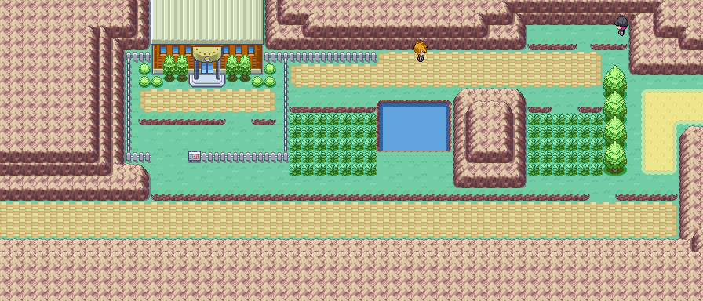
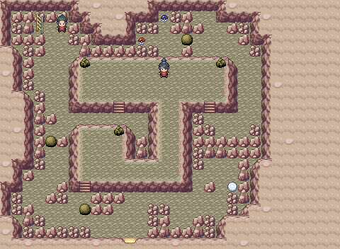
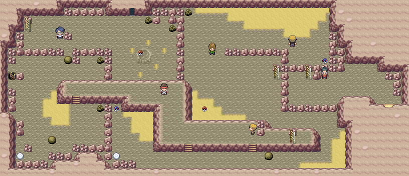
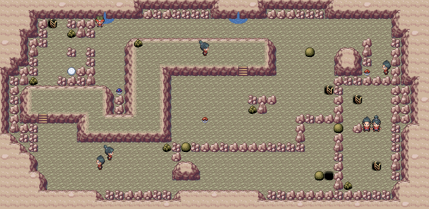
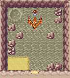
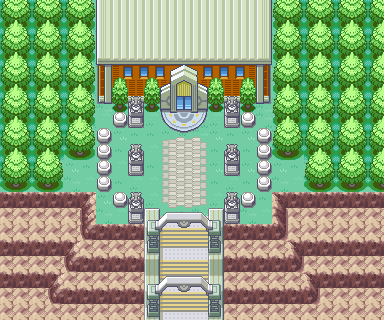

> [← Anterior](08-giovanni.md) · [Índice general](../README.md) · [Cómo usar](../COMO-USAR-LA-GUIA.md) · [Siguiente →](10-postgame-zapdos-mewtwo-y-mew.md)

[Español] · [English](../../en/guide/09-victory-road-and-pokemon-league.md)

**POKÉMON CLASSIC**

**v1.5**

**VOLUMEN 9**

**Calle Victoria y Liga Pokémon**

Recorrido paso a paso • Mapas • Objetos • Alto Mando • Campeón

> Consulta [Cómo usar la guía](../COMO-USAR-LA-GUIA.md) para conocer los símbolos, las mecánicas esenciales y el criterio de datos común a todos los volúmenes.

# Contenido

- Ruta 22 y combate contra el rival

- Ruta 23

- Calle Victoria y Moltres

- Meseta Añil

- Alto Mando y Campeón

| **CRITERIO DE DATOS** Los mapas, objetos, encuentros y entrenadores proceden de la guía inicial. Los equipos y niveles del Alto Mando y Campeón se basan en Pokémon Amarillo porque la guía del hack no detalla sus plantillas. |
|---|

# Ruta 22

*Mapa de la Ruta 22.*

| **🎯 OBJETIVO** Superar el último combate obligatorio contra el rival y dirigirte a la Liga. |
|-------------------------------------------------------------------------------------------|

## Recorrido recomendado

1.  Cura al equipo antes de salir de Ciudad Verde hacia el oeste.

2.  Si omitiste el combate opcional del inicio del juego, la evolución final del Eevee del rival puede variar.

3.  Avanza hasta el punto del combate obligatorio contra el rival.

4.  Tras vencerlo, continúa hacia el acceso de la Ruta 23.

## ⭐ Pokémon y capturas recomendadas

| **Pokémon / grupo** | **Disponibilidad** | **Valor para la aventura**           |
|---------------------|--------------------|--------------------------------------|
| Nidoran♀ / Nidoran♂ | 5-20%              | Ya no suelen mejorar el equipo final |
| Mankey              | 10% de día         | Opcional                             |
| Slowbro / Golduck   | Surf, raros        | Opcionales                           |

## ↩ Encuentros acuáticos

> Vuelve cuando dispongas de 🏄 Surf o de la 🎣 caña indicada.

| Pokémon | Método | Disponibilidad |
|---|---|---|
| Slowpoke | 🏄 Surf | Día, 30-60 % |
| Slowbro | 🏄 Surf | Día, 1-5 % |
| Psyduck | 🏄 Surf | Noche, 30-60 % |
| Golduck | 🏄 Surf | Noche, 1-5 % |
| Magikarp | 🎣 Caña Vieja | Día y noche, 30-70 % |
| Goldeen | 🎣 Caña Buena | Día, 20-60 %; noche, 20 % |
| Poliwag | 🎣 Caña Buena | Día, 20 %; noche, 20-60 % |
| Krabby | 🎣 Supercaña | Día, 40 %; noche, 1-40 % |
| Shellder | 🎣 Supercaña | Día, 1-40 %; noche, 40 % |

## Entrenadores

| **Entrenador** | **Zona / referencia**                | **Equipo** |
|----------------|--------------------------------------|---|
| Rival          | Combate opcional temprano            | Spearow Nv. 9 · Eevee Nv. 8 |
| Rival          | Combate obligatorio antes de la Liga | **Jolteon:** Sandslash Nv. 47 · Exeggcute Nv. 45 · Ninetales Nv. 45 · Cloyster Nv. 47 · Kadabra Nv. 50 · Jolteon Nv. 53 **Flareon:** Sandslash Nv. 47 · Exeggcute Nv. 45 · Cloyster Nv. 45 · Magneton Nv. 47 · Kadabra Nv. 50 · Flareon Nv. 53 **Vaporeon:** Sandslash Nv. 47 · Exeggcute Nv. 45 · Ninetales Nv. 47 · Magneton Nv. 45 · Kadabra Nv. 50 · Vaporeon Nv. 53 |

| **EQUIPO DEL RIVAL** La evolución de Eevee depende de los dos primeros combates: Vaporeon si pierdes el primero; Flareon si ganas el primero y pierdes u omites el segundo; Jolteon si ganas ambos. |
|-----------------------------------------------------------------------------------------------------------------------------------------------------------------------------------------------------|

## ⚠ Antes de continuar

- [ ] Derrotar al rival

- [ ] Curar y comprar objetos para Ruta 23 y Calle Victoria

# Ruta 23

*Mapa de la Ruta 23 y controles de medallas.*

| **🎯 OBJETIVO** Atravesar los controles de medallas y recoger los objetos ocultos antes de Calle Victoria. |
|---------------------------------------------------------------------------------------------------------|

## Recorrido recomendado

5.  Avanza por los puestos de control; cada guardia comprueba una medalla distinta.

6.  Busca las bayas y objetos ocultos a ambos lados del camino.

7.  Recoge la MT10 en la Great Ball visible.

8.  Explora el agua si quieres intentar conseguir Dratini con la Supercaña.

9.  Entra en Calle Victoria con Fuerza, Surf y suficientes curas.

## ⭐ Pokémon y capturas recomendadas

| **Pokémon / grupo**          | **Disponibilidad**        | **Valor para la aventura**   |
|------------------------------|---------------------------|------------------------------|
| Primeape / Arbok / Sandslash | 1-4% según hora           | Opcionales                   |
| Ditto                        | 10-20%                    | Útil para crianza            |
| Dratini                      | 1-4% con Supercaña de día | Muy raro                     |
| Gyarados                     | 15% con Supercaña de día  | Potente si aún no tienes uno |

## ↩ Encuentros acuáticos

> Usa 🏄 Surf para navegar o la 🎣 caña indicada para pescar.

| Pokémon | Método | Disponibilidad |
|---|---|---|
| Slowpoke | 🏄 Surf | Día, 30-60 % |
| Slowbro | 🏄 Surf | Día, 1-5 % |
| Psyduck | 🏄 Surf | Noche, 30-60 % |
| Golduck | 🏄 Surf | Noche, 1-5 % |
| Magikarp | 🎣 Caña Vieja | Día y noche, 30-70 % |
| Goldeen | 🎣 Caña Buena | Día, 20-60 %; noche, 20 % |
| Poliwag | 🎣 Caña Buena | Día, 20 %; noche, 20-60 % |
| Seaking | 🎣 Supercaña | Día, 40 % |
| Poliwhirl | 🎣 Supercaña | Noche, 40 % |
| Gyarados | 🎣 Supercaña | Día, 15 % |
| Dratini | 🎣 Supercaña | Día, 1-4 % |

## 💎 Objetos y recompensas

| **Objeto**     | **Dónde / cómo** | **Prioridad** |
|----------------|------------------|---------------|
| Baya Leppa     | 🔍 Oculta           | Alta          |
| Éter Máx.      | 🔍 Oculto           | Alta          |
| Baya Aspear    | 🔍 Oculta           | Media         |
| Restaurar Todo | 🔍 Oculto           | Muy alta      |
| Baya Zidra     | 🔍 Oculta           | Alta          |
| Baya Ziuela    | 🔍 Oculta           | Muy alta      |
| Elixir Máx.    | 🔍 Oculto           | Muy alta      |
| MT10           | Great Ball       | Alta          |

## ⚠ Antes de continuar

- [ ] Recoger Restaurar Todo y Elixir Máx.

- [ ] Recoger MT10

- [ ] Entrar con Fuerza y muchas curas

# Calle Victoria

*Calle Victoria, planta 1.*

*Calle Victoria, planta 2.*

*Calle Victoria, planta 3.*

*Cueva lateral de Moltres.*

| **🎯 OBJETIVO** Resolver los puzles de rocas, capturar a Moltres y alcanzar la Meseta Añil. |
|------------------------------------------------------------------------------------------|

## Recorrido recomendado

10. Empuja las rocas con Fuerza sobre los interruptores para abrir los pasos.

11. Explora cada planta antes de subir: hay varias MT y objetos ocultos.

12. En la cueva lateral guarda antes de enfrentarte a Moltres.

13. Recoge la Power Stone en 3F y la MT50 antes de salir.

14. Habla con el tutor de Doble Filo en 2F si te interesa el movimiento.

15. Sal por el extremo norte hacia la Meseta Añil.

## ⭐ Pokémon y capturas recomendadas

| **Pokémon / grupo** | **Disponibilidad** | **Valor para la aventura** |
|---------------------|--------------------|----------------------------|
| Machoke / Graveler  | 20%                | Comunes y útiles           |
| Onix                | 1-10% / Rock Smash | Opcional                   |
| Sandslash           | Rock Smash         | Raro                       |
| Moltres             | Encuentro estático | Legendario; prioridad alta |

## 💎 Objetos y recompensas

| **Objeto**          | **Dónde / cómo** | **Prioridad** |
|---------------------|------------------|---------------|
| Heat Rock           | Cueva de Moltres | Alta          |
| Ultra Ball          | 🔍 Oculta, 1F       | Alta          |
| Restaurar Todo      | 🔍 Oculto, 1F       | Muy alta      |
| MT02                | 1F               | Muy alta      |
| MT37                | 2F               | Alta          |
| Cura Total          | 2F               | Media         |
| MT07                | 2F               | Alta          |
| Protección Especial | 2F               | Media         |
| Power Stone         | 3F               | Muy alta      |
| Revivir Máx.        | 3F               | Muy alta      |
| MT50                | 3F               | Muy alta      |

## Entrenadores

| **Entrenador**       | **Zona / referencia**                      | **Equipo** |
|----------------------|--------------------------------------------|---|
| Cooltrainer Naomi    | 1F                                         | Persian Nv. 42 · Ponyta Nv. 42 · Rapidash Nv. 42 · Vulpix Nv. 42 · Ninetales Nv. 42 |
| Cooltrainer Rolando  | 1F                                         | Raticate Nv. 42 · Ivysaur Nv. 42 · Wartortle Nv. 42 · Charmeleon Nv. 42 · Charizard Nv. 42 |
| Black Belt Daisuke   | 2F                                         | Machoke Nv. 43 · Machop Nv. 43 · Machoke Nv. 43 |
| Trainer Nelson       | 2F                                         | Drowzee Nv. 41 · Hypno Nv. 41 · Kadabra Nv. 41 · Kadabra Nv. 41 |
| Trainer Vincent      | 2F                                         | Persian Nv. 44 · Golduck Nv. 44 |
| Trainer Gregory      | 2F                                         | Mr. Mime Nv. 48 |
| Pokemaniac Dawson    | 2F                                         | Charmeleon Nv. 40 · Lapras Nv. 40 · Lickitung Nv. 40 |
| Cooltrainer George   | 3F                                         | Exeggutor Nv. 42 · Sandslash Nv. 42 · Cloyster Nv. 42 · Electrode Nv. 42 · Arcanine Nv. 42 |
| Ninja Boy Orion      | Combate doble, 3F                          | Raichu Nv. 45 · Blastoise Nv. 45 · Slowbro Nv. 45 · Charizard Nv. 45 |
| Cooltrainer Alexa    | 3F                                         | Clefairy Nv. 42 · Jigglypuff Nv. 42 · Persian Nv. 42 · Dewgong Nv. 42 · Chansey Nv. 42 |
| Cooltrainer Colby    | 3F                                         | Kingler Nv. 41 · Poliwhirl Nv. 42 · Tentacruel Nv. 42 · Seadra Nv. 42 · Blastoise Nv. 43 |
| Cooltrainer Caroline | 3F                                         | Bellsprout Nv. 42 · Weepinbell Nv. 42 · Victreebel Nv. 42 · Paras Nv. 42 · Parasect Nv. 42 |
| Cooltrainer Ray      | 3F; posible doble con Tyra según la fuente | Nidoqueen Nv. 45 · Nidoking Nv. 45 |
| Cooltrainer Tyra     | 3F; posible doble con Ray según la fuente  | Nidoqueen Nv. 45 · Nidoking Nv. 45 |

| **ANTES DE MOLTRES** Guarda la partida. Un Pokémon de Agua o Roca facilita el combate; lleva Ultra Ball y movimientos de estado. |
|----------------------------------------------------------------------------------------------------------------------------------|

| **NOTA DE LA FUENTE** La guía original deja pendiente confirmar si Ray y Tyra forman un combate doble; se conserva esa advertencia. |
|-------------------------------------------------------------------------------------------------------------------------------------|

## ⚠ Antes de continuar

- [ ] Capturar o derrotar a Moltres

- [ ] Recoger Power Stone, MT02 y MT50

- [ ] Llegar a la Meseta Añil

# Meseta Añil

*Exterior de la Meseta Añil.*

| **🎯 OBJETIVO** Preparar el equipo y comprar todo lo necesario antes del Alto Mando. |
|-----------------------------------------------------------------------------------|

## Recorrido recomendado

16. Activa el Centro Pokémon y cura al equipo.

17. Compra Restaurar Todo, Revivir, Máxima Poción y curas de estado.

18. Organiza las MT y objetos equipados; dentro no podrás regresar al Centro entre combates.

19. Lleva un equipo cercano a niveles 58-62; el Pokémon más alto del Campeón alcanza el nivel 65.

20. Guarda la partida antes de entrar.

## 💎 Objetos y recompensas

| **Objeto**   | **Dónde / cómo**                       | **Prioridad** |
|--------------|----------------------------------------|---------------|
| Tarjeta Roja | Cueball Punk, exterior de Battle Tower | Opcional      |

| **EQUIPO RECOMENDADO** Una combinación de Agua/Hielo, Eléctrico, Psíquico, Tierra/Roca y un atacante físico fuerte cubre la mayor parte de la Liga. |
|-----------------------------------------------------------------------------------------------------------------------------------------------------|

| **SUMINISTROS** Compra más de lo que crees necesario: los cinco combates se realizan seguidos. |
|------------------------------------------------------------------------------------------------|

## ⚠ Antes de continuar

- [ ] Equipo al menos en torno a nivel 58

- [ ] Objetos curativos suficientes

- [ ] Movimientos Hielo y Eléctrico disponibles

- [ ] Guardar la partida

# 🏆 ALTO MANDO 1: Lorelei

| **NIVEL MÁXIMO DEL RIVAL** 56 |
|-------------------------------|

| **Pokémon** | **Nivel** | **Tipo**       | **Respuesta recomendada**                           |
|-------------|-----------|----------------|-----------------------------------------------------|
| Dewgong     | 54        | Agua/Hielo     | Eléctrico o Lucha                                   |
| Cloyster    | 53        | Agua/Hielo     | Eléctrico; evitar ataques físicos débiles           |
| Slowbro     | 54        | Agua/Psíquico  | Eléctrico o Planta; vencer antes de que se potencie |
| Jynx        | 56        | Hielo/Psíquico | Fuego, Roca o ataques físicos                       |
| Lapras      | 56        | Agua/Hielo     | Eléctrico o Lucha                                   |

## Plan de combate

- Los ataques Eléctricos son la solución más consistente contra cuatro miembros.

- Cloyster tiene Defensa física muy alta; usa ataques especiales.

- Slowbro puede volverse peligroso si acumula mejoras: priorízalo.

- Jynx es frágil físicamente, pero puede dormir o congelar.

- Guarda PP de los movimientos Hielo para Lance.

# 🏆 ALTO MANDO 2: Bruno

| **NIVEL MÁXIMO DEL RIVAL** 58 |
|-------------------------------|

| **Pokémon** | **Nivel** | **Tipo**    | **Respuesta recomendada**                  |
|-------------|-----------|-------------|--------------------------------------------|
| Onix        | 53        | Roca/Tierra | Agua o Planta                              |
| Hitmonchan  | 55        | Lucha       | Psíquico o Volador                         |
| Hitmonlee   | 55        | Lucha       | Psíquico o Volador                         |
| Onix        | 56        | Roca/Tierra | Agua o Planta                              |
| Machamp     | 58        | Lucha       | Psíquico; evitar combate físico prolongado |

## Plan de combate

- Los dos Onix caen rápidamente ante Surf.

- Psíquico es la respuesta más eficaz contra sus tres Pokémon de Lucha.

- Machamp es el mayor peligro: llega con tu atacante Psíquico sano.

- No dependas solo de Pokémon Volador frágiles; Hitmonchan puede disponer de cobertura.

# 🏆 ALTO MANDO 3: Agatha

| **NIVEL MÁXIMO DEL RIVAL** 60 |
|-------------------------------|

| **Pokémon** | **Nivel** | **Tipo**        | **Respuesta recomendada**             |
|-------------|-----------|-----------------|---------------------------------------|
| Gengar      | 56        | Fantasma/Veneno | Psíquico o Tierra                     |
| Golbat      | 56        | Veneno/Volador  | Psíquico, Eléctrico o Hielo           |
| Haunter     | 55        | Fantasma/Veneno | Psíquico                              |
| Arbok       | 58        | Veneno          | Psíquico o Tierra                     |
| Gengar      | 60        | Fantasma/Veneno | Psíquico; controlar sueño y confusión |

## Plan de combate

- Lleva Despertar, Cura Total o Restaurar Todo: Agatha abusa de estados.

- Psíquico es muy fuerte contra todo su equipo por el tipo Veneno.

- Evita ataques Normal y Lucha contra Gengar y Haunter.

- Derrota al Gengar final rápidamente antes de que encadene Hipnosis y confusión.

# 🏆 ALTO MANDO 4: Lance

| **NIVEL MÁXIMO DEL RIVAL** 62 |
|-------------------------------|

| **Pokémon** | **Nivel** | **Tipo**       | **Respuesta recomendada**      |
|-------------|-----------|----------------|--------------------------------|
| Gyarados    | 58        | Agua/Volador   | Eléctrico, debilidad cuádruple |
| Dragonair   | 56        | Dragón         | Hielo                          |
| Dragonair   | 56        | Dragón         | Hielo                          |
| Aerodactyl  | 60        | Roca/Volador   | Agua, Eléctrico o Hielo        |
| Dragonite   | 62        | Dragón/Volador | Hielo, debilidad cuádruple     |

## Plan de combate

- Abre con un ataque Eléctrico fuerte contra Gyarados.

- Reserva Rayo Hielo o Ventisca para los Dragonair y Dragonite.

- Aerodactyl es muy rápido; Agua suele ser la respuesta más segura.

- Dragonite tiene cobertura elemental peligrosa: intenta vencerlo de uno o dos golpes.

- Lapras o Articuno pueden ser decisivos, pero vigila los ataques Eléctricos de cobertura.

# 🏆 CAMPEÓN: Rival

| **LEVEL CAP FINAL** 65. La evolución de Eevee depende de tus dos primeros combates contra el rival. |
|-----------------------------------------------------------------------------------------------------|

## Núcleo fijo

| **Pokémon** | **Nivel** | **Tipo**        | **Comentario** |
|-------------|-----------|-----------------|----------------|
| Sandslash   | 61        | Tierra          | Fijo           |
| Alakazam    | 59        | Psíquico        | Fijo           |
| Exeggutor   | 61        | Planta/Psíquico | Fijo           |

## Variantes del equipo

| **Evolución de Eevee** | **Otros Pokémon**             | **Niveles** |
|------------------------|-------------------------------|-------------|
| Vaporeon               | Ninetales, Magneton, Vaporeon | 61, 63, 65  |
| Jolteon                | Cloyster, Ninetales, Jolteon  | 61, 63, 65  |
| Flareon                | Magneton, Cloyster, Flareon   | 61, 63, 65  |

## Plan de combate

- Identifica la evolución de Eevee antes de entrar y conserva su contra directa para el final.

- Usa Agua o Hielo contra Sandslash.

- Alakazam es muy rápido y frágil físicamente: presiónalo con ataques físicos fuertes.

- Exeggutor teme Fuego, Hielo, Volador y Bicho; evita dejarle tiempo para usar estados.

- Contra Vaporeon usa Eléctrico o Planta; contra Jolteon usa Tierra; contra Flareon usa Agua, Tierra o Roca.

- Cura completamente antes del combate final y no reserves objetos: después del Campeón termina la cadena.

| **FINAL DE LA HISTORIA PRINCIPAL** Tras vencer al Campeón entrarás en el Hall of Fame. El posjuego abre nuevas misiones, rematches, Cueva Celeste, Mega Evolución y contenido de Islas Lejanas. |
|-------------------------------------------------------------------------------------------------------------------------------------------------------------------------------------------------|

---

> [← Anterior](08-giovanni.md) · [Índice general](../README.md) · [Cómo usar](../COMO-USAR-LA-GUIA.md) · [Siguiente →](10-postgame-zapdos-mewtwo-y-mew.md)
