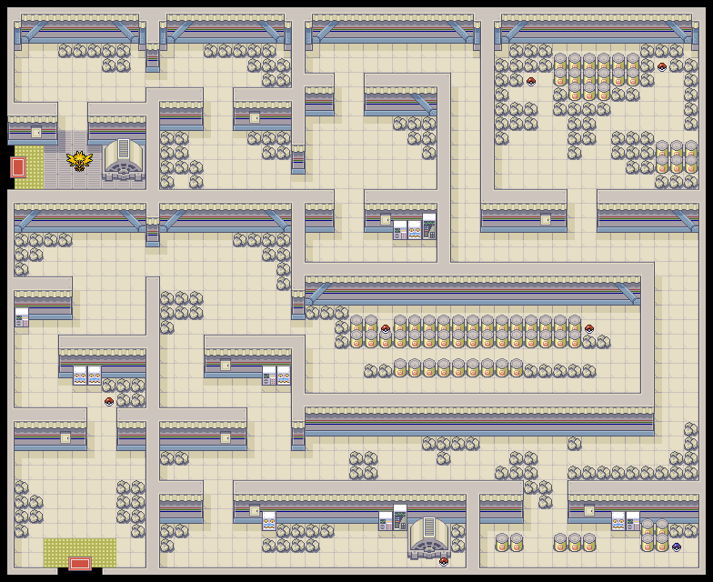
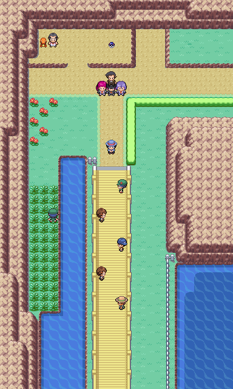
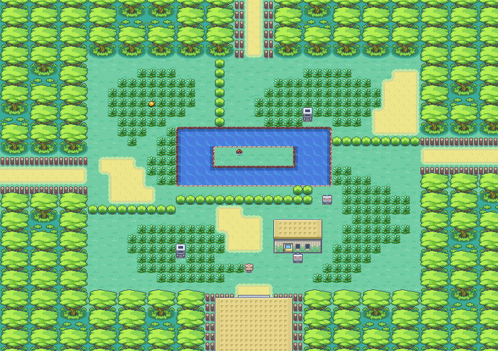
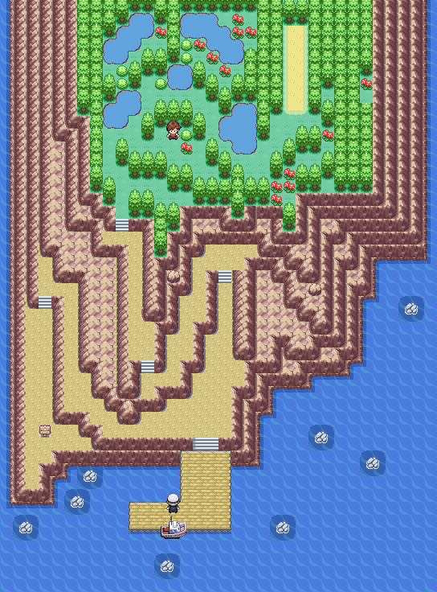
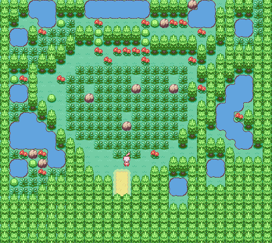

> [← Anterior](09-calle-victoria-y-liga.md) · [Índice general](../README.md) · [Cómo usar](../COMO-USAR-LA-GUIA.md) · [Siguiente →](11-postgame-team-rocket-y-rematches.md)

[Español] · [English](../../en/guide/10-postgame-zapdos-mewtwo-and-mew.md)

**POKÉMON CLASSIC**

**v1.5**

**VOLUMEN 10**

**El primer posjuego y los Pokémon legendarios**

*Recorrido paso a paso • Mapas originales • Tablas • Checklists*

> Consulta [Cómo usar la guía](../COMO-USAR-LA-GUIA.md) para conocer los símbolos, las mecánicas esenciales y el criterio de datos común a todos los volúmenes.

# Cómo abordar el posjuego

| **ORDEN RECOMENDADO**                                                                                                                                                                                                                                                                |
|--------------------------------------------------------------------------------------------------------------------------------------------------------------------------------------------------------------------------------------------------------------------------------------|
| 1\) Visita a Cedar y revisa los nuevos seguidores. 2) Captura a Zapdos. 3) Explora Cueva Celeste y captura a Mewtwo. 4) Usa el Old Sea Map para llegar a Faraway Island y capturar a Mew. 5) Defiende el título ante el retador diario y completa una segunda vuelta de la Liga para desbloquear el Mega Ring y las megapiedras. |

- La guía original confirma que el juego abre rematches, combates por Battle Points, Cueva Celeste, Faraway Island, seguidores adicionales y Mega Evolución en el posjuego.

- Guarda antes de cada legendario. Lleva Ultra Balls, movimientos de sueño o parálisis y un Pokémon que pueda reducir PS sin debilitar.

- La fuente no aporta equipos ni niveles exactos de la segunda Liga. Por ello, esta guía no inventa esos datos: entra con un equipo claramente más fuerte que el usado en la primera victoria.

## Checklist

**☐** Visitar el laboratorio de Oak y hablar con Cedar

**☐** Revisar el PC y los objetos de captura

**☐** Preparar un equipo de captura

**☐** Comprar Ultra Balls y curas

# Cedar y los objetos de posjuego

| **🎯 OBJETIVO**                                                                             |
|------------------------------------------------------------------------------------------|
| Recoger las ayudas de captura y completar los encargos pendientes de la ayudante de Oak. |

## Recorrido paso a paso

1.  Vuelve a Pueblo Paleta y entra en el laboratorio de Oak. Habla con los ayudantes para obtener pistas sobre la posición actual de Cedar.

2.  La guía sitúa Catching Charm, Oval Charm y Shiny Charm como recompensas de posjuego de Cedar.

3.  Recorre sus localizaciones en el orden que te indique el laboratorio; la guía no publica una secuencia fija completa, por lo que debes seguir las pistas dentro del juego.

4.  Revisa también los regalos de tu padre en el PC de tu habitación si dejaste alguno pendiente.

5.  Tras convertirte en Campeón, ya pueden habilitarse otros Pokémon como seguidores, no solo Pikachu.

## 💎 Objetos importantes

| **Objeto**     | **Localización**                   | **Prioridad**                   |
|----------------|------------------------------------|---------------------------------|
| Catching Charm | Recompensa de Cedar en el posjuego | Muy alta                        |
| Oval Charm     | Recompensa de Cedar en el posjuego | Media; útil para crianza        |
| Shiny Charm    | Recompensa de Cedar en el posjuego | Muy alta para búsqueda de shiny |

| **LO QUE DICE LA FUENTE**                                                                                                                                                   |
|-----------------------------------------------------------------------------------------------------------------------------------------------------------------------------|
| Si no sabes dónde está Cedar, habla con los otros ayudantes del laboratorio de Oak. La guía no enumera todos los pasos intermedios ni los requisitos exactos de cada charm. |

## Checklist

**☐** Conseguir los tres charms

**☐** Probar un nuevo Pokémon como seguidor

**☐** Revisar pistas de Cedar en el laboratorio

# Central de Energía y Zapdos

| **🎯 OBJETIVO**                                                            |
|-------------------------------------------------------------------------|
| Explorar la Central, recoger sus MT y capturar al legendario eléctrico. |

*Mapa original de la Central de Energía.*

## Recorrido paso a paso

6.  Vuela a la entrada del Túnel Roca en Ruta 10 y usa Surf para alcanzar la Central de Energía.

7.  Recorre el edificio recogiendo los objetos; dos Poké Balls son en realidad Electrode.

8.  Consigue MT25, MT17, las Piedras Trueno y los objetos ocultos antes de llegar al fondo.

9.  Guarda la partida junto al generador final.

10. Enfréntate a Zapdos. Tierra anula sus ataques eléctricos, pero evita debilitarlo con golpes demasiado fuertes.

11. Aplica sueño o parálisis, reduce sus PS y usa Ultra Balls.

## Pokémon y encuentros

| **Pokémon**          | **Disponibilidad**                           | **Recomendación**        |
|----------------------|----------------------------------------------|--------------------------|
| Pikachu              | 20%                                          | Opcional                 |
| Electabuzz           | 10%                                          | Buena captura eléctrica  |
| Magnemite / Magneton | 5-10% / 1-4%                                 | Útiles por su tipo Acero |
| Electrode            | 2 encuentros estáticos disfrazados de objeto | Cuidado                  |
| Zapdos               | Encuentro estático                           | Legendario prioritario   |

## 💎 Objetos importantes

| **Objeto**             | **Localización**                         | **Prioridad** |
|------------------------|------------------------------------------|---------------|
| Máxima Poción          | Poké Ball                                | Alta          |
| Revestimiento Metálico | 🔍 Objeto oculto                            | Alta          |
| MT25                   | Great Ball                               | Muy alta      |
| Elixir                 | Poké Ball                                | Alta          |
| MT17                   | Poké Ball                                | Alta          |
| Piedra Trueno          | Visible y otra oculta junto al generador | Alta          |
| Elixir Máx.            | 🔍 Objeto oculto                            | Muy alta      |

| **ANTES DE ZAPDOS**                                                                                                          |
|------------------------------------------------------------------------------------------------------------------------------|
| Guarda. Un Pokémon de tipo Tierra es excelente para aguantar, pero usa movimientos neutrales débiles para controlar el daño. |

## Checklist

**☐** Recoger MT25 y MT17

**☐** Detectar los Electrode falsos

**☐** Capturar a Zapdos

# Ruta 24 y acceso a Cueva Celeste

| **🎯 OBJETIVO**                                                                      |
|-----------------------------------------------------------------------------------|
| Revisar los eventos nuevos de la zona y entrar en la cueva más exigente de Kanto. |

*Mapa original de la Ruta 24.*

## Recorrido paso a paso

12. Ve al norte de Ciudad Celeste y cruza el Puente Pepita.

13. La Ruta 24 contiene combates de la historia extendida contra Rocket, Jessie y James; si quedaron pendientes, complétalos.

14. Captura el Charmander estático si aún no lo hiciste.

15. Usa Surf para llegar a la entrada de Cueva Celeste.

16. En el posjuego puede aparecer un Rocket Fugitive cerca de la cueva; revisa también la hierba de Ruta 4 si estás haciendo la misión diaria.

17. Entra con Fuerza, Surf, Repelentes, Ultra Balls y muchas curas.

## Pokémon y encuentros

| **Pokémon** | **Disponibilidad** | **Recomendación** |
|-------------|--------------------|-------------------|
| Charmander  | Encuentro estático | Muy recomendado   |
| Dratini     | 1% con Supercaña   | Muy raro          |
| Abra        | 10% de día         | Opcional          |

## ↩ Encuentros acuáticos

> La tabla corresponde a la Ruta 24; el acceso a Cueva Celeste sigue requiriendo el progreso de posjuego indicado en esta sección.

| Pokémon | Método | Disponibilidad |
|---|---|---|
| Goldeen | 🏄 Surf | Día, 30-60 % |
| Seaking | 🏄 Surf | Día, 1-5 % |
| Poliwag | 🏄 Surf | Noche, 30-60 % |
| Poliwhirl | 🏄 Surf | Noche, 1-5 % |
| Magikarp | 🎣 Caña Vieja | Día y noche, 30-70 % |
| Goldeen | 🎣 Caña Buena | Día, 20-60 %; noche, 20 % |
| Poliwag | 🎣 Caña Buena | Día, 20 %; noche, 20-60 % |
| Poliwhirl | 🎣 Supercaña | Día, 40 %; noche, 4-15 % |
| Seaking | 🎣 Supercaña | Día, 4-15 %; noche, 40 % |
| Dratini | 🎣 Supercaña | Día y noche, 1 % |

## 💎 Objetos importantes

| **Objeto** | **Localización**      | **Prioridad** |
|------------|-----------------------|---------------|
| MT45       | Great Ball en Ruta 24 | Alta          |

## Entrenadores / combates

| **Entrenador**   | **Zona o función** | **Equipo** |
|------------------|--------------------|---|
| Bug Catcher Cale | Ruta 24            | Caterpie Nv. 10 · Weedle Nv. 10 · Metapod Nv. 10 · Kakuna Nv. 10 |
| Lass Ali         | Ruta 24            | Pidgey Nv. 12 · Oddish Nv. 12 · Bellsprout Nv. 12 |
| Youngster Timmy  | Ruta 24            | Sandshrew Nv. 14 · Ekans Nv. 14 |
| Lass Reli        | Ruta 24            | Nidoran♂ Nv. 16 · Nidoran♀ Nv. 16 |
| Camper Ethan     | Ruta 24            | Mankey Nv. 18 |
| Disguised Rocket | Historia extendida | Ekans Nv. 15 · Zubat Nv. 15 |
| Camper Shane     | Ruta 24            | Rattata Nv. 14 · Ekans Nv. 14 |
| Rocket Grunt     | Historia extendida | Ekans Nv. 15 · Zubat Nv. 15 |
| Jessie y James   | Combate doble      | Ekans Nv. 17 · Meowth Nv. 17 · Koffing Nv. 17 · Lickitung Nv. 17 |

## Checklist

**☐** Conseguir Charmander si faltaba

**☐** Revisar el Rocket Fugitive

**☐** Entrar preparado en Cueva Celeste

# Cueva Celeste y Mewtwo

| **🎯 OBJETIVO**                                                               |
|----------------------------------------------------------------------------|
| Atravesar las tres plantas, recoger todos los objetos y capturar a Mewtwo. |

*Cueva Celeste, planta 1.*

*Cueva Celeste, planta 2.*

*Cueva Celeste, sótano B1F.*

## Recorrido paso a paso

18. Explora por completo la primera planta antes de usar las escaleras; la cueva tiene caminos conectados mediante Surf.

19. Recoge el Nugget, los Restaurar Todo y el Elixir Máx.

20. En la segunda planta recoge PP Más y Ultra Ball. Las Mewtwonitas todavía no aparecen hasta ganar la Liga por segunda vez.

21. Desciende al sótano B1F y recoge Revivir Máx. y Ultra Ball.

22. Guarda antes del encuentro final.

23. Mewtwo es el objetivo principal. Usa estados y un equipo resistente a Psíquico; evita envenenarlo o quemarlo si el combate puede alargarse demasiado.

24. Tras capturarlo, usa Cuerda Huida o regresa por el recorrido de salida.

## Pokémon y encuentros

| **Pokémon** | **Disponibilidad**        | **Recomendación**    |
|-------------|---------------------------|----------------------|
| Golbat      | 20%                       | Común                |
| Graveler    | 10%                       | Opcional             |
| Rhyhorn     | 5-10%                     | Útil físicamente     |
| Kangaskhan  | 5-10%                     | Raro                 |
| Rhydon      | 4%                        | Potente              |
| Chansey     | 1%                        | Muy raro             |
| Dratini     | 1-4% con Supercaña        | Raro                 |
| Mewtwo      | Encuentro estático en B1F | Legendario principal |

## ↩ Encuentros acuáticos

| Pokémon | Método | Disponibilidad |
|---|---|---|
| Slowpoke | 🏄 Surf | 5-60 % |
| Slowbro | 🏄 Surf | 1-30 % |
| Magikarp | 🎣 Caña Vieja | 30-70 % |
| Poliwag | 🎣 Caña Buena | 60 % |
| Goldeen | 🎣 Caña Buena | 20 % |
| Krabby | 🎣 Supercaña | 40 % |
| Kingler | 🎣 Supercaña | 40 % |
| Gyarados | 🎣 Supercaña | 15 % |
| Dratini | 🎣 Supercaña | 1-4 % |

## 💎 Objetos importantes

| **Objeto**     | **Localización**                  | **Prioridad** |
|----------------|-----------------------------------|---------------|
| Ultra Ball     | 🔍 Oculta, 1F                        | Alta          |
| Nugget         | 1F                                | Media         |
| Restaurar Todo | 1F y 2F                           | Muy alta      |
| Elixir Máx.    | 1F                                | Muy alta      |
| Ultra Ball     | 2F y B1F                          | Alta          |
| PP Más         | 2F                                | Alta          |
| Revivir Máx.   | B1F                               | Muy alta      |
| Mewtwonita Y   | 2F, tras ganar la Liga por segunda vez | ↩ Más adelante  |
| Mewtwonita X   | 2F, tras ganar la Liga por segunda vez | ↩ Más adelante  |

| **CAPTURA SEGURA**                                                                                                                                                         |
|----------------------------------------------------------------------------------------------------------------------------------------------------------------------------|
| La guía fuente confirma la localización, pero no publica el nivel ni los movimientos exactos de Mewtwo. Lleva más recursos de los que usarías contra un legendario normal. |

## Checklist

**☐** Recoger todos los objetos

**☐** Capturar a Mewtwo

**☐** Marcar las Mewtwonitas para volver después

# Old Sea Map y Faraway Island

| **🎯 OBJETIVO**                                                                       |
|------------------------------------------------------------------------------------|
| Usar el mapa antiguo de la Mansión Pokémon para llegar a la isla y capturar a Mew. |

*Faraway Island: muelle y acceso al bosque.*

*Faraway Island: zona del encuentro con Mew.*

## Recorrido paso a paso

25. Vuelve a la Mansión Pokémon en Isla Canela.

26. En B1F examina la pared indicada en la guía para obtener el Old Sea Map.

27. Con el mapa en tu poder, entra en la casa normal de Isla Canela y habla con el viejo capitán. Él es quien ofrece el viaje a Faraway Island; no el marinero del S.S. Anne de Ciudad Carmín.

28. Recorre el muelle y sube a la zona boscosa.

29. En la segunda área, sigue a Mew entre la hierba hasta poder iniciar el encuentro.

30. Guarda antes de interactuar y captura a Mew con estados y Ultra Balls.

31. La guía registra además un evento posterior con Lass Kairi cuando el encuentro de Faraway Island está capturado y ya has completado el primer campeonato.

## Pokémon y encuentros

| **Pokémon** | **Disponibilidad**                      | **Recomendación**                  |
|-------------|-----------------------------------------|------------------------------------|
| Mew         | Encuentro estático en la zona de hierba | Legendario / mítico imprescindible |

## 💎 Objetos importantes

| **Objeto**  | **Localización**                | **Prioridad**         |
|-------------|---------------------------------|-----------------------|
| Old Sea Map | Pared de B1F en Mansión Pokémon | Necesario para viajar |

## Entrenadores / combates

| **Entrenador** | **Zona o función**                                          | **Equipo** |
|----------------|-------------------------------------------------------------|---|
| Lass Kairi     | Evento de posjuego tras capturar el encuentro y ser Campeón | Vaporeon Nv. 75 · Jigglypuff Nv. 65 · Aerodactyl Nv. 65 · Charizard Nv. 65 · Butterfree Nv. 65 · Mew Nv. 65 |

| **INFORMACIÓN VISUAL**                                                                                          |
|-----------------------------------------------------------------------------------------------------------------|
| El texto de la guía es muy breve, pero el mapa original muestra claramente a Mew en la segunda zona de la isla. |

## Checklist

**☐** Recoger Old Sea Map

**☐** Viajar a Faraway Island

**☐** Capturar a Mew

**☐** Hablar con Lass Kairi

# Defensa diaria del título

| **🎯 OBJETIVO** |
|-----------------|
| Defender el título ante un retador antes de iniciar la revancha del Alto Mando. |

## Recorrido paso a paso

32. Después del primer campeonato, habla con el guardia del Centro Pokémon de la Meseta Añil. Si la defensa diaria está disponible, te avisará de que un retador ha superado al Alto Mando.

33. Acepta el combate para entrar en la sala del retador. El rival se elige al azar entre los nueve entrenadores de la tabla inferior.

34. Al ganar regresarás al Centro Pokémon con el equipo curado. Habla otra vez con el guardia para iniciar la segunda Liga.

## Posibles retadores

| **Entrenador** | **Equipo confirmado en Pokémon Classic v1.5** |
|----------------|------------------------------------------------|
| Lass Steph | Raticate · Kangaskhan · Fearow · Tauros · Persian · Snorlax (Nv. 65) |
| Battle Girl Liz | Raticate · Kangaskhan · Fearow · Tauros · Persian · Snorlax (Nv. 65) |
| Cooltrainer Mike | Charizard · Venusaur · Blastoise · Raichu · Jynx · Wigglytuff (Nv. 65) |
| Cue Ball Chris | Pidgeot · Nidoking · Alakazam · Charizard · Gengar · Dragonite (Nv. 65) |
| Ninja Boy Kev | Ninetales · Omastar · Exeggutor · Rhydon · Machamp · Weezing (Nv. 65) |
| Hex Maniac Meghan | Farfetch'd · Venusaur · Vileplume · Arcanine · Gengar · Kingler (Nv. 65) |
| Dragon Tamer Steve | Charizard · Nidoking · Aerodactyl · Kangaskhan · Gyarados · Dragonite (Nv. 65) |
| Bug Catcher M. | Butterfree · Venomoth · Golbat · Farfetch'd · Venusaur · Poliwrath (Nv. 65) |
| Youngster Bean | Charizard · Arcanine · Alakazam · Hypno · Raichu · Magneton (Nv. 65) |

> [!NOTE]
> Es una defensa diaria independiente, no una ronda de la segunda Liga. En la tercera defensa registrada, el juego cambia a un grupo especial formado por Brock, Misty, Lt. Surge, Erika, Sabrina, Koga, Blaine, Deserter y Daisy. Hay otros dos candidatos previstos que no pueden aparecer durante el juego normal. Liz utiliza el mismo equipo que Steph en la versión 1.5.

# Segunda Liga Pokémon

| **🎯 OBJETIVO** |
|-----------------|
| Vencer de nuevo al Alto Mando y superar el combate final sorpresa; después recoge de Bill el Mega Ring en tu casa. |

## Recorrido paso a paso

35. Entrena al equipo hasta alrededor del nivel 65 y mejora movimientos, objetos equipados e IV/EV si lo deseas.

36. Compra suficientes Restaurar Todo, Revivir Máx. y Elixir.

37. Vence de nuevo a Lorelei, Bruno, Agatha y Lance. Sus equipos de posjuego están entre los niveles 65 y 70.

38. Después de Lance pasarás directamente al último combate de la segunda Liga. No hay un combate obligatorio contra el rival en esta ronda.

39. Reserva curas y PP: son cinco combates consecutivos, los cuatro del Alto Mando y el enfrentamiento final.

40. Tras ganar la Liga por segunda vez, vuelve a tu casa de Pueblo Paleta y habla con Bill, que estará esperándote allí, para recibir el Mega Ring.

41. A partir de ese momento aparecen megapiedras visibles como piedras doradas y nuevos entrenadores especiales repartidos por Kanto.

## Equipos de la segunda Liga

| **Entrenador** | **Equipo confirmado en Pokémon Classic v1.5** |
|----------------|------------------------------------------------|
| Lorelei | Dewgong Nv. 65 · Cloyster Nv. 65 · Slowbro Nv. 65 · Jynx Nv. 65 · Wigglytuff Nv. 65 · Lapras Nv. 70 |
| Bruno | Onix Nv. 65 · Hitmonchan Nv. 65 · Hitmonlee Nv. 65 · Golem Nv. 65 · Poliwrath Nv. 65 · Machamp Nv. 65 |
| Agatha | Arbok Nv. 65 · Gengar Nv. 65 · Golbat Nv. 65 · Weezing Nv. 65 · Gengar Nv. 65 · Haunter Nv. 65 |
| Lance | Gyarados Nv. 65 · Seadra Nv. 65 · Charizard Nv. 65 · Aerodactyl Nv. 65 · Dragonite Nv. 65 · Dragonite Nv. 65 |

> [!IMPORTANT]
> La sala del retador pertenece a la defensa diaria del título y no forma parte de esta ronda. Tras Lance se accede directamente al combate final sorpresa.

<strong>⚠ Spoiler: identidad y equipo del combate final</strong>

| **Entrenador** | **Equipo confirmado en Pokémon Classic v1.5** |
|----------------|------------------------------------------------|
| Oak | Ditto Nv. 69 · Tauros Nv. 69 · Chansey Nv. 69 · Arcanine Nv. 69 · Exeggutor Nv. 69 · Rhydon Nv. 70 |

## 💎 Objetos importantes

| **Objeto** | **Localización**                                      | **Prioridad**  |
|------------|-------------------------------------------------------|----------------|
| Mega Ring  | Bill, casa del jugador en Pueblo Paleta, tras ganar la Liga por segunda vez | Imprescindible |

| **MEGA EVOLUCIÓN**                                                                                                                                                                                                   |
|----------------------------------------------------------------------------------------------------------------------------------------------------------------------------------------------------------------------|
| Equipa la megapiedra al Pokémon. Al seleccionar un movimiento aparecerá el símbolo Mega gris; pulsa START para convertirlo en arcoíris y confirma el movimiento. Solo puedes megaevolucionar un Pokémon por combate. |

## Checklist

**☐** Completar la defensa diaria del título

**☐** Completar la Liga por segunda vez

**☐** Obtener el Mega Ring

**☐** Empezar la búsqueda de megapiedras

---

> [← Anterior](09-calle-victoria-y-liga.md) · [Índice general](../README.md) · [Cómo usar](../COMO-USAR-LA-GUIA.md) · [Siguiente →](11-postgame-team-rocket-y-rematches.md)
