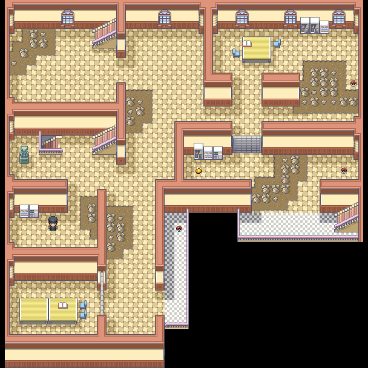
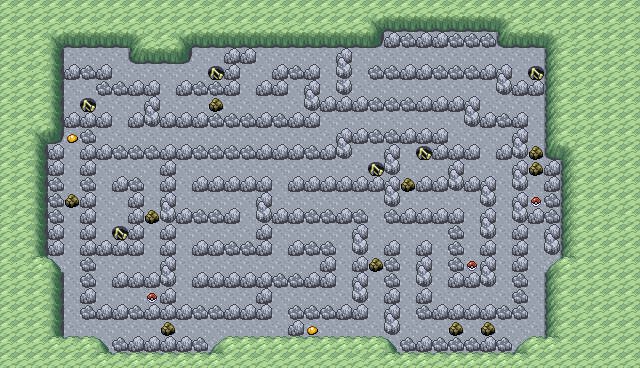

> [← Anterior](11-postgame-team-rocket-y-rematches.md) · [Índice general](../README.md) · [Cómo usar](../COMO-USAR-LA-GUIA.md) · [Siguiente →](../README.md)

[Español] · [English](../../en/guide/12-mega-evolution-and-100-percent.md)

**POKÉMON CLASSIC**

**v1.5**

**VOLUMEN 12**

**Mega Evolución y guía de finalización al 100 %**

*Recorrido paso a paso • Mapas originales • Tablas • Checklists*

> Consulta [Cómo usar la guía](../COMO-USAR-LA-GUIA.md) para conocer los símbolos, las mecánicas esenciales y el criterio de datos común a todos los volúmenes.

# Mega Evolución

| **REQUISITO**                                                                                                            |
|--------------------------------------------------------------------------------------------------------------------------|
| Completa la segunda Liga venciendo al rival y a Oak, vuelve a tu casa de Pueblo Paleta y habla con Bill para recibir el Mega Ring. Las megapiedras aparecen después de este hito. |

- El Pokémon debe llevar equipada su megapiedra como objeto de combate.

- Al elegir un movimiento aparece un símbolo Mega gris. Pulsa START para convertirlo en un símbolo arcoíris y confirma el ataque.

- La transformación dura hasta que el Pokémon cae debilitado o termina el combate.

- Solo se permite una Mega Evolución por combate o encuentro.

# Todas las megapiedras documentadas

> [!IMPORTANT]
> Las megapiedras que aparecen en el suelo no son objetos ocultos: después de vencer a Oak se ven en el mapa como piedras doradas. Examina esas piedras, no casillas vacías. Alakazita es la excepción porque la entrega Mr. Psychic.

| **Megapiedra** | **Localización** | **Cómo identificarla** |
|----------------|------------------|------------------------|
| Venusaurita | Berry Backyard, Ciudad Celeste | Piedra dorada visible |
| Charizardita X | Mansión Pokémon 2F | Piedra dorada visible |
| Charizardita Y | Mansión Pokémon 3F | Piedra dorada visible |
| Blastoisinita | Ciudad Carmín | Piedra dorada visible |
| Beedrillita | Bosque Verde | Piedra dorada visible |
| Pidgeotita | Ruta 2 | Piedra dorada visible |
| Alakazita | Casa de Mr. Psychic, Ciudad Azafrán | La entrega Mr. Psychic |
| Slowbronita | Ruta 20 | Piedra dorada visible |
| Gengarita | Torre Pokémon 6F | Piedra dorada visible |
| Kangaskhanita | Zona Safari Este | Piedra dorada visible |
| Pinsirita | Zona Safari Centro | Piedra dorada visible |
| Gyaradosita | Islas Espuma B1F | Piedra dorada visible |
| Aerodactylita | Túnel Roca B1F | Piedra dorada visible |
| Mewtwonita Y | Cueva Celeste 2F | Piedra dorada visible |
| Mewtwonita X | Cueva Celeste 2F | Piedra dorada visible |

# Ruta de megapiedras: norte y centro de Kanto

| **🎯 OBJETIVO**                                                                                       |
|----------------------------------------------------------------------------------------------------|
| Recoger las piedras de Bosque Verde, Ruta 2, Ciudad Celeste, Ciudad Carmín, Túnel Roca y Torre Pokémon. |


*Túnel Roca, una de las plantas con acceso a B1F.*


*Túnel Roca, segunda planta del recorrido.*

## Recorrido paso a paso

1.  Empieza en Bosque Verde y recoge Beedrillita.

2.  Sal a Ruta 2 y busca Pidgeotita.

3.  Vuela a Ciudad Celeste y busca la piedra dorada de Venusaurita en Berry Backyard.

4.  Ve a Ciudad Carmín y recoge la piedra dorada de Blastoisinita.

5.  Entra en Túnel Roca y baja a B1F para Aerodactylita.

6.  Vuela a Pueblo Lavanda y sube a 6F de Torre Pokémon para Gengarita.

## 💎 Objetos importantes

| **Objeto**    | **Localización**          | **Prioridad** |
|---------------|---------------------------|---------------|
| Beedrillita   | Bosque Verde              | Mega          |
| Pidgeotita    | Ruta 2                    | Mega          |
| Venusaurita   | Berry Backyard, Ciudad Celeste | Mega       |
| Blastoisinita | Ciudad Carmín                  | Mega       |
| Aerodactylita | Túnel Roca B1F            | Mega          |
| Gengarita     | Torre Pokémon 6F          | Mega          |

## Checklist

**☐** Beedrillita

**☐** Pidgeotita

**☐** Venusaurita

**☐** Blastoisinita

**☐** Aerodactylita

**☐** Gengarita

# Ruta de megapiedras: sur y oeste de Kanto

| **🎯 OBJETIVO**                                                        |
|---------------------------------------------------------------------|
| Recoger las piedras de Zona Safari, Islas Espuma y Mansión Pokémon. |


*Zona Safari: área central.*


*Zona Safari: área este.*


*Mansión Pokémon, planta 1.*



*Mansión Pokémon, planta 2.*

## Recorrido paso a paso

7.  Vuela a Ciudad Fucsia y entra en la Zona Safari.

8.  En el área Centro recoge Pinsirita.

9.  En el área Este recoge Kangaskhanita.

10. Viaja a Islas Espuma y busca la piedra dorada de Gyaradosita en B1F.

11. Ve a Isla Canela y entra en la Mansión Pokémon.

12. Recoge Charizardita X en 2F y Charizardita Y en 3F.

## 💎 Objetos importantes

| **Objeto**     | **Localización**   | **Prioridad** |
|----------------|--------------------|---------------|
| Pinsirita      | Zona Safari Centro | Mega          |
| Kangaskhanita  | Zona Safari Este   | Mega          |
| Gyaradosita    | Islas Espuma B1F   | Mega          |
| Charizardita X | Mansión Pokémon 2F | Mega          |
| Charizardita Y | Mansión Pokémon 3F | Mega          |

## Checklist

**☐** Pinsirita

**☐** Kangaskhanita

**☐** Gyaradosita

**☐** Charizardita X

**☐** Charizardita Y

# Ruta de megapiedras: Ciudad Azafrán y Cueva Celeste

| **🎯 OBJETIVO**                               |
|--------------------------------------------|
| Conseguir Alakazita y las dos Mewtwonitas. |



*Cueva Celeste 2F, donde aparecen ambas Mewtwonitas.*

## Recorrido paso a paso

13. En Ciudad Azafrán visita la casa de Mr. Psychic para recibir Alakazita.

14. Vuela a Ciudad Celeste y entra de nuevo en Cueva Celeste.

15. Recorre hasta la segunda planta.

16. Recoge Mewtwonita X y Mewtwonita Y, que ahora están disponibles.

17. Equipa la piedra correspondiente a Mewtwo según la forma que quieras usar.

## 💎 Objetos importantes

| **Objeto**   | **Localización**    | **Prioridad** |
|--------------|---------------------|---------------|
| Alakazita    | Casa de Mr. Psychic | Mega          |
| Mewtwonita X | Cueva Celeste 2F    | Mega          |
| Mewtwonita Y | Cueva Celeste 2F    | Mega          |

## Checklist

**☐** Alakazita

**☐** Mewtwonita X

**☐** Mewtwonita Y

# Entrenadores con Mega Evolución

Después de recibir el Mega Ring aparecen nuevos combates repartidos por Kanto. Cada rival usa una Mega Evolución concreta; lleva un equipo de nivel 72 o superior para la ruta principal y reserva el combate secreto final para un equipo de nivel 80 o más.

| **N.º** | **Entrenador** | **Zona** | **Mega principal** | **Nv. Mega** |
|--------:|----------------|----------|--------------------|-------------:|
| 1 | Cooltrainer Mura | Ruta 1 | Mega Pidgeot | 72 |
| 2 | Bug Catcher Dani | Bosque Verde | Mega Venusaur | 72 |
| 3 | Youngster Kody | Ruta 4 | Mega Charizard Y | 72 |
| 4 | Super Nerd Miguel | Mt. Moon B2F | Mega Aerodactyl | 72 |
| 5 | Gentleman Diamond | Exterior de la S.S. Anne | Mega Slowbro | 72 |
| 6 | Fisherman Larry | Ruta 12 | Mega Gyarados | 72 |
| 7 | Beauty Kishi | Pueblo Lavanda | Mega Gengar | 72 |
| 8 | Aroma Lady Phoebe | Ruta 8 | Mega Beedrill | 72 |
| 9 | Cooltrainer Tony | Guarida Rocket B4F | Mega Kangaskhan | 72 |
| 10 | Aroma Lady Lily | Ruta 18 | Mega Pinsir | 72 |
| 11 | Engineer Dylan | Ruta 20 | Mega Blastoise | 72 |
| 12 | Gentleman Justice | Mansión Pokémon 1F | Mega Alakazam | 72 |
| 13 | Pokémon Ranger Mei Hui | Gimnasio de Ciudad Verde | Mega Mewtwo Y | 72 |
| 14 | Dragon Tamer Nick | Exterior de la Meseta Añil | Mega Charizard X | 72 |
| 15 | Black Belt Jiraiya | Battle Tower, sala de descanso de 3F | Mega Mewtwo X | 80 |

> [!WARNING]
> Jiraiya es el desafío más duro de esta lista: aunque su Mega Mewtwo X está al nivel 80, su Charizard alcanza el nivel 85.

# Legendarios y míticos: control final

| **Pokémon** | **Localización**                    | **Estado** |
|-------------|-------------------------------------|------------|
| Articuno    | Islas Espuma B4F                    | ☐          |
| Zapdos      | Central de Energía                  | ☐          |
| Moltres     | Cueva lateral de Calle Victoria     | ☐          |
| Mewtwo      | Cueva Celeste B1F                   | ☐          |
| Mew         | Faraway Island mediante Old Sea Map | ☐          |

## Pokémon únicos y regalos

| **Pokémon / regalo** | **Localización o condición**                      | **Estado** |
|----------------------|---------------------------------------------------|------------|
| Bulbasaur            | Berry Backyard de Ciudad Celeste con alta amistad | ☐          |
| Charmander           | Ruta 24, encuentro estático                       | ☐          |
| Squirtle             | Encuentro raro en Islas Espuma según la guía      | ☐          |
| Lapras               | Silph S.A.                                        | ☐          |
| Hitmonlee            | Dojo de Ciudad Azafrán                            | ☐          |
| Hitmonchan           | Dojo de Ciudad Azafrán                            | ☐          |
| Aerodactyl           | Reviviendo Old Amber                              | ☐          |
| Omanyte / Kabuto     | Fósil escogido                                    | ☐          |

## Objetos y funciones de finalización

| **Elemento**             | **Cómo conseguirlo**          | **Estado** |
|--------------------------|-------------------------------|------------|
| Catching Charm           | Cedar, posjuego               | ☐          |
| Oval Charm               | Cedar, posjuego               | ☐          |
| Shiny Charm              | Cedar, posjuego               | ☐          |
| Mega Ring                | Bill en tu casa, tras vencer a Oak | ☐      |
| DexNAV                   | Casa de Bill                  | ☐          |
| Todos los seguidores     | Se habilitan tras ser Campeón | ☐          |
| Objeto para maximizar IV | Battle Points                 | ☐          |
| Master Ball diaria       | Presidente de Silph           | ☐          |

## Checklist

**☐** Capturar los cinco legendarios/míticos

**☐** Conseguir todas las megapiedras

**☐** Completar la segunda historia Rocket

**☐** Derrotar todos los rematches de líderes

**☐** Derrotar a los quince entrenadores con Mega Evolución

**☐** Comprar la mejora de IV

**☐** Conseguir los tres charms

**☐** Completar eventos de Erin y Kairi

**☐** Probar seguidores alternativos

**☐** Completar Pokédex o DexNAV al nivel deseado

# Información extra: Caramelos Raros

> [!NOTE]
> Esta ayuda es completamente opcional y no forma parte del recorrido normal. Puede ser útil para compensar el salto desde el nivel 50 de Giovanni hasta el nivel 65 del Campeón sin dedicar tantas horas al entrenamiento.

En mGBA o RetroArch, introduce los códigos como trucos separados:

```text
820051B4 003B
```

El código anterior sustituye un artículo de tienda por Caramelos Raros. El código fuente local confirma que en este hack Caramelo Raro usa el ID decimal 59 (`0x3B`), no el `0x44` habitual de muchos trucos de Pokémon Emerald. Si además quieres que cuesten 1 ₽, activa por separado:

```text
820050F0 0001
```

> [!WARNING]
> Haz una copia de la partida antes de usar trucos. Activa los códigos solo al comprar, comprueba el resultado en una tienda y desactívalos después; no unas ambas líneas con un signo `+`.

| **FIN DE LA GUÍA PRINCIPAL**                                                                                                                                                  |
|-------------------------------------------------------------------------------------------------------------------------------------------------------------------------------|
| Con estos objetivos se cubre todo el contenido de historia, posjuego, legendarios, Mega Evolución y actividades extra que la guía original documenta con suficiente claridad. |

---

> [← Anterior](11-postgame-team-rocket-y-rematches.md) · [Índice general](../README.md) · [Cómo usar](../COMO-USAR-LA-GUIA.md) · [Siguiente →](../README.md)
