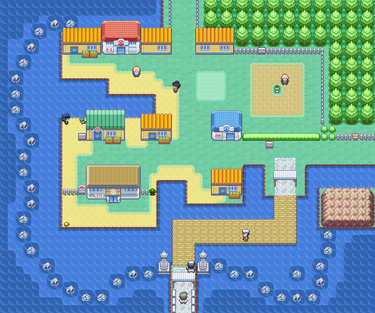
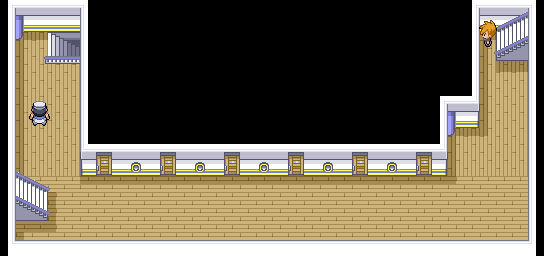
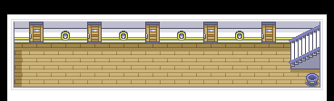
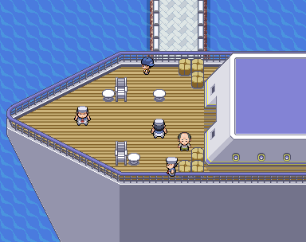
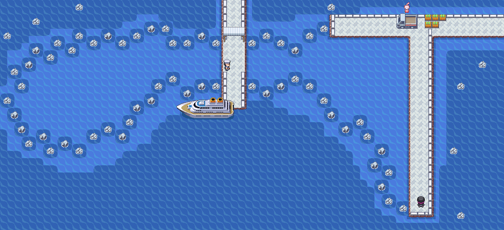

> [← Anterior](01-inicio-brock-y-monte-moon.md) · [Índice general](../README.md) · [Cómo usar](../COMO-USAR-LA-GUIA.md) · [Siguiente →](03-erika-y-guarida-rocket.md)

**POKÉMON CLASSIC**

**v1.5**

**VOLUMEN 2**

**Ciudad Celeste, Cabo Celeste y Ciudad Carmín**

Recorrido paso a paso • Objetos • Capturas recomendadas • Gimnasios • Checklists

# Contenido

- Ciudad Celeste y el robo de la MT28

- Gimnasio de Misty

- Ruta 24 y Puente Pepita

- Ruta 25 y Bill

- Rutas 5 y 6

- Ciudad Carmín

- S.S. Anne

- Gimnasio del Lt. Surge

- Cueva Diglett y cierre del volumen

| **CRITERIO DE DATOS** Los objetos, encuentros y eventos específicos proceden de la guía de Pokémon Classic v1.5. Los equipos de Misty y Lt. Surge se toman de Pokémon Amarillo, salvo que el hack indique un cambio. |
|----------------------------------------------------------------------------------------------------------------------------------------------------------------------------------------------------------------------|

# Ciudad Celeste

*Mapa de Ciudad Celeste extraído de la guía original.*

| **🎯 OBJETIVO** Resolver los eventos de la ciudad, prepararte para Misty y abrir el camino hacia el norte. |
|---------------------------------------------------------------------------------------------------------|

## Recorrido recomendado

1.  Recupera a tu equipo en el Centro Pokémon y revisa la tienda.

2.  Busca el Caramelo Raro oculto en el patio de bayas, junto a la valla.

3.  Visita el gimnasio cuando tu equipo ronde los niveles 18-21; también puedes completar primero las rutas 24 y 25 para ganar experiencia.

4.  Tras avanzar por el norte, vuelve a la casa vigilada por la agente y derrota al Rocket del patio para conseguir la MT28 Excavar.

5.  Cuando tengas mucha amistad con el Pokémon situado primero en el equipo, habla con la criadora del patio para recibir a Bulbasaur.

## ⭐ Pokémon y capturas recomendadas

| **Pokémon / grupo** | **Disponibilidad**               | **Valor para la aventura**                             |
|---------------------|----------------------------------|--------------------------------------------------------|
| Bulbasaur (regalo)  | Patio de bayas, con amistad alta | Excelente opción Planta/Veneno para el resto del juego |
| Dratini / Dragonair | Pesca avanzada, más adelante     | Muy raros; no merece retrasar la historia ahora        |
| Goldeen / Poliwag   | Surf o pesca posterior           | Opcionales; no son necesarios para Misty               |

## 💎 Objetos y recompensas

| **Objeto**    | **Dónde / cómo**                                     | **Prioridad** |
|---------------|------------------------------------------------------|---------------|
| Caramelo Raro | 🔍 Oculto junto a la valla del patio de bayas           | Alta          |
| MT28 Excavar  | Derrota al miembro Rocket detrás de la casa vigilada | Muy alta      |
| Bulbasaur     | Regalo por amistad alta                              | Muy alta      |
| Venusaurita   | Solo tras completar dos veces Liga y Campeón         | Posjuego      |

## Entrenadores

| **Entrenador** | **Zona / referencia**                                                |
|----------------|----------------------------------------------------------------------|
| Miembro Rocket | Patio trasero de la casa vigilada; entrega la MT28 al ser derrotado. |
| Rival          | Acceso norte, antes del Puente Pepita.                               |

| **CONSEJO** No gastes Excavar a ciegas: además de ser un buen ataque de tipo Tierra, puede ayudarte a salir de algunas cuevas. |
|--------------------------------------------------------------------------------------------------------------------------------|

## ⚠ Antes de continuar

- [ ] Recoger el Caramelo Raro

- [ ] Conseguir la MT28

- [ ] Decidir si quieres usar a Bulbasaur

# 🏆 GIMNASIO: Misty

*Interior del Gimnasio de Ciudad Celeste.*

| **LEVEL CAP RECOMENDADO** 21. Se toma como referencia el Pokémon de mayor nivel del equipo de Pokémon Amarillo. |
|-----------------------------------------------------------------------------------------------------------------|

| **Pokémon** | **Nivel** | **Tipo**      | **Peligro principal**               |
|-------------|-----------|---------------|-------------------------------------|
| Staryu      | 18        | Agua          | Velocidad y ataques de Agua         |
| Starmie     | 21        | Agua/Psíquico | Muy rápido y con estadísticas altas |

## Plan de combate

- Pikachu es la respuesta natural, pero evita llegar varios niveles por debajo de Starmie.

- Bellsprout u Oddish de las rutas del norte resisten Agua y pueden usar cambios de estado.

- No dependas de un único Pokémon: Starmie puede superar en velocidad a gran parte del equipo.

- Lleva Pociones y cura antes de iniciar el combate.

| **RECOMPENSA** Medalla Cascada y MT03 de Pokémon Classic. |
|-----------------------------------------------------------|

# Ruta 24 · Puente Pepita

*Ruta 24 y Puente Pepita.*

| **🎯 OBJETIVO** Superar la cadena de entrenadores, derrotar al Rocket y ampliar el equipo. |
|-----------------------------------------------------------------------------------------|

## Recorrido recomendado

6.  Cruza el puente derrotando a los cinco entrenadores consecutivos.

7.  Vence al reclutador disfrazado del Team Rocket al final del puente.

8.  Explora la hierba: Abra es una captura excelente, aunque puede escapar usando Teletransporte.

9.  Recoge la MT45 y habla con los personajes de la zona.

10. Derrota a Jessie y James y al Rocket adicional antes de continuar hacia la Ruta 25.

11. Recoge al Charmander estático cuando esté disponible.

## ⭐ Pokémon y capturas recomendadas

| **Pokémon / grupo**            | **Disponibilidad** | **Valor para la aventura**                                             |
|--------------------------------|--------------------|------------------------------------------------------------------------|
| Abra                           | 10% de día         | Alakazam es extraordinario; usa sueño/parálisis o una Poké Ball rápida |
| Bellsprout / Oddish            | Día / noche        | Muy útiles contra Misty y para estados alterados                       |
| Charmander                     | Encuentro estático | Gran incorporación de tipo Fuego                                       |
| Pidgeotto / Weepinbell / Gloom | Muy raros          | Captura de comodidad, no imprescindible                                |

## 💎 Objetos y recompensas

| **Objeto** | **Dónde / cómo**              | **Prioridad** |
|------------|-------------------------------|---------------|
| MT45       | Poké Ball especial en la ruta | Alta          |
| Charmander | Encuentro estático            | Muy alta      |

## Entrenadores

| **Entrenador**    | **Zona / referencia**         |
|-------------------|-------------------------------|
| Bug Catcher Cale  | 1.º combate del Puente Pepita |
| Lass Ali          | 2.º combate del Puente Pepita |
| Youngster Timmy   | 3.º combate del Puente Pepita |
| Lass Reli         | 4.º combate del Puente Pepita |
| Camper Ethan      | 5.º combate del Puente Pepita |
| Rocket disfrazado | Final del puente              |
| Camper Shane      | Zona norte de la ruta         |
| Rocket Grunt      | Evento Rocket                 |
| Jessie y James    | Combate doble                 |

## ⚠ Antes de continuar

- [ ] Superar todo el Puente Pepita

- [ ] Capturar Abra si te interesa

- [ ] Recoger Charmander y MT45

# Ruta 25 · Casa de Bill

*Ruta 25 y camino hacia la casa de Bill.*

| **🎯 OBJETIVO** Ayudar a Bill y conseguir el acceso a la S.S. Anne. |
|------------------------------------------------------------------|

## Recorrido recomendado

12. Recorre el pasillo de entrenadores y usa los huecos entre árboles para acceder a los objetos.

13. Recoge los objetos ocultos antes de entrar en la casa.

14. Ayuda a Bill con su experimento.

15. Recibe el Ticket Barco y el DexNAV.

16. Regresa a Ciudad Celeste; ya puedes dirigirte al sur.

## ⭐ Pokémon y capturas recomendadas

| **Pokémon / grupo**        | **Disponibilidad**       | **Valor para la aventura**                    |
|----------------------------|--------------------------|-----------------------------------------------|
| Abra                       | 10%                      | Captura prioritaria si no apareció en Ruta 24 |
| Bellsprout / Oddish        | Comunes según hora       | Buenas opciones de tipo Planta                |
| Venonat / Gloom / Venomoth | Nocturnos, algunos raros | Opcionales                                    |

## 💎 Objetos y recompensas

| **Objeto**   | **Dónde / cómo** | **Prioridad**                 |
|--------------|------------------|-------------------------------|
| Elixir       | 🔍 Oculto           | Media                         |
| Baya Aranja  | 🔍 Oculta           | Baja                          |
| Baya Bluk    | 🔍 Oculta           | Baja                          |
| Éter         | 🔍 Oculto           | Media                         |
| Orbe Tóxico  | Poké Ball        | Alta para estrategias futuras |
| Ticket Barco | Casa de Bill     | Obligatoria                   |
| DexNAV       | Casa de Bill     | Obligatoria                   |

| **DEXNAV** Úsalo para localizar especies ya vistas y buscar mejores IV, habilidades o encuentros ocultos. |
|-----------------------------------------------------------------------------------------------------------|

## ⚠ Antes de continuar

- [ ] Conseguir Ticket Barco

- [ ] Conseguir DexNAV

- [ ] Recoger el Orbe Tóxico

# Rutas 5 y 6

*Ruta 5: salida sur de Ciudad Celeste y acceso al paso subterráneo.*

*Ruta 6: tramo final hasta Ciudad Carmín.*

| **🎯 OBJETIVO** Atravesar el paso subterráneo y llegar a Ciudad Carmín. |
|----------------------------------------------------------------------|

## Recorrido recomendado

17. Baja por la Ruta 5 y visita la Guardería si quieres dejar un Pokémon.

18. Recoge o planta las bayas de reducción de EV de la Ruta 5.

19. Como el acceso directo a Azafrán sigue bloqueado, entra en el paso subterráneo hacia la Ruta 6.

20. En la Ruta 6, busca el Caramelo Raro oculto y la Baya Zidra.

21. Derrota a los seis entrenadores y entra en Ciudad Carmín.

## ⭐ Pokémon y capturas recomendadas

| **Pokémon / grupo** | **Disponibilidad** | **Valor para la aventura**                                     |
|---------------------|--------------------|----------------------------------------------------------------|
| Abra                | 5-20%              | Muy recomendable                                               |
| Meowth              | Raro               | Útil por Día de Pago y recogida de objetos según configuración |
| Jigglypuff          | 10% aprox.         | Buen soporte, pero no imprescindible                           |
| Pidgeotto           | Raro               | Atajo para obtener un volador evolucionado                     |

## 💎 Objetos y recompensas

| **Objeto**             | **Dónde / cómo**   | **Prioridad** |
|------------------------|--------------------|---------------|
| Bayas reductoras de EV | Parcelas de Ruta 5 | Media         |
| Baya Zidra             | 🔍 Oculta en Ruta 6   | Alta          |
| Caramelo Raro          | 🔍 Oculto en Ruta 6   | Alta          |

## Entrenadores

- Bug Catcher Keigo

- Camper Ricky

- Picnicker Nancy

- Bug Catcher Elijah

- Picnicker Isabelle

- Camper Jeff

## ⚠ Antes de continuar

- [ ] Recoger el Caramelo Raro

- [ ] Llegar con el equipo alrededor de nivel 22-24

# Ciudad Carmín

*Mapa de Ciudad Carmín.*

| **🎯 OBJETIVO** Preparar la visita a la S.S. Anne y obtener objetos clave. |
|-------------------------------------------------------------------------|

## Recorrido recomendado

22. Visita el Club de Fans Pokémon y escucha al presidente para recibir el Vale Bici.

23. Consigue la Caña Vieja en la casa del gurú pescador.

24. Busca el Máx. Éter oculto en la costa, bajando desde el Centro Pokémon.

25. Sube a la S.S. Anne usando el Ticket Barco.

26. Tras ganar la tercera medalla, vuelve para recibir a Squirtle.

## ⭐ Pokémon y capturas recomendadas

| **Pokémon / grupo**      | **Disponibilidad**           | **Valor para la aventura**                                 |
|--------------------------|------------------------------|------------------------------------------------------------|
| Squirtle (regalo)        | Tras completar el Gimnasio 3 | Excelente Pokémon de Agua                                  |
| Magikarp                 | Caña Vieja                   | Gyarados merece la inversión si quieres un atacante físico |
| Horsea / Staryu / Krabby | Con mejores cañas            | Opciones posteriores                                       |

## 💎 Objetos y recompensas

| **Objeto**  | **Dónde / cómo**                     | **Prioridad**          |
|-------------|--------------------------------------|------------------------|
| Vale Bici   | Club de Fans Pokémon                 | Obligatoria / muy alta |
| Caña Vieja  | Casa del pescador                    | Media                  |
| Máx. Éter   | 🔍 Oculto en la costa                   | Alta                   |
| Blastoisita | Posjuego tras segunda victoria final | Posjuego               |

## ⚠ Antes de continuar

- [ ] Conseguir Vale Bici

- [ ] Conseguir Caña Vieja

- [ ] Recoger Máx. Éter

# S.S. Anne

*S.S. Anne: cubierta principal.*

*S.S. Anne: planta de acceso.*

*S.S. Anne: pasillos y camarotes.*

*S.S. Anne: cubierta exterior.*

*S.S. Anne: zona interior adicional.*

*S.S. Anne: camarote del capitán y tramo final.*

| **🎯 OBJETIVO** Explorar el barco por completo, vencer al rival y conseguir Corte. |
|---------------------------------------------------------------------------------|

## Recorrido recomendado

27. Explora primero las habitaciones de las plantas inferiores y derrota a los entrenadores para ganar experiencia.

28. Revisa la cocina: hay tres bayas en las papeleras y una Super Ball.

29. Recoge las MT31 y MT44, además de Polvo Estelar, Ataque X, Éter y Superpoción.

30. Descansa cuando sea necesario antes de subir al corredor de la segunda planta.

31. Derrota al rival.

32. Habla con el capitán mareado para conseguir la MO01 Corte. No abandones el barco hasta haber recogido todo.

## 💎 Objetos y recompensas

| **Objeto**                  | **Dónde / cómo**       | **Prioridad** |
|-----------------------------|------------------------|---------------|
| Hiperpoción                 | 🔍 Oculta, corredor B1F   | Alta          |
| Super Ball                  | Cocina                 | Media         |
| Bayas Atania, Zreza y Meloc | Papeleras de la cocina | Media         |
| MT31                        | Habitación 2, planta 1 | Alta          |
| Polvo Estelar               | Habitación 2, planta 2 | Media         |
| Ataque X                    | Habitación 4, planta 2 | Baja          |
| MT44                        | Habitación 2, B1F      | Alta          |
| Éter                        | Habitación 3, B1F      | Media         |
| Superpoción                 | Habitación 5, B1F      | Media         |
| MO01 Corte                  | Capitán                | Obligatoria   |

## Entrenadores

- Rival, corredor 2F

- Sailor Trevor y Sailor Edmond, cubierta

- Lass Ann y Youngster Tyler

- Gentleman Arthur y Gentleman Thomas

- Fisherman Dale y Gentleman Brooks

- Lady Dawn y Gentleman Lamar

- Entrenadores de B1F: Barny, Phillip, Huey, Dylan, Duncan y Leonard

| **AVISO** La S.S. Anne deja de estar disponible al completar el evento. Recoge todos los objetos antes de entregar el objetivo final y salir. |
|-----------------------------------------------------------------------------------------------------------------------------------------------|

## ⚠ Antes de continuar

- [ ] Recoger ambas MT

- [ ] Derrotar al rival

- [ ] Conseguir Corte

# 🏆 GIMNASIO: Lt. Surge

*Interior del Gimnasio de Ciudad Carmín.*

| **LEVEL CAP RECOMENDADO** 28. Se toma como referencia el Pokémon de mayor nivel del equipo de Pokémon Amarillo. |
|-----------------------------------------------------------------------------------------------------------------|

| **Pokémon** | **Nivel** | **Tipo**  | **Peligro principal**                  |
|-------------|-----------|-----------|----------------------------------------|
| Raichu      | 28        | Eléctrico | Gran velocidad y fuerte daño eléctrico |

## Plan de combate

- Captura Diglett o Dugtrio en la cueva cercana: el tipo Tierra es inmune a los ataques Eléctricos.

- Nidoking/Nidoqueen también funcionan muy bien si ya han evolucionado.

- No uses Pokémon de Agua o Volador salvo que puedan derrotarlo de inmediato.

- El gimnasio usa el clásico puzle de interruptores en papeleras: al encontrar el primero, prueba las papeleras adyacentes.

| **RECOMPENSA** Medalla Trueno y MT34 de Pokémon Classic. |
|----------------------------------------------------------|

# Cueva Diglett

*Mapa completo de la Cueva Diglett.*

| **🎯 OBJETIVO** Conseguir una opción de tipo Tierra y abrir atajos hacia zonas anteriores. |
|-----------------------------------------------------------------------------------------|

## Recorrido recomendado

33. Entra desde las afueras de Ciudad Carmín después de conseguir Corte.

34. Captura un Diglett; Dugtrio es raro, pero puede aparecer ya evolucionado.

35. Recoge la Roca Suave.

36. Cruza la cueva para regresar a la zona oriental de la Ruta 2 y explorar accesos que antes estaban bloqueados.

## ⭐ Pokémon y capturas recomendadas

| **Pokémon / grupo** | **Disponibilidad**                    | **Valor para la aventura**                                      |
|---------------------|---------------------------------------|-----------------------------------------------------------------|
| Diglett             | Muy común, niveles 1-20 según la zona | La mejor respuesta inmediata contra Lt. Surge                   |
| Dugtrio             | 1-4%                                  | Muy potente, aunque puede estar por encima del resto del equipo |

## 💎 Objetos y recompensas

| **Objeto** | **Dónde / cómo**             | **Prioridad** |
|------------|------------------------------|---------------|
| Roca Suave | Poké Ball dentro de la cueva | Media         |

| **CIERRE DEL VOLUMEN** Con Corte y tres medallas, el siguiente objetivo es avanzar por las rutas 9 y 10, atravesar el Túnel Roca y llegar a Pueblo Lavanda. |
|-------------------------------------------------------------------------------------------------------------------------------------------------------------|

## ⚠ Antes de continuar

- [ ] Tener Corte

- [ ] Conseguir la Medalla Trueno

- [ ] Recibir a Squirtle en Ciudad Carmín

---

> [← Anterior](01-inicio-brock-y-monte-moon.md) · [Índice general](../README.md) · [Cómo usar](../COMO-USAR-LA-GUIA.md) · [Siguiente →](03-erika-y-guarida-rocket.md)

