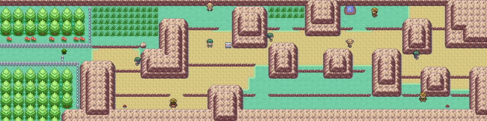
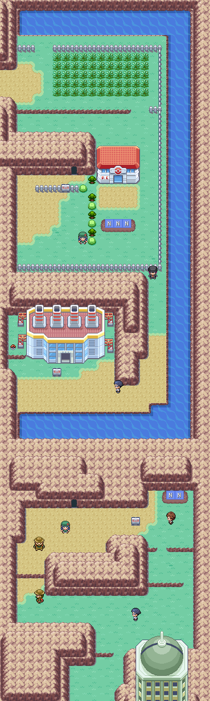
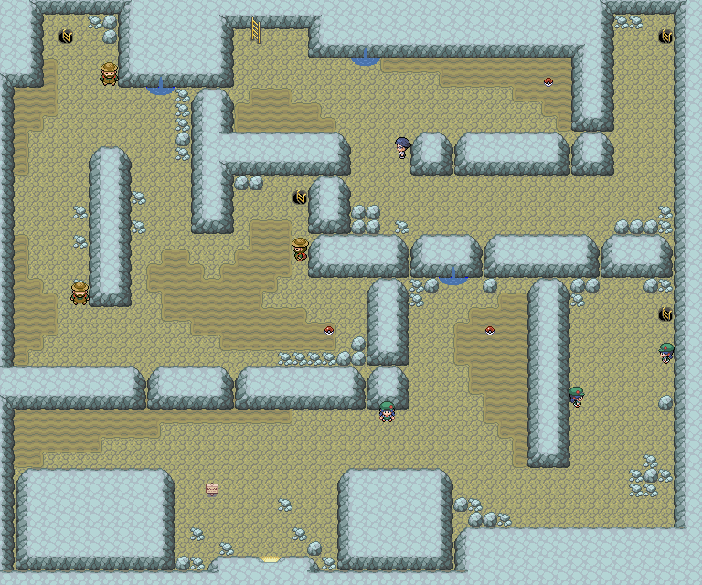
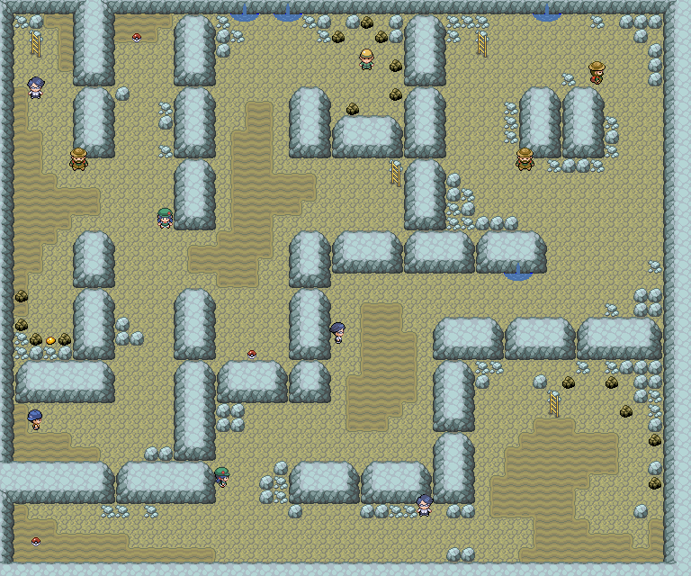

> [← Anterior](02-misty-y-lt-surge.md) · [Índice general](../README.md) · [Siguiente →](04-torre-pokemon-koga-y-zona-safari.md)

**POKÉMON  
CLASSIC**

**v1.5**

**VOLUMEN 3**

**Túnel Roca, Pueblo Lavanda y Ciudad Azulona**

Recorrido paso a paso • Objetos • Capturas recomendadas • Gimnasios • Checklists

# Contenido

- Preparativos tras la tercera medalla

- Ruta 9

- Ruta 10

- Túnel Roca

- Pueblo Lavanda

- Rutas 8 y 7

- Ciudad Azulona

- Casino y Guarida Rocket

- Gimnasio de Erika

| **ORDEN RECOMENDADO** Este volumen sigue el camino más natural: Ciudad Celeste → Ruta 9 → Ruta 10 → Túnel Roca → Pueblo Lavanda → Ruta 8 → paso subterráneo → Ruta 7 → Ciudad Azulona. |
|----------------------------------------------------------------------------------------------------------------------------------------------------------------------------------------|

# Preparativos

| **OBJETIVO** Usar Corte para recoger pendientes y dejar listo el equipo para una sección larga de entrenadores y cueva. |
|-------------------------------------------------------------------------------------------------------------------------|

## Recorrido recomendado

1.  Canjea el Vale Bici en Ciudad Celeste si aún no lo hiciste.

2.  Compra Repelentes, Superpociones, Antídotos y Cuerdas Huida.

3.  Lleva un Pokémon capaz de usar Destello si has conseguido la habilidad o recurso equivalente; el túnel puede recorrerse sin él, pero será mucho más incómodo.

4.  Mantén un hueco libre si quieres capturar a Charmander dentro del Túnel Roca.

| **NIVEL ORIENTATIVO** Empieza la Ruta 9 cerca del nivel 24-26 y procura salir del Túnel Roca alrededor del 28-30. |
|-------------------------------------------------------------------------------------------------------------------|

## Antes de continuar

- [ ] Comprar suministros

- [ ] Llevar Cuerda Huida

- [ ] Preparar Poké Balls

# Ruta 9

*Mapa de la Ruta 9.*

| **OBJETIVO** Abrir el camino hacia el Túnel Roca y aprovechar la alta densidad de entrenadores. |
|-------------------------------------------------------------------------------------------------|

## Recorrido recomendado

5.  Corta el arbusto al este de Ciudad Celeste.

6.  Derrota a todos los entrenadores; la experiencia es importante antes del túnel.

7.  Recoge la MT40 y el Antiquemar visibles.

8.  Busca el Éter y el Caramelo Raro ocultos.

9.  Continúa hacia la Ruta 10.

## Pokémon y capturas recomendadas

| **Pokémon / grupo** | **Disponibilidad** | **Valor para la aventura**                               |
|---------------------|--------------------|----------------------------------------------------------|
| Nidoran♀ / Nidoran♂ | Comunes            | Todavía es buen momento para formar Nidoking o Nidoqueen |
| Nidorino / Nidorina | 5% de día          | Ahorran entrenamiento                                    |
| Raticate            | Frecuente de noche | Fuerte a corto plazo                                     |
| Fearow              | 1% de día          | Buen volador físico                                      |

## Objetos y recompensas

| **Objeto**    | **Dónde / cómo** | **Prioridad** |
|---------------|------------------|---------------|
| Éter          | Oculto           | Media         |
| MT40          | Poké Ball        | Alta          |
| Antiquemar    | Poké Ball        | Media         |
| Baya Atania   | Oculta           | Baja          |
| Caramelo Raro | Oculto           | Alta          |

## Entrenadores

- Picnicker Alicia

- Hiker Jeremy

- Camper Chris

- Bug Catcher Brent

- Camper Drew

- Bug Catcher Conner

- Hiker Brice

- Picnicker Caitlin

- Hiker Alan

## Antes de continuar

- [ ] Recoger MT40

- [ ] Encontrar Caramelo Raro

- [ ] Derrotar a todos los entrenadores

# Ruta 10

*Ruta 10 completa, incluida la entrada al Túnel Roca.*

| **OBJETIVO** Prepararte justo antes del Túnel Roca y recoger objetos muy valiosos. |
|------------------------------------------------------------------------------------|

## Recorrido recomendado

10. Visita el Centro Pokémon y cura al equipo.

11. Después de la tercera medalla, habla con Cedar en el Centro para recibir la Piedra Eterna.

12. Recoge la Bola Luminosa visible; es especialmente valiosa para Pikachu.

13. Busca la Superpoción y el Máx. Éter ocultos.

14. Habla con el NPC de bayas para recibir una baya diaria.

15. Entra en el Túnel Roca con el equipo curado.

## Pokémon y capturas recomendadas

| **Pokémon / grupo** | **Disponibilidad** | **Valor para la aventura**          |
|---------------------|--------------------|-------------------------------------|
| Magnemite           | 10-20%             | Excelente tipo Eléctrico/Acero      |
| Machop              | 1-4%               | Buen atacante Lucha                 |
| Dratini             | 1% con Surf de día | Demasiado raro para detenerse ahora |
| Nidoran             | 10%                | Alternativa si aún no tienes uno    |

## Objetos y recompensas

| **Objeto**     | **Dónde / cómo**                       | **Prioridad**         |
|----------------|----------------------------------------|-----------------------|
| Superpoción    | Oculta                                 | Media                 |
| Máx. Éter      | Oculto                                 | Alta                  |
| Bola Luminosa  | Poké Ball                              | Muy alta para Pikachu |
| Piedra Eterna  | Cedar, Centro Pokémon, tras Gimnasio 3 | Alta                  |
| Baya aleatoria | NPC diario                             | Media                 |

## Entrenadores

- Picnicker Heidi

- Pokemaniac Mark

- Picnicker Carol

- Hiker Clark

- Hiker Trent

- Pokemaniac Herman

| **PIKACHU** Comprueba si la Bola Luminosa funciona como objeto equipado en tu versión; si es así, puede aumentar enormemente su potencia. |
|-------------------------------------------------------------------------------------------------------------------------------------------|

## Antes de continuar

- [ ] Conseguir Bola Luminosa

- [ ] Conseguir Piedra Eterna

- [ ] Curar y guardar

# Túnel Roca

*Túnel Roca, planta 1.*

*Túnel Roca, sótano 1.*

| **OBJETIVO** Cruzar la cueva, recoger la Piedra Poder y llegar a Pueblo Lavanda. |
|----------------------------------------------------------------------------------|

## Recorrido recomendado

16. Avanza por la primera planta revisando los desvíos para encontrar Repelente, Cuerda Huida y Perla.

17. En B1F recoge Revivir, Piedra Poder y Máx. Éter.

18. Derrota a los entrenadores para mantener el nivel del equipo.

19. Captura a Charmander si no lo obtuviste antes o quieres otro ejemplar.

20. Conserva al menos una Cuerda Huida por seguridad.

21. Busca la salida sur hacia la Ruta 10 inferior y Pueblo Lavanda.

## Pokémon y capturas recomendadas

| **Pokémon / grupo** | **Disponibilidad** | **Valor para la aventura**                                |
|---------------------|--------------------|-----------------------------------------------------------|
| Geodude             | 5-20% y Golpe Roca | Sólido tipo Roca/Tierra                                   |
| Machop              | 1-10%              | Buena cobertura de Lucha                                  |
| Zubat               | 10%                | Crobat no existe en la Pokédex clásica; utilidad moderada |
| Onix                | 5%                 | Muy defensivo, poco daño                                  |
| Charmander          | 4%                 | Captura prioritaria si no tienes uno                      |
| Graveler            | Golpe Roca         | Puede ahorrar evolución                                   |

## Objetos y recompensas

| **Objeto**    | **Dónde / cómo** | **Prioridad**                                                    |
|---------------|------------------|------------------------------------------------------------------|
| Repelente     | 1F               | Media                                                            |
| Cuerda Huida  | 1F               | Alta                                                             |
| Perla         | 1F               | Media                                                            |
| Revivir       | B1F              | Alta                                                             |
| Piedra Poder  | B1F              | Muy alta; sirve para evoluciones que antes requerían intercambio |
| Máx. Éter     | B1F              | Alta                                                             |
| Aerodactylita | B1F, posjuego    | Posjuego                                                         |

## Entrenadores

- Pokemaniac Ashton

- Hiker Lenny y otros entrenadores distribuidos por las dos plantas

| **PIEDRA PODER** Guárdala hasta decidir qué evolución por intercambio quieres priorizar, como Kadabra, Machoke, Graveler o Haunter. |
|-------------------------------------------------------------------------------------------------------------------------------------|

## Antes de continuar

- [ ] Recoger Piedra Poder

- [ ] Capturar Charmander si falta

- [ ] Salir con recursos suficientes

# Pueblo Lavanda

*Mapa de Pueblo Lavanda.*

| **OBJETIVO** Conocer el conflicto de la Torre Pokémon y preparar el desvío hacia Azulona. |
|-------------------------------------------------------------------------------------------|

## Recorrido recomendado

22. Cura al equipo y visita los edificios de la ciudad.

23. Entra en la Torre Pokémon para activar los eventos disponibles, pero no podrás completarla todavía sin el visor adecuado.

24. Habla con los habitantes para conocer la situación del Sr. Fuji y el Team Rocket.

25. Sal hacia el oeste por la Ruta 8.

| **BLOQUEO DE HISTORIA** La Torre Pokémon queda pendiente. El objeto necesario para identificar a los fantasmas se consigue al derrotar al Team Rocket en Ciudad Azulona. |
|--------------------------------------------------------------------------------------------------------------------------------------------------------------------------|

## Antes de continuar

- [ ] Activar el evento de la Torre

- [ ] Preparar el viaje a Azulona

# Ruta 8

*Mapa de la Ruta 8.*

| **OBJETIVO** Atravesar la ruta de entrenadores y acceder al paso subterráneo. |
|-------------------------------------------------------------------------------|

## Recorrido recomendado

26. Derrota a los numerosos entrenadores para ganar experiencia.

27. Busca las bayas Leppa, Lum y Rawst ocultas.

28. Captura Growlithe de día o Vulpix de noche si quieres un tipo Fuego.

29. Como la puerta de Azafrán sigue bloqueada, usa el paso subterráneo que lleva a la Ruta 7.

## Pokémon y capturas recomendadas

| **Pokémon / grupo** | **Disponibilidad**       | **Valor para la aventura**                |
|---------------------|--------------------------|-------------------------------------------|
| Growlithe           | 10% de día               | Arcanine es uno de los mejores tipo Fuego |
| Vulpix              | 10% de noche             | Ninetales es rápido y útil                |
| Abra / Kadabra      | Abra común; Kadabra 1-4% | Gran tipo Psíquico                        |
| Jigglypuff          | Hasta 20% de noche       | Soporte opcional                          |

## Objetos y recompensas

| **Objeto** | **Dónde / cómo** | **Prioridad** |
|------------|------------------|---------------|
| Baya Leppa | Oculta           | Media         |
| Baya Lum   | Oculta           | Alta          |
| Baya Rawst | Oculta           | Baja          |

## Entrenadores

| **Entrenador**    | **Zona / referencia** |
|-------------------|-----------------------|
| Lass Julia        | Ruta 8                |
| Gambler Rich      | Ruta 8                |
| Pokemaniac Glenn  | Ruta 8                |
| Twins Eli y Anne  | Combate doble         |
| Lass Paige        | Ruta 8                |
| Pokemaniac Leslie | Ruta 8                |
| Lass Andrea       | Ruta 8                |
| Lass Megan        | Ruta 8                |
| Biker Jaren       | Ruta 8                |
| Biker Ricardo     | Ruta 8                |
| Gambler Stan      | Ruta 8                |
| Pokemaniac Aidan  | Ruta 8                |

## Antes de continuar

- [ ] Capturar Growlithe o Vulpix si te interesa

- [ ] Recoger Baya Lum

- [ ] Usar el paso subterráneo

# Ruta 7

*Mapa de la Ruta 7.*

| **OBJETIVO** Entrar en Ciudad Azulona y conseguir una última captura antes de la ciudad. |
|------------------------------------------------------------------------------------------|

## Recorrido recomendado

30. Recoge la Baya Wepear oculta y revisa la parcela de Baya Leppa.

31. Busca Growlithe de día o Vulpix de noche.

32. Entra en Ciudad Azulona.

## Pokémon y capturas recomendadas

| **Pokémon / grupo** | **Disponibilidad** | **Valor para la aventura**          |
|---------------------|--------------------|-------------------------------------|
| Growlithe           | 1-4% de día        | Muy recomendable                    |
| Vulpix              | 1-4% de noche      | Muy recomendable                    |
| Abra                | Hasta 10%          | Buen último intento para capturarlo |
| Pidgeotto           | 1-5%               | Volador evolucionado                |

## Objetos y recompensas

| **Objeto**  | **Dónde / cómo** | **Prioridad** |
|-------------|------------------|---------------|
| Baya Wepear | Oculta           | Baja          |
| Baya Leppa  | Parcela          | Media         |

## Antes de continuar

- [ ] Entrar en Azulona con hueco libre en la mochila

# Ciudad Azulona

*Mapa de Ciudad Azulona.*

| **OBJETIVO** Conseguir objetos clave, explorar los grandes almacenes y descubrir la actividad Rocket. |
|-------------------------------------------------------------------------------------------------------|

## Recorrido recomendado

33. Explora los Grandes Almacenes y compra piedras evolutivas, objetos de combate y MT disponibles.

34. Habla con el hombre del restaurante para recibir el Monedero.

35. Recoge el Éter visible y el PP Más oculto tras el árbol que requiere Corte.

36. Obtén el Té, que más adelante permitirá acceder a Azafrán.

37. Investiga el Casino y consigue la Bolsa de Pruebas Rocket.

38. Antes o después de la guarida, desafía el Gimnasio de Erika según el nivel de tu equipo.

## Objetos y recompensas

| **Objeto**              | **Dónde / cómo**           | **Prioridad**              |
|-------------------------|----------------------------|----------------------------|
| Éter                    | Poké Ball                  | Media                      |
| PP Más                  | Oculto tras árbol de Corte | Alta                       |
| Monedero                | Hombre del restaurante     | Obligatoria para el casino |
| Bolsa de Pruebas Rocket | Evento de ciudad/casino    | Obligatoria                |
| Té                      | Ciudad Azulona             | Muy alta                   |

| **COMPRAS** Prioriza piedras evolutivas para los Pokémon que ya tengas preparados. No evoluciones demasiado pronto si perderías movimientos importantes por nivel. |
|--------------------------------------------------------------------------------------------------------------------------------------------------------------------|

## Antes de continuar

- [ ] Conseguir Monedero

- [ ] Conseguir Té

- [ ] Recoger PP Más

- [ ] Localizar la guarida

# Guarida Rocket

*Guarida Rocket, planta B1F.*

*Guarida Rocket, planta B2F.*

*Guarida Rocket, planta B3F.*

*Guarida Rocket, planta B4F.*

| **OBJETIVO** Derrotar a Giovanni, obtener el visor necesario y saquear las MT exclusivas. |
|-------------------------------------------------------------------------------------------|

## Recorrido recomendado

39. Activa la entrada secreta del Casino y baja a B1F.

40. Derrota a los ladrones Rocket: varios entregan MT exclusivas.

41. Resuelve los suelos de flechas y recoge la Llave Ascensor en B4F.

42. Explora todas las plantas antes del combate final para recoger la Piedra Lunar, Caramelo Raro y numerosas MT.

43. Derrota a Jessie y James en combate doble.

44. Derrota a Giovanni y consigue el objeto de historia necesario para regresar a la Torre Pokémon.

## Objetos y recompensas

| **Objeto**         | **Dónde / cómo**    | **Prioridad** |
|--------------------|---------------------|---------------|
| MT13 y MT23        | Ladrones Rocket B1F | Muy alta      |
| Cuerda Huida       | B1F                 | Alta          |
| Hiperpoción        | B1F                 | Alta          |
| PP Más             | Oculto en planta    | Alta          |
| MT24               | Ladrón B2F          | Muy alta      |
| Piedra Lunar       | B2F                 | Muy alta      |
| MT12               | B2F                 | Alta          |
| MT30               | Ladrón B3F          | Muy alta      |
| Pepita             | Oculta B3F          | Media         |
| Caramelo Raro      | B3F                 | Alta          |
| Gafas Negras       | B3F                 | Alta          |
| MT21               | B3F                 | Alta          |
| MT35 y MT36        | Ladrones B4F        | Muy alta      |
| Calcio / Máx. Éter | B4F                 | Alta          |
| MT49               | B4F                 | Alta          |
| Llave Ascensor     | B4F                 | Obligatoria   |

## Entrenadores

| **Entrenador**  | **Zona / referencia**       |
|-----------------|-----------------------------|
| Rocket Grunt ×5 | B1F                         |
| Rocket Grunt ×1 | B2F                         |
| Rocket Grunt ×2 | B3F                         |
| Rocket Grunt ×3 | B4F                         |
| Jessie y James  | Combate doble               |
| Giovanni        | Combate final de la guarida |

| **AVISO** La guarida contiene muchas MT que no conviene perder. Recorre cada planta antes de abandonar el edificio. |
|---------------------------------------------------------------------------------------------------------------------|

## Antes de continuar

- [ ] Conseguir Llave Ascensor

- [ ] Recoger Piedra Lunar y Caramelo Raro

- [ ] Derrotar a Giovanni

# GIMNASIO: Erika

*Interior del Gimnasio de Ciudad Azulona.*

| **LEVEL CAP RECOMENDADO** 32. Se toma como referencia el Pokémon de mayor nivel del equipo de Pokémon Amarillo. |
|-----------------------------------------------------------------------------------------------------------------|

| **Pokémon** | **Nivel** | **Tipo**      | **Peligro principal**                |
|-------------|-----------|---------------|--------------------------------------|
| Tangela     | 30        | Planta        | Alta Defensa y movimientos de estado |
| Weepinbell  | 32        | Planta/Veneno | Estados y ataques Planta             |
| Gloom       | 32        | Planta/Veneno | Somnífero, veneno y resistencia      |

## Plan de combate

- Charmander/Charmeleon, Growlithe/Arcanine o Vulpix/Ninetales facilitan mucho el combate.

- Los Pokémon Volador y Psíquico también son efectivos contra sus tipos Planta/Veneno.

- Lleva Antídotos y Despertar o Bayas Lum: el mayor peligro son los cambios de estado.

- Evita depender de ataques de Agua, Tierra o Planta.

- Derrota a las seis entrenadoras del gimnasio para ganar experiencia antes de Erika.

| **RECOMPENSA** Medalla Arcoíris y MT19 de Pokémon Classic. |
|------------------------------------------------------------|

| **SIGUIENTE VOLUMEN** Con el visor de Giovanni, regresa a Pueblo Lavanda para completar la Torre Pokémon. Después podrás avanzar hacia Fucsia y continuar con la historia. |
|----------------------------------------------------------------------------------------------------------------------------------------------------------------------------|

---

> [← Anterior](02-misty-y-lt-surge.md) · [Índice general](../README.md) · [Siguiente →](04-torre-pokemon-koga-y-zona-safari.md)

